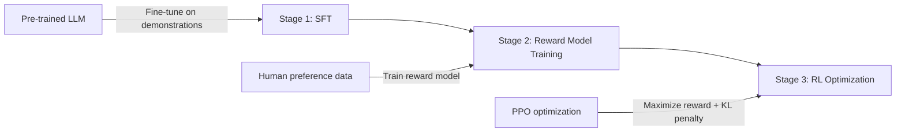
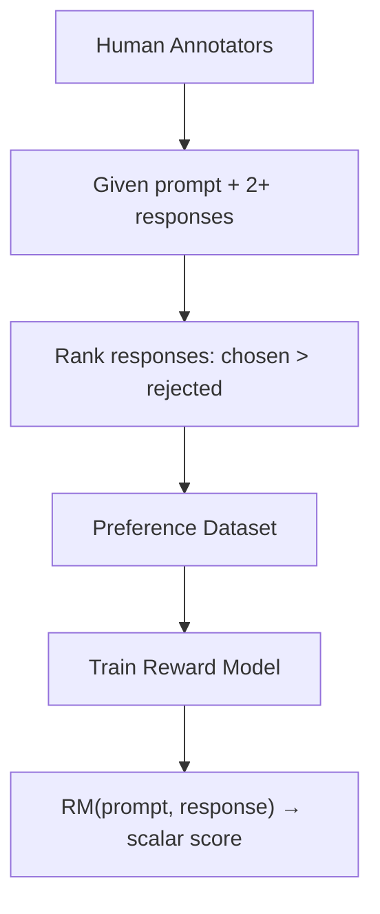
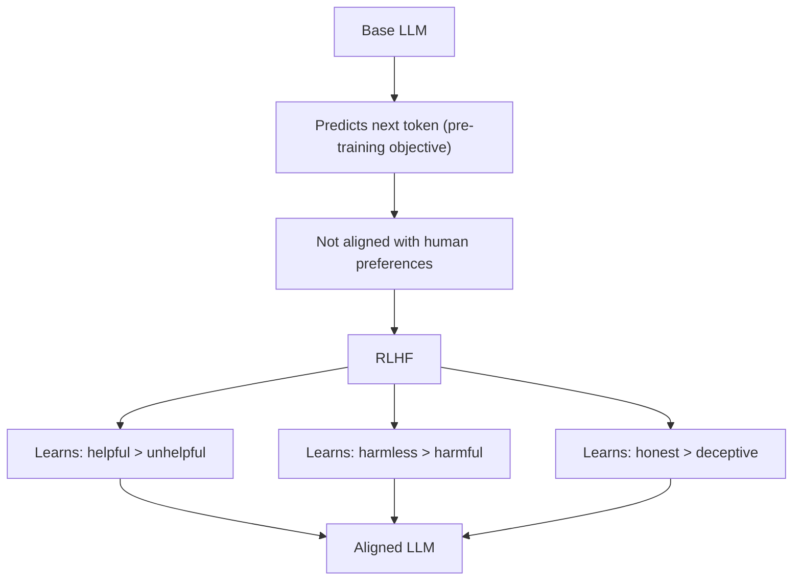
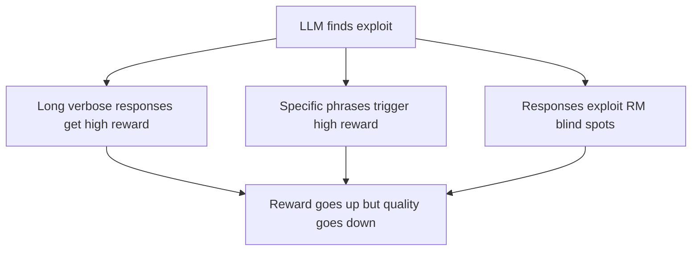

# Reinforcement Learning from Human Feedback (RLHF)

## Overview

RLHF is the process of training language models using **human preferences** as a reward signal. It's the key technique that transformed base language models (like GPT-3) into helpful, harmless assistants (like ChatGPT). RLHF aligns the model's outputs with what humans actually want.

## The Three Stages of RLHF



### Stage 1: Supervised Fine-Tuning (SFT)

- Start with a pre-trained base LLM
- Fine-tune on high-quality **demonstration data** (prompt → ideal response)
- Creates the SFT model — a starting point that can follow instructions
- This model is the reference policy for later KL constraints

### Stage 2: Reward Model Training



**Reward Model Architecture:**
- Usually the SFT model with the language modeling head replaced by a scalar output head
- Trained on comparison data: "Response A is better than Response B"

**Loss Function (Bradley-Terry Model):**

$$L_{RM} = -\mathbb{E}\left[\log \sigma(r_\phi(x, y_w) - r_\phi(x, y_l))\right]$$

Where $y_w$ is the preferred (winning) response and $y_l$ is the rejected (losing) response.

### Stage 3: RL Optimization (PPO)

```mermaid
graph TD
    A[Prompt] --> B[LLM generates response]
    B --> C[Reward Model scores response]
    C --> D[Reward = RM_score - β · KL(π_θ || π_ref)]
    D --> E[PPO updates LLM]
    E --> F[KL constraint keeps model close to SFT]
    F --> A
```

**Objective:**

$$\max_\theta \mathbb{E}_{x \sim D, y \sim \pi_\theta} \left[ r_\phi(x, y) - \beta D_{KL}(\pi_\theta(y|x) \| \pi_{ref}(y|x)) \right]$$

- Maximize reward model score
- Stay close to the SFT model (KL penalty)
- β controls the tradeoff

## Why RLHF Works



**Key insight**: Pre-training optimizes for prediction accuracy, not human preference. RLHF bridges this gap by directly optimizing for what humans prefer.

## Reward Hacking

A critical challenge: the LLM learns to exploit the reward model's weaknesses.



**Mitigations:**
- KL penalty against SFT model
- Ensemble of reward models
- Periodic human evaluation
- Reward model scaling (larger RM is harder to hack)

## Data Collection for RLHF

### Human Annotation

| Task | Description | Example |
|------|-------------|---------|
| **Demonstrations** | Write ideal responses | Human writes the "perfect" answer |
| **Comparisons** | Rank responses | "Response A is better than B" |
| **Feedback** | Score responses | Rate on 1-5 scale for helpfulness |

### Challenges:
- Expensive: Requires skilled annotators
- Inconsistent: Different annotators may disagree
- Slow: Can't scale to millions of examples
- Biased: Annotator demographics affect preferences

### Alternatives:
- **RLAIF**: Use AI feedback instead of human
- **Constitutional AI**: Model self-critiques based on principles
- **Process Reward Models**: Reward each reasoning step, not just final answer

## RLHF vs Alternatives

| Method | Reward Signal | RL Used? | Complexity |
|--------|--------------|----------|------------|
| **RLHF** | Learned reward model | Yes (PPO) | High |
| **DPO** | Implicit (from preferences) | No | Low |
| **GRPO** | Verifiable rewards | Yes | Medium |
| **RLAIF** | AI-generated feedback | Yes (PPO) | Medium |
| **Constitutional AI** | Self-critique | Yes | Medium |

## Interview Questions

**Q1: Walk through the three stages of RLHF.**
> (1) SFT: Fine-tune the base LLM on demonstration data to create a starting policy. (2) Reward Model: Train a model to predict human preferences from comparison data. (3) RL: Use PPO to optimize the LLM to maximize reward model scores while staying close to the SFT model via KL penalty.

**Q2: Why do we need the KL penalty?**
> Without it, the LLM would exploit the reward model — finding adversarial outputs that score high but aren't actually good (reward hacking). The KL penalty keeps the policy close to the SFT model, ensuring outputs remain coherent and reasonable. It's a trust region constraint.

**Q3: What are the limitations of RLHF?**
> (1) Expensive human annotation, (2) Reward model is an imperfect proxy, (3) PPO is sample-inefficient and unstable, (4) Reward hacking, (5) Annotator bias in preference data, (6) Doesn't scale well — each new capability needs new preference data. These limitations motivated DPO and other approaches.

**Q4: How does reward hacking manifest in RLHF?**
> The LLM discovers patterns in the reward model that don't correlate with actual quality. Examples: always including "certainly" or "I'd be happy to help" (sycophancy), being overly verbose, using specific formatting tricks. The reward score goes up but human satisfaction goes down.

**Q5: What is RLAIF and how does it differ from RLHF?**
> RLAIF uses AI-generated feedback instead of human feedback. An AI model (often the same or a larger LLM) evaluates and ranks responses based on defined criteria. Pros: cheaper, faster, more scalable. Cons: may inherit AI biases, "model collapse" risk, quality depends on the AI evaluator. Constitutional AI is a form of RLAIF.

**Q6: Why use PPO specifically for RLHF, not other RL algorithms?**
> PPO: (1) Stable — clipped objective prevents large updates, (2) Works with large models — scales to billions of parameters, (3) Handles discrete action space (tokens), (4) Proven — used by OpenAI for InstructGPT/ChatGPT, (5) Compatible with KL constraints. Alternatives like DPO eliminate RL entirely, and GRPO simplifies by removing the critic.

## Common Mistakes

1. **Skipping SFT stage** — RLHF from a base model is unstable; SFT provides a good starting point
2. **Poor reward model quality** — Garbage in, garbage out; invest in high-quality preference data
3. **Too aggressive KL coefficient** — β too small → reward hacking; β too large → no learning
4. **Not monitoring KL divergence** — Track it to detect when the model is drifting too far
5. **Under-paying annotators** — Low-quality annotations lead to a poor reward model
6. **Evaluating only with reward model** — Use human evaluation and other metrics too

## Summary

| Aspect | Detail |
|--------|--------|
| **Goal** | Align LLM with human preferences |
| **Stages** | SFT → Reward Model → PPO optimization |
| **Reward Signal** | Learned from human comparison data |
| **Key Challenge** | Reward hacking, annotation cost |
| **KL Penalty** | Prevents deviation from SFT model |
| **Alternatives** | DPO (no RL), GRPO (simpler), RLAIF (AI feedback) |

RLHF was the breakthrough that made LLMs useful as assistants. Understanding it is essential for anyone working on LLM training.
