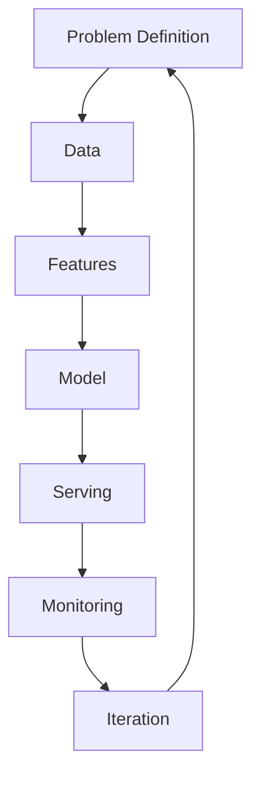
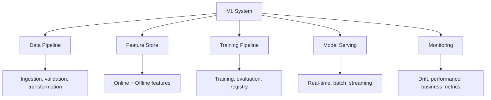

# ML System Design

## Overview

ML System Design is a critical skill for ML engineers, combining machine learning knowledge with systems thinking. It involves designing end-to-end ML systems that are scalable, reliable, and maintainable. This section covers the key components of ML systems and real-world design patterns commonly discussed in interviews.

## ML System Design Framework

### The FRAMEWORK

1. **F**ormulate the problem (metrics, constraints)
2. **R**equirements (latency, throughput, scale)
3. **A**rchitecture (data pipeline, feature store, model, serving)
4. **M**odel selection and training
5. **E**valuation (offline + online metrics)
6. **W**orkflow (training pipeline, retraining)
7. **O**perations (monitoring, alerting, debugging)
8. **R**ollout (A/B testing, canary deployment)
9. **K**ey trade-offs and alternatives

## Key System Components

## Interview Questions

1. **How do you approach ML system design questions?** — Clarify requirements → Define metrics → Design data pipeline → Choose model → Design serving architecture → Plan monitoring → Discuss trade-offs.

2. **What are the key differences between ML system design and traditional system design?** — ML systems need data pipelines, feature stores, model training/retraining, A/B testing, and drift monitoring on top of traditional distributed systems concerns.

3. **How do you handle model updates in production?** — CI/CD pipelines with automated training, evaluation gates, canary/blue-green deployment, and rollback capability.

## Cross-References

- [MLOps](../mlops/README.md) — Operational practices
- [System Design Interview](../../interview/system-design/README.md) — General system design
- [ML Overview](../overview.md) — ML fundamentals
