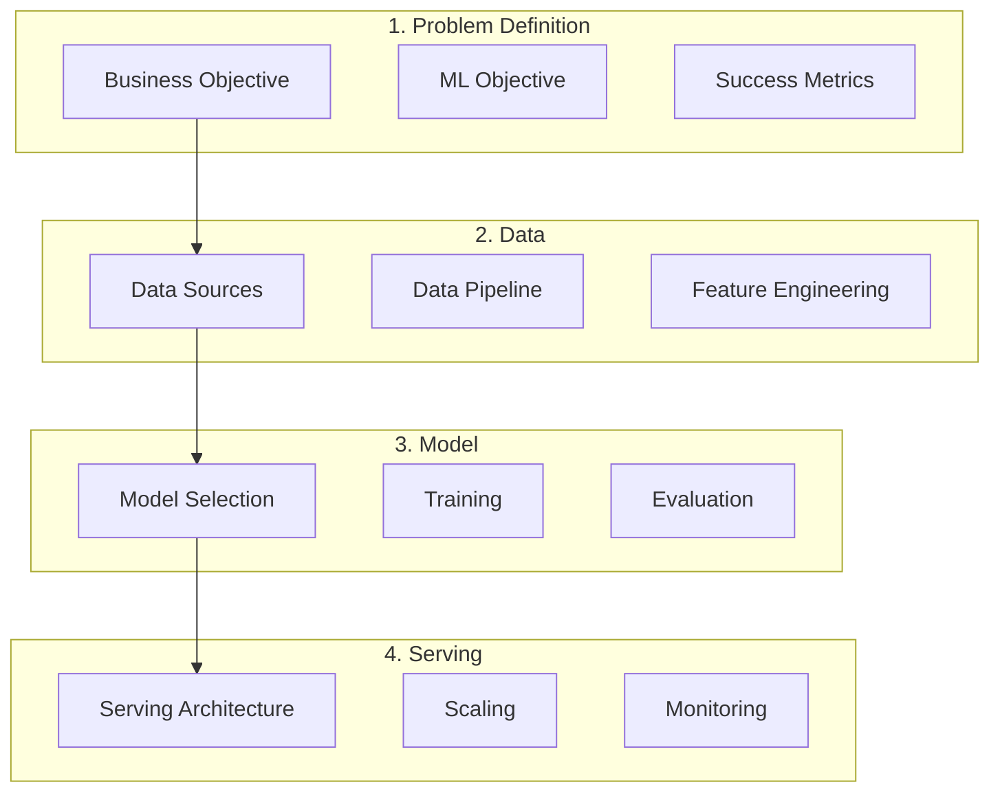

# ML System Design

## Overview

ML System Design is the process of designing end-to-end machine learning systems that solve real-world problems. It combines software engineering principles with ML-specific considerations like data pipelines, model serving, feature engineering, and monitoring.

## ML System Design Framework

## System Design Template

### Step 1: Requirements
- Clarify business goals and constraints
- Define ML metrics (precision, recall, latency)
- Identify scale requirements (QPS, data volume)

### Step 2: Data
- Identify data sources
- Design data pipeline
- Define feature engineering

### Step 3: Model
- Select model architecture
- Define training strategy
- Plan evaluation approach

### Step 4: Serving
- Design serving architecture
- Plan scaling strategy
- Define monitoring approach

## Common System Design Questions

| System | Key Challenges |
|--------|---------------|
| Recommendation | Candidate generation, ranking, real-time features |
| Search Ranking | Relevance, freshness, personalization |
| Fraud Detection | Imbalanced data, real-time inference, latency |
| Ad Click Prediction | Scale, CTR estimation, feature freshness |
| Content Moderation | Multi-modal, low latency, high recall |

## Interview Tips

1. **Clarify requirements first** — Don't jump into model architecture
2. **Start simple** — Begin with baseline, then iterate
3. **Consider trade-offs** — Accuracy vs latency, complexity vs maintainability
4. **Think about data** — Where does it come from? How fresh?
5. **Address failure modes** — What happens when the model fails?

## Summary

ML System Design interviews test your ability to design end-to-end ML systems. The key is to balance technical depth with practical considerations. Follow a structured approach: requirements → data → model → serving. Always consider trade-offs and failure modes.
