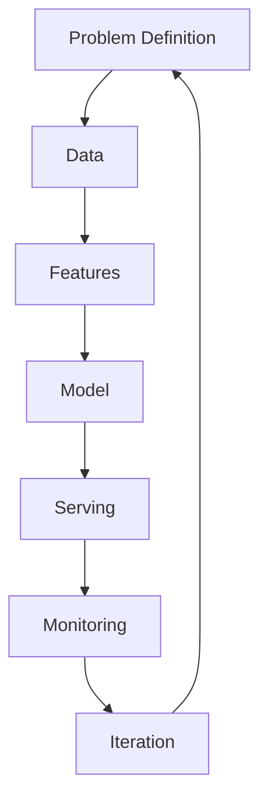
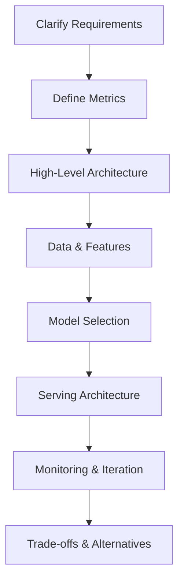
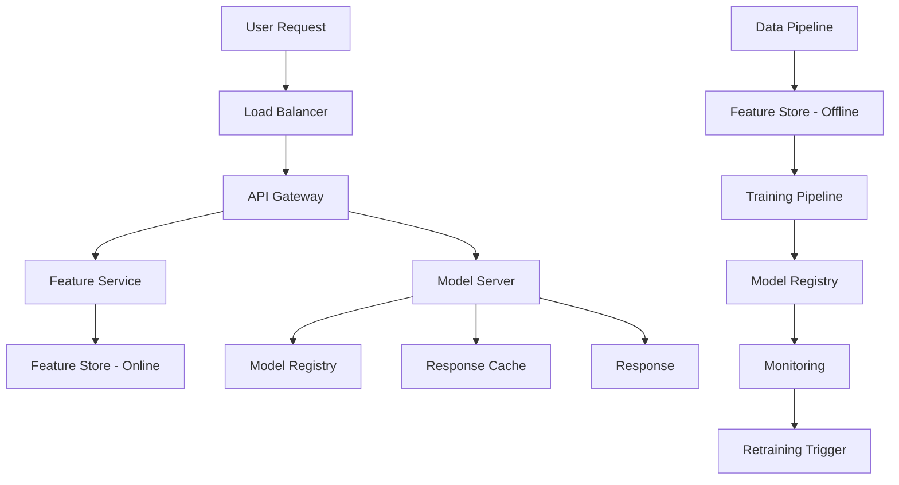
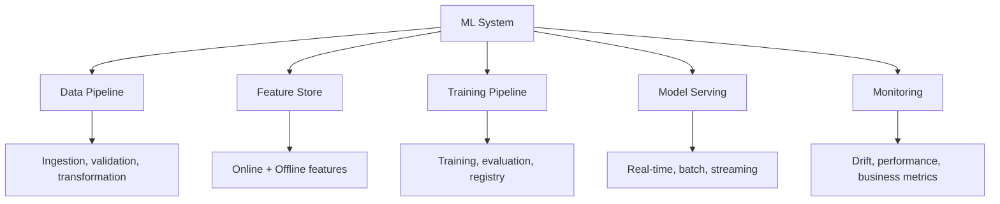
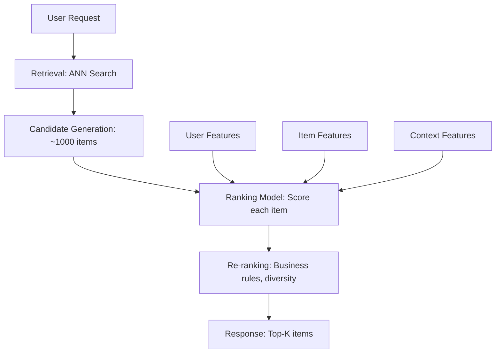
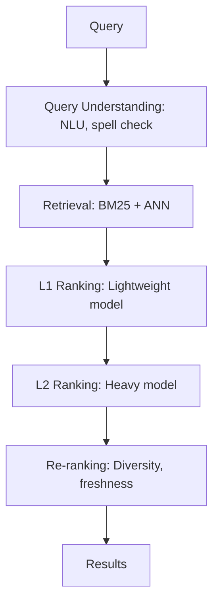
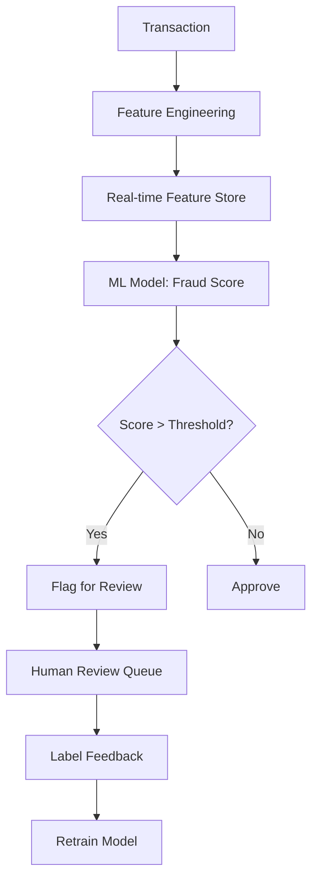

# ML System Design

## Overview

ML System Design is a critical skill for ML engineers, combining machine learning knowledge with systems thinking. It involves designing end-to-end ML systems that are scalable, reliable, and maintainable. This section covers the key components of ML systems and real-world design patterns commonly discussed in interviews.

## ML System Design Framework

### The FRAMEWORK

1. **F**ormulate the problem (metrics, constraints)
2. **R**equirements (latency, throughput, scale)
3. **A**rchitecture (data pipeline, feature store, model, serving)
4. **M**odel selection and training
5. **E**valuation (offline + online metrics)
6. **W**orkflow (training pipeline, retraining)
7. **O**perations (monitoring, alerting, debugging)
8. **R**ollout (A/B testing, canary deployment)
9. **K**ey trade-offs and alternatives

## How to Approach ML System Design Interviews

### Step 1: Clarify Requirements

Questions to ask:
- What is the business objective? (click-through, engagement, revenue)
- What are the latency requirements? (real-time <100ms, near-real-time <1s, batch OK)
- What is the scale? (QPS, data volume, number of users)
- What data is available? (labeled, unlabeled, features)
- Are there fairness/privacy constraints?

### Step 2: Define Metrics

| Metric Type | Examples | Purpose |
|------------|---------|---------|
| **Offline** | AUC, NDCG, RMSE | Model quality during training |
| **Online** | CTR, conversion rate, engagement | Business impact in production |
| **System** | Latency p50/p99, throughput, error rate | Infrastructure health |
| **Guardrail** | Fairness metrics, safety checks | Prevent harm |

**Key insight:** Offline metrics don't always correlate with online metrics. Always validate with A/B tests.

### Step 3: High-Level Architecture

## Key System Components

### Data Pipeline

| Component | Description | Tools |
|-----------|-------------|-------|
| Ingestion | Collect data from sources | Kafka, Kinesis, Pub/Sub |
| Validation | Check quality, schema | Great Expectations, TFX |
| Transformation | Clean, aggregate, join | Spark, Beam, dbt |
| Storage | Store processed data | S3, BigQuery, Delta Lake |

### Feature Engineering

| Pattern | Description | Latency |
|---------|-------------|---------|
| **Batch features** | Computed on schedule (hourly/daily) | Minutes to hours |
| **Streaming features** | Computed in real-time from events | Seconds |
| **On-demand features** | Computed at request time | Milliseconds |

### Model Selection Guide

| Problem | Data Size | Model | Notes |
|---------|-----------|-------|-------|
| Tabular classification | Small-Medium | XGBoost, LightGBM | Best for structured data |
| Tabular classification | Large | TabNet, DeepFM | Deep learning on tabular |
| Image classification | Medium | EfficientNet + fine-tuning | Transfer learning |
| Image classification | Large | ViT, ConvNeXt | Train from scratch |
| Text classification | Any | BERT/RoBERTa fine-tuned | Pre-trained embeddings |
| Ranking | Large | Two-tower + ANN | Retrieval + ranking |
| Recommendations | Large | Matrix factorization + deep | Hybrid approach |

### Serving Architecture Patterns

| Pattern | Latency | Throughput | Use Case |
|---------|---------|-----------|----------|
| **Synchronous** | Low | Medium | Real-time predictions |
| **Asynchronous** | Higher | High | Non-urgent predictions |
| **Batch** | High (scheduled) | Very high | Reports, recommendations |
| **Streaming** | Low | High | Event-driven predictions |

## Real-World ML System Design Examples

### Example 1: Recommendation System

**Key decisions:**
- Retrieval: Two-tower model with ANN (FAISS, ScaNN)
- Ranking: Deep learning model (Wide & Deep, DeepFM)
- Features: User history, item properties, context (time, device)
- Online learning: Update model with recent interactions

### Example 2: Search Ranking

**Key decisions:**
- Multi-stage ranking (L1: fast, L2: accurate)
- Query understanding (intent classification, entity extraction)
- Learning to rank (pointwise, pairwise, listwise)

### Example 3: Fraud Detection

**Key decisions:**
- Real-time features (velocity, device fingerprint, geo)
- Class imbalance (SMOTE, focal loss, class weights)
- Explainability (SHAP values for flagged transactions)
- Latency requirement: <50ms

## Common Interview Questions

1. **How do you approach ML system design questions?**
   Clarify requirements → Define metrics → Design data pipeline → Choose model → Design serving architecture → Plan monitoring → Discuss trade-offs. Always start with the problem, not the model.

2. **What are the key differences between ML system design and traditional system design?**
   ML systems need data pipelines, feature stores, model training/retraining, A/B testing, and drift monitoring on top of traditional distributed systems concerns. The data dependency makes ML systems fundamentally different.

3. **How do you handle model updates in production?**
   CI/CD pipelines with automated training, evaluation gates, canary/blue-green deployment, and rollback capability. Shadow mode testing before serving real traffic.

4. **How do you choose between batch and real-time serving?**
   Batch: when latency isn't critical (daily recommendations), higher throughput, simpler. Real-time: when instant predictions are needed (fraud detection), more complex infrastructure. Many systems use both (batch for heavy computation, real-time for lightweight).

5. **How do you handle cold-start problems?**
   New users/items with no history. Solutions: (1) Content-based features (item metadata). (2) Popularity-based recommendations. (3) Demographic features. (4) Exploration/exploitation. (5) Transfer learning from similar domains.

## Trade-offs to Discuss

| Trade-off | Consideration |
|-----------|--------------|
| Accuracy vs Latency | More complex model = higher accuracy but slower |
| Batch vs Real-time | Real-time is more complex but fresher |
| Custom vs Off-the-shelf | Custom is better but costs more to build/maintain |
| Online vs Offline features | Online is fresher but more expensive |
| Centralized vs Distributed serving | Distributed is scalable but harder to manage |

## Cross-References

- [MLOps](../mlops/README.md) — Operational practices
- [System Design Interview](../../interview/system-design/README.md) — General system design
- [ML Overview](../overview.md) — ML fundamentals
- [Feature Store](./feature-store.md) — Feature management
- [Model Serving](./model-serving.md) — Serving patterns
- [Monitoring](./monitoring.md) — Production monitoring
- [ML Pipeline](./pipeline.md) — Training pipelines

## References

- Aminian, A. & Xu, A. (2023). *Machine Learning System Design Interview* — Best ML system design book
- Huyen, C. (2022). *Designing Machine Learning Systems* (O'Reilly) — Practical MLOps
- Chip Huyen's ML Systems Design course (Stanford CS 329S)
- Google. *Rules of ML* — Best practices for ML engineering
