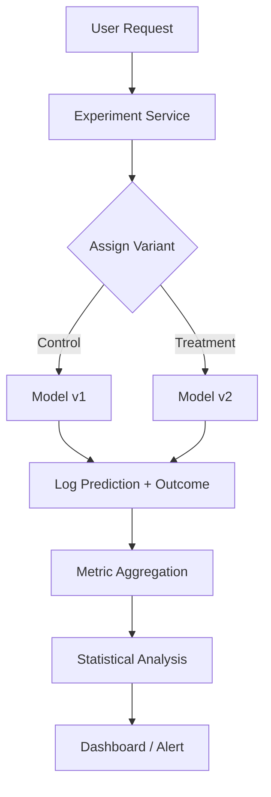

# A/B Testing Design for ML

## Overview

A/B testing in ML compares model versions by serving each to a user subset and measuring business impact. Designing an A/B testing system involves traffic routing, metric collection, statistical analysis, and experiment management.

## System Architecture



## Key Components

### 1. Experiment Assignment

```python
class ExperimentService:
    def __init__(self):
        self.experiments = {}

    def assign_variant(self, user_id, experiment_id):
        """Deterministic assignment using hashing"""
        hash_val = hash(f"{user_id}:{experiment_id}") % 100
        config = self.experiments[experiment_id]

        if hash_val < config['control_pct']:
            return 'control'
        elif hash_val < config['control_pct'] + config['treatment_pct']:
            return 'treatment'
        else:
            return 'holdout'

    def get_model_version(self, user_id, experiment_id):
        variant = self.assign_variant(user_id, experiment_id)
        return self.experiments[experiment_id]['variants'][variant]
```

### 2. Metric Collection

```python
class MetricLogger:
    def log_event(self, user_id, experiment_id, variant, event_type, value):
        """Log experiment events"""
        event = {
            'user_id': user_id,
            'experiment_id': experiment_id,
            'variant': variant,
            'event_type': event_type,  # 'impression', 'click', 'conversion'
            'value': value,
            'timestamp': time.time()
        }
        self.kafka_producer.send('experiment-events', event)
```

### 3. Statistical Analysis

```python
from scipy import stats

def analyze_experiment(control_metrics, treatment_metrics):
    """Two-sample t-test for continuous metrics"""
    t_stat, p_value = stats.ttest_ind(treatment_metrics, control_metrics)
    lift = (treatment_metrics.mean() - control_metrics.mean()) / control_metrics.mean()

    # Welch's two-sample t-interval for the mean difference
    diff = treatment_metrics.mean() - control_metrics.mean()
    n1, n2 = len(treatment_metrics), len(control_metrics)
    se_diff = np.sqrt(treatment_metrics.var(ddof=1) / n1 + control_metrics.var(ddof=1) / n2)
    df_welch = se_diff**4 / ((treatment_metrics.var(ddof=1) / n1)**2 / (n1 - 1) +
                              (control_metrics.var(ddof=1) / n2)**2 / (n2 - 1))
    ci = stats.t.interval(0.95, df=df_welch, loc=diff, scale=se_diff)
    return {
        'p_value': p_value,
        'significant': p_value < 0.05,
        'lift': lift,
        'confidence_interval': ci
    }
```

## Multi-Armed Bandit

```python
class ThompsonSampling:
    """Bayesian approach to experiment allocation"""
    def __init__(self, n_arms):
        self.alpha = np.ones(n_arms)  # Success counts
        self.beta_param = np.ones(n_arms)   # Failure counts

    def select_arm(self):
        """Sample from Beta distribution, select highest"""
        samples = np.random.beta(self.alpha, self.beta_param)
        return np.argmax(samples)

    def update(self, arm, reward):
        if reward:
            self.alpha[arm] += 1
        else:
            self.beta_param[arm] += 1
```

## Interview Questions

1. **How do you design an A/B testing system for ML models?** — Experiment service for assignment, feature routing to different models, metric logging, statistical analysis engine, and dashboard for results.

2. **How do you handle multiple concurrent experiments?** — Orthogonal experiment layers: each experiment hashes independently. Or factorial design for interaction effects.

3. **A/B testing vs multi-armed bandit?** — A/B: fixed allocation, cleaner statistics, better for understanding. Bandit: adaptive allocation, minimizes regret, better for optimization.

## Summary

A/B testing design for ML requires traffic routing, metric collection, and statistical analysis. Key challenges include consistent assignment, metric attribution, and statistical significance. Multi-armed bandits offer an adaptive alternative for optimization-focused experiments.

---

## Statistical Machinery: From Test to Decision

The [Experimentation Platform](../../interview/system-design/real-world/experimentation-platform.md) page owns assignment, exposures, and the metrics pipeline; this is the statistics half of the contract. All worked numbers below were computed with python3/scipy this session.

### Hypothesis Testing Done Right

The workhorse for binary metrics is the **two-proportion z-test**. Worked example: control n=50,000 with 2,500 conversions (5.00%); treatment n=50,000 with 2,700 (5.40%). Pooled p̄ = 5,200/100,000 = 0.052; SE = √(p̄(1−p̄)(1/n₁+1/n₂)) = √(0.052×0.948×0.00004) = 0.001404; z = 0.004/0.001404 = **2.85**; two-sided p = **0.0044**. The 95% CI uses the *unpooled* SE: [0.125pp, 0.675pp] — pooled SE belongs to the test statistic under H₀, unpooled to the interval.

Continuous metrics use **Welch's t-test**, not Student's: a treatment shifts variance along with the mean, so equal variances cannot be assumed. Worked example: control mean 10.07 min, variance 50.6; treatment mean 10.48, variance 55.9; n=12,000 each → Welch t = 4.35, Welch–Satterthwaite df ≈ 23,940, p ≈ 1.4×10⁻⁵.

**Five classic misinterpretations**: (1) p is *not* P(H₀ true) — it is P(data this extreme | H₀ true). (2) "Not significant" ≠ "no effect". (3) p=0.049 vs p=0.051 is not a cliff; the dichotomy is a convention, the evidence continuous. (4) A 95% CI is not "95% probability the truth is inside" — it is a property of the procedure across repeats. (5) A tiny p says nothing about importance: at large n a 0.01pp lift is "highly significant" and worthless.

### Power, MDE, and Runtime

```
n ≈ (z_α/2 + z_β)² · 2·p̄(1−p̄) / Δ²   →   n ≈ 16·p(1−p)/Δ²  at α=.05, power=.8
```

Derivation: rejection needs the true Δ to be (z_α/2+z_β) SEs from zero; each arm contributes p(1−p)/n, so solving SE = Δ/(z_α/2+z_β) for n gives (1.96+0.84)²·2p(1−p)/Δ² ≈ **16·p(1−p)/Δ²**. Worked example (computed): baseline 5%, MDE 1pp absolute → exact approximation **7,663 per arm**; 16-rule 16×0.05×0.95/0.01² = **7,600** — within 1%. Runtime is traffic math: 5,000 users/day at 50/50 → **3.1 days**; 100,000/day → 0.2 days. Inverting, n=20,000/arm detects only **0.61pp** at 80% power — why rare-event metrics need weeks (0.1% baseline → ≈160,000/arm).

**Why peeking breaks this**: the 5% guarantee holds for one look at the pre-registered n. Simulated here (null true, 20,000 replications, daily looks, stop at p<0.05): 2 looks → 8.3%, 5 → 14.0%, 10 → **19.8%**, 20 → **24.9%** empirical false-positive rate. Stopping "when it looks significant" quadruples α.

### Multiple Comparisons and Contamination

With K metrics each tested at α=0.05, P(at least one false win) = 1−0.95ᴷ — **64%** at K=20. **Bonferroni** controls family-wise error (test each at α/K = 0.0025, decision z ≈ 3.02) — conservative but right for launch decisions; **FDR (Benjamini–Hochberg)** bounds the false fraction among discoveries and suits exploration, where naive testing with 10 true effects among 100 hypotheses yields ~5 false wins against 10 true ones. Network effects: when treatment changes a shared resource (feed ranking, cache), effects leak onto control users and bias the readout toward zero; the fix is **cluster randomization** (by market or user cluster), accepting inflated variance. Infra-side isolation (domains/layers) is the [Experimentation Platform](../../interview/system-design/real-world/experimentation-platform.md) page's problem.

### SRM: The Single Most Important Invariant

**Sample ratio mismatch** must gate every experiment before any metric is read: chi-square goodness-of-fit of observed exposures against configured allocation, χ² = Σ(Oᵢ−Eᵢ)²/Eᵢ, df = variants−1. Worked example (computed): configured 50/50, observed 103,000/97,000 → E=100,000 each, χ² = 2×(3,000²/100,000) = **180.0**, p ≈ **4.8×10⁻⁴¹**. Sensitivity scales with volume: 0.5% deviation at 200k users is p≈0.025; 0.8% at 10M gives χ²=640 (p≈3×10⁻¹⁴¹). Statsig: SRM matters because it is *"usually non-random: the extra or missing traffic is not identical to the original traffic"* ([Managing SRM](https://docs.statsig.com/experiments/monitoring/srm)) — extra users differ systematically, so every per-user metric is biased.

Top causes: asymmetric bot filtering; redirect loss; client crash between assignment and exposure-log flush; conditional dependencies filtering one arm; backfills truncating one variant's log; bucketing bugs (config ≠ code allocation). Contract: **assert SRM on every experiment, continuously, and page before anyone reads a metric.**

### Variance Reduction: CUPED

**CUPED** ([Deng et al., WSDM 2013](https://dl.acm.org/doi/10.1145/2433396.2433413), DOI 10.1145/2433396.2433413, re-verified via Crossref this session) removes variance predictable from **pre-experiment** data: θ = Cov(X,Y)/Var(X); Y_adj = Y − θ(X − E[X]); Var(Y_adj) = Var(Y)(1−ρ²). Worked example (computed, N=40,000): X = pre-period orders, Y = post-period orders, ρ = 0.841, θ = 11.73/12.58 = 0.932; variance drops 15.47 → 4.54, ratio 0.293 = 1−ρ² exactly. A +0.05 orders/user lift is unbiased either way, but SE falls 0.0278 → 0.0151 — **~3.4× effective sample size for free**. Validity requires X measured before assignment; the platform implication is retaining per-user pre-period aggregates.

### Sequential Testing

| | Fixed horizon | Sequential (e.g., mSPRT) |
|---|---|---|
| When you may look | Once, after pre-registered n | Continuously, any time |
| False positives | 5% for the single look | Maintained ≈5% at every look |
| Sample size for fixed power | Smallest | Modest penalty when effects are small |
| Decision speed | Waits for full horizon | Stops early on strong evidence |

The peeking problem is a fixed-horizon test evaluated repeatedly; the fix preserving early stopping is the **mixture sequential probability ratio test (mSPRT)** — compare the null against a mixture of alternatives, yielding p-values valid under any stopping rule. Statsig: *"Statsig uses mSPRT based on the approach that Zhao et al. propose"* ([Frequentist Sequential Testing](https://docs.statsig.com/experiments/advanced-setup/sequential-testing/), citing [arXiv:1905.10493](https://arxiv.org/abs/1905.10493); both fetched this session). Rule of thumb: sequential machinery for guardrail dashboards, fixed-horizon for the OEC readout.

### Ratio Metrics and the Delta Method

CTR (clicks/sessions) and revenue/session are **ratios of per-user sums**; their variance depends on numerator variance, denominator variance, *and* their covariance — treating the denominator as constant yields anti-conservative CIs, because click-heavy users are session-heavy too. The **delta method** linearizes g(y,x)=ȳ/x̄: Var ≈ (1/x̄²)·(Var(y) − 2(ȳ/x̄)Cov(y,x) + (ȳ/x̄)²Var(x)) — computable only if the pipeline stores per-user (sum, count, sum-of-squares, cross-sums), another metric-definitions-as-code obligation. Foundational survey: Kohavi, Longbotham, Sommerfield & Henne, *"Controlled experiments on the web: survey and practical guide"* (Data Mining and Knowledge Discovery, [DOI 10.1007/s10618-008-0114-1](https://doi.org/10.1007/s10618-008-0114-1), Crossref-verified — the often-quoted KDD "2009" DOI resolves to a different paper).

### A/A Tests and Guardrails

An **A/A test** (identical arms) should find nothing; when it doesn't, it catches SRM-class assignment bugs, variance misspecification (more "significant" results than the 5% nominal — CIs too narrow), instrumentation drift, and metric-definition regressions. Two behavioral effects make short readouts lie: **novelty** (users try the new thing because it is new) and **primacy** (experienced users react to any change), both decaying over time — documented by Kohavi et al., *"Online controlled experiments at large scale"* (KDD 2013, [DOI 10.1145/2487575.2488217](https://doi.org/10.1145/2487575.2488217), Crossref-verified; 10.1145/2487575.2488211 is an unrelated paper). Mitigations: segment by tenure, exclude the first days, or wait for stabilization.

### OEC Design Pitfalls

The **overall evaluation criterion** is where experiments are won or lost before statistics runs. The classic failure: an ads change raises click-through while sessions decline — the OEC (CTR) is measurable in-window and "wins", while the long-term value it traded away is invisible. Also: guardrails chosen after seeing results are rationalization, not guardrails; too many co-primaries reintroduce multiple comparisons. Defensible pattern: one OEC + small declared guardrail set + long-term holdout ([Experimentation Platform](../../interview/system-design/real-world/experimentation-platform.md)) measuring what the OEC proxies for.

### Interview Problems: Worked

**P1 — "+2% lift, p = 0.06. Ship?"** Wrong: "basically significant" — or run longer until p drops (peeking). Right: (1) assert SRM first; (2) confirm one fixed-horizon look, not a stopping rule; (3) compute achieved power/MDE — if the pre-registered MDE was 3pp, the experiment was underpowered, not evidence of failure; (4) report the CI and weigh the cost of being wrong each way. *Rubric*: junior = "close enough" intuition; mid = power analysis + no-peeking; senior = invariants first, decision-cost framing, replicate or sequential design.

**P2 — "SRM alarm: 8% deviation, 10M users."** Compute: expected 5.0M/5.0M, observed ≈5.4M/4.6M → χ² = 2×(400,000²/5,000,000) = **64,000** — not noise, a broken experiment. Freeze the decision; segment the chi-square by client/platform/country to localize (one segment's SRM usually names the cause — a crashing browser version, a region's redirect loss, one-sided bot filtering); compare covariates of the extra users to confirm non-randomness; treat pre-fix data as unsalvageable. *Rubric*: junior = "8% is small"; mid = chi-square + cause list; senior = segment to localize + covariate check + "SRM'd metrics are unreadable".

**P3 — "Choose the OEC for a notifications feature."** Candidates: open rate (sensitive but gameable — volume wins), sessions (what the feature exists to drive), 28-day retention (the real goal, unmeasurable in-window), opt-out rate (guardrail). Strong answer: OEC = sessions (or core product action) in-window; guardrails = opt-outs, uninstall proxy, send-pipeline latency; long-term holdout for retention. The trap to name: maximizing opens rewards spam; the guardrail set is what converts "notifications people open" into "notifications people want". *Rubric*: junior = one metric, no guardrails; mid = OEC + guardrails; senior = proxy-vs-goal mapping, gameability analysis, holdout.

### Key Takeaways

- Two-proportion z-test (pooled SE) tests; unpooled SE builds the CI; Welch for continuous metrics.
- n ≈ 16·p(1−p)/Δ² per arm; peeking multiplies false positives (19.8% at 10 daily looks vs 5% nominal).
- Bonferroni (FWER) for launch decisions, FDR for exploration; 20 uncorrected metrics at α=0.05 → 64% false-win chance.
- SRM is the gate: χ² against configured allocation on every experiment, continuously.
- CUPED converts pre-experiment correlation into sample size: variance × (1−ρ²), unbiased, free if pre-period aggregates are retained.
- Ratio metrics need delta-method variances; A/A tests validate the stack; OEC design decides experiments before statistics runs.

## Cross-References

- [A/B Testing (MLOps)](../mlops/ab-testing.md) — Implementation details
- [Canary Deployment](../mlops/canary.md) — Safe rollout
- [Monitoring](./monitoring.md) — Metric tracking
- [Evaluation Metrics](../foundations/evaluation.md) — Offline metrics
- [Experimentation Platform](../../interview/system-design/real-world/experimentation-platform.md) — The infrastructure side: assignment, bucketing, exposure logging, SRM alerting as an invariant, ship/rollback
- [Probability & Statistics](../../mathematics/probability-statistics.md) — Distributions and inference foundations

## References

- A. Deng, Y. Li, R. Kohavi, T. Zhang, "[Improving the Sensitivity of Online Controlled Experiments by Utilizing Pre-Experiment Data](https://dl.acm.org/doi/10.1145/2433396.2433413)", WSDM 2013 — the CUPED paper. DOI: 10.1145/2433396.2433413 (Crossref-verified).
- R. Kohavi, D. Longbotham, D. Sommerfield, R. Henne, "[Controlled experiments on the web: survey and practical guide](https://doi.org/10.1007/s10618-008-0114-1)", Data Mining and Knowledge Discovery 2009. DOI: 10.1007/s10618-008-0114-1 (Crossref-verified; the KDD 2009 DOI 10.1145/1557019.1557021 resolves to an unrelated paper and was rejected this session).
- R. Kohavi, A. Deng, B. Frasca, T. Walker, Y. Xu, N. Pohlmann, "[Online controlled experiments at large scale](https://dl.acm.org/doi/10.1145/2487575.2488217)", KDD 2013 — novelty/primacy effects and large-scale pitfalls. DOI: 10.1145/2487575.2488217 (Crossref-verified; 10.1145/2487575.2488211 resolves to an unrelated paper and was rejected this session).
- R. Kohavi, A. Deng, B. Frasca, R. Longbotham, T. Walker, Y. Xu, "[Trustworthy online controlled experiments](https://dl.acm.org/doi/10.1145/2339530.2339653)", KDD 2012. DOI: 10.1145/2339530.2339653 (Crossref-verified).
- Z. Zhao, M. Liu, A. Deb, "[Safely and Quickly Deploying New Features with a Staged Rollout Framework Using Sequential Test and Adaptive Experimental Design](https://arxiv.org/abs/1905.10493)", arXiv:1905.10493 — the mSPRT-based staged-rollout design Statsig's sequential testing implements (arXiv page fetched, authors verified this session).
- Statsig Docs, "[Frequentist Sequential Testing](https://docs.statsig.com/experiments/advanced-setup/sequential-testing/)" — peeking problem, mSPRT formulation, always-valid inference (fetched via .md endpoint this session).
- Statsig Docs, "[Managing SRM](https://docs.statsig.com/experiments/monitoring/srm)" — SRM definition, non-randomness argument, causes, chi-square detection (fetched via .md endpoint this session).
