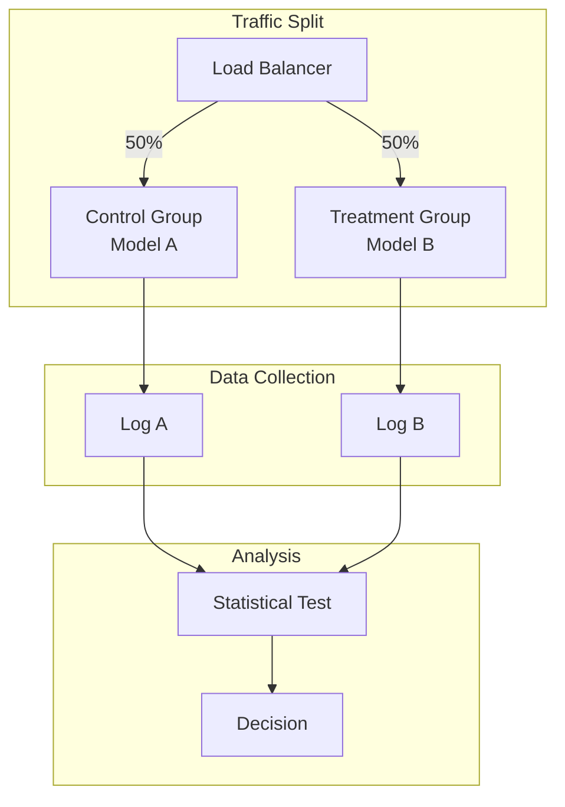
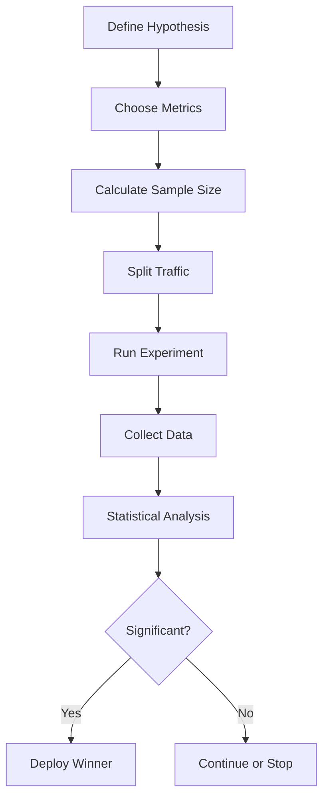

# A/B Testing for ML

## Overview

A/B Testing is a statistical method for comparing two versions of a model or feature to determine which performs better. In ML, it's used to validate model changes before full rollout and to measure business impact.

## A/B Testing Architecture



## A/B Testing Process



## Key Concepts

### 1. Hypothesis Testing
```python
from scipy import stats

# Two-sample t-test
t_stat, p_value = stats.ttest_ind(control_metrics, treatment_metrics)

if p_value < 0.05:
    print("Statistically significant difference")
else:
    print("No significant difference")
```

### 2. Sample Size Calculation
```python
from statsmodels.stats.power import TTestIndPower

power_analysis = TTestIndPower()
sample_size = power_analysis.solve_power(
    effect_size=0.2,  # Minimum detectable effect
    power=0.8,        # Statistical power
    alpha=0.05        # Significance level
)
print(f"Required sample size: {sample_size}")
```

### 3. Metrics

| Metric Type | Examples | When to Use |
|-------------|----------|-------------|
| Binary | Click/no-click, Buy/no-buy | Conversion rates |
| Continuous | Revenue, Time spent | Numeric outcomes |
| Count | Page views, Actions | Frequency metrics |

## Common Pitfalls

### 1. Multiple Testing
```python
# WRONG: Testing many metrics without correction
for metric in metrics:
    if p_value < 0.05:
        declare_significant(metric)

# RIGHT: Apply Bonferroni correction
adjusted_alpha = 0.05 / len(metrics)
for metric in metrics:
    if p_value < adjusted_alpha:
        declare_significant(metric)
```

### 2. Peeking Problem
```python
# WRONG: Checking results daily and stopping early
while experiment_running:
    if check_results().p_value < 0.05:
        stop_experiment()  # Invalid!

# RIGHT: Pre-determined sample size
if current_sample_size >= required_sample_size:
    results = analyze_results()
```

### 3. Novelty Effect
- Users may interact differently with new features initially
- Run experiments long enough to account for this
- Consider segmenting by user type

## A/B vs Other Methods

| Method | Purpose | Duration | Risk |
|--------|---------|----------|------|
| A/B Testing | Compare two versions | Days-Weeks | Low |
| Canary | Gradual rollout | Hours-Days | Very Low |
| Shadow | Validate new model | Hours | Zero |
| Multi-Armed Bandit | Optimize continuously | Ongoing | Low |

## Interview Questions

1. **How do you design an A/B test for a new ML model?**
2. **How do you calculate the required sample size?**
3. **What is statistical significance and how do you determine it?**
4. **How do you handle multiple comparisons?**
5. **What's the difference between A/B testing and canary deployment?**

## Common Mistakes

- **Peeking at results**: Checking too frequently leads to false positives
- **Too short duration**: Not accounting for weekly cycles or novelty effects
- **Wrong metrics**: Optimizing for proxy metrics that don't align with business goals
- **Ignoring segment effects**: Overall effect may hide positive/negative effects on subgroups

## Summary

A/B Testing is essential for validating ML model changes with statistical rigor. Key components include hypothesis testing, sample size calculation, and proper statistical analysis. Avoid common pitfalls like peeking, multiple testing without correction, and running experiments too short. Use A/B testing for important decisions; use canary/shadow for risk mitigation.
