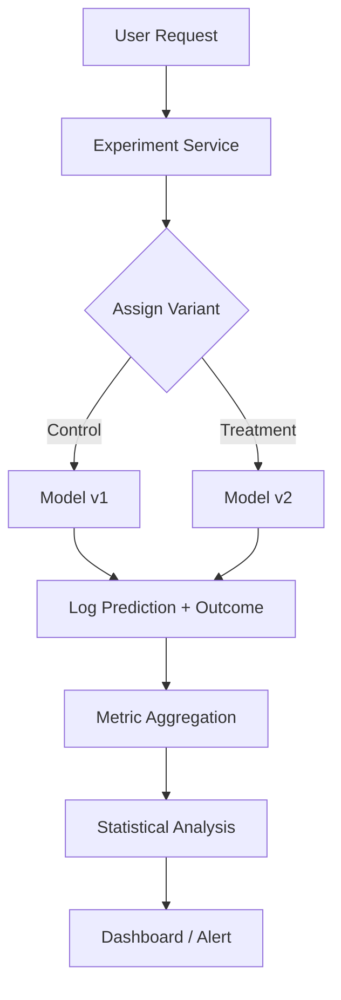

# A/B Testing Design for ML

## Overview

A/B testing in ML compares model versions by serving each to a user subset and measuring business impact. Designing an A/B testing system involves traffic routing, metric collection, statistical analysis, and experiment management.

## System Architecture



## Key Components

### 1. Experiment Assignment

```python
class ExperimentService:
    def __init__(self):
        self.experiments = {}

    def assign_variant(self, user_id, experiment_id):
        """Deterministic assignment using hashing"""
        hash_val = hash(f"{user_id}:{experiment_id}") % 100
        config = self.experiments[experiment_id]

        if hash_val < config['control_pct']:
            return 'control'
        elif hash_val < config['control_pct'] + config['treatment_pct']:
            return 'treatment'
        else:
            return 'holdout'

    def get_model_version(self, user_id, experiment_id):
        variant = self.assign_variant(user_id, experiment_id)
        return self.experiments[experiment_id]['variants'][variant]
```

### 2. Metric Collection

```python
class MetricLogger:
    def log_event(self, user_id, experiment_id, variant, event_type, value):
        """Log experiment events"""
        event = {
            'user_id': user_id,
            'experiment_id': experiment_id,
            'variant': variant,
            'event_type': event_type,  # 'impression', 'click', 'conversion'
            'value': value,
            'timestamp': time.time()
        }
        self.kafka_producer.send('experiment-events', event)
```

### 3. Statistical Analysis

```python
from scipy import stats

def analyze_experiment(control_metrics, treatment_metrics):
    """Two-sample t-test for continuous metrics"""
    t_stat, p_value = stats.ttest_ind(treatment_metrics, control_metrics)
    lift = (treatment_metrics.mean() - control_metrics.mean()) / control_metrics.mean()

    return {
        'p_value': p_value,
        'significant': p_value < 0.05,
        'lift': lift,
        'confidence_interval': stats.t.interval(0.95, df=len(treatment_metrics)-1)
    }
```

## Multi-Armed Bandit

```python
class ThompsonSampling:
    """Bayesian approach to experiment allocation"""
    def __init__(self, n_arms):
        self.alpha = np.ones(n_arms)  # Success counts
        self.beta_param = np.ones(n_arms)   # Failure counts

    def select_arm(self):
        """Sample from Beta distribution, select highest"""
        samples = np.random.beta(self.alpha, self.beta_param)
        return np.argmax(samples)

    def update(self, arm, reward):
        if reward:
            self.alpha[arm] += 1
        else:
            self.beta_param[arm] += 1
```

## Interview Questions

1. **How do you design an A/B testing system for ML models?** — Experiment service for assignment, feature routing to different models, metric logging, statistical analysis engine, and dashboard for results.

2. **How do you handle multiple concurrent experiments?** — Orthogonal experiment layers: each experiment hashes independently. Or factorial design for interaction effects.

3. **A/B testing vs multi-armed bandit?** — A/B: fixed allocation, cleaner statistics, better for understanding. Bandit: adaptive allocation, minimizes regret, better for optimization.

## Summary

A/B testing design for ML requires traffic routing, metric collection, and statistical analysis. Key challenges include consistent assignment, metric attribution, and statistical significance. Multi-armed bandits offer an adaptive alternative for optimization-focused experiments.

## Cross-References

- [A/B Testing (MLOps)](../mlops/ab-testing.md) — Implementation details
- [Canary Deployment](../mlops/canary.md) — Safe rollout
- [Monitoring](./monitoring.md) — Metric tracking
- [Evaluation Metrics](../foundations/evaluation.md) — Offline metrics
