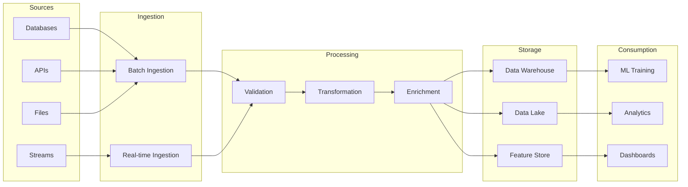
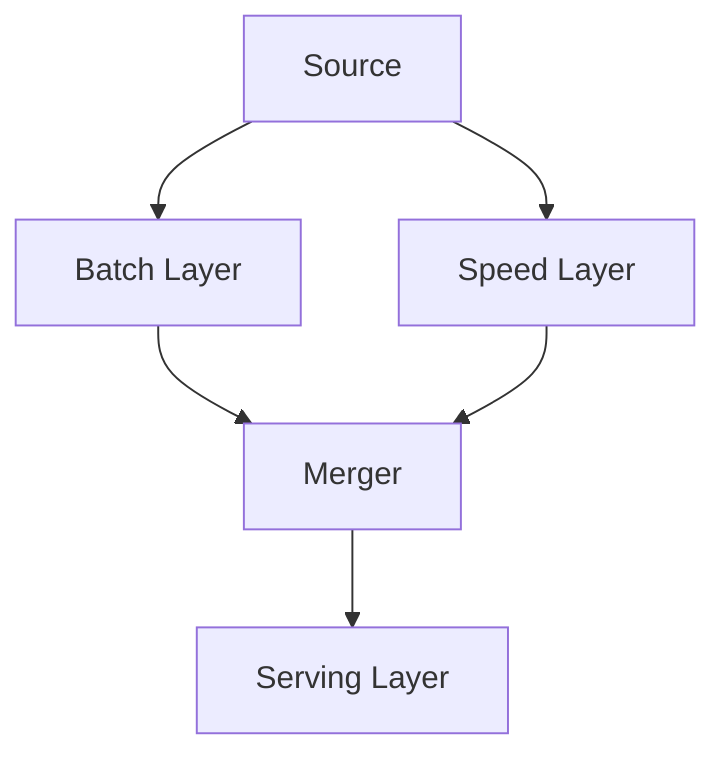
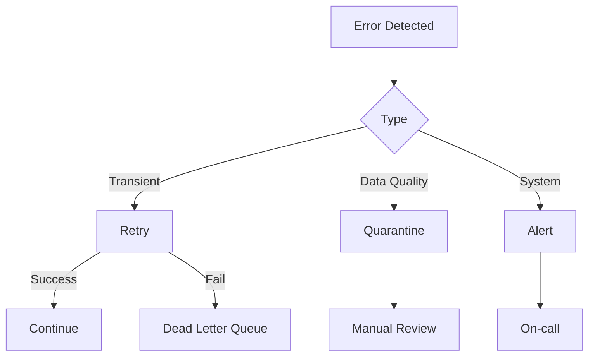

# Data Pipeline Design

## Overview

Data Pipelines are automated workflows that move and transform data from various sources to destinations where it can be used for ML training, serving, and analysis. Good data pipeline design is foundational to successful ML systems.

## Pipeline Architecture



## Pipeline Types

### 1. Batch Pipeline


**Characteristics:**
- Runs on schedule (hourly, daily)
- Processes large volumes
- Higher latency, lower complexity

### 2. Streaming Pipeline


**Characteristics:**
- Processes data in real-time
- Lower latency, higher complexity
- Requires message queue

### 3. Lambda Architecture


- Combines batch and streaming
- Batch for accuracy, streaming for freshness
- Complex but comprehensive

## Data Validation

```python
# Great Expectations example
import great_expectations as gx

context = gx.get_context()

# Define expectations
validator = context.sources.pandas_default.read_csv("data.csv")

# Schema validation
validator.expect_column_to_exist("user_id")
validator.expect_column_values_to_not_be_null("user_id")

# Value validation
validator.expect_column_values_to_be_between("age", 0, 120)
validator.expect_column_values_to_be_in_set("status", ["active", "inactive"])

# Statistical validation
validator.expect_column_mean_to_be_between("purchase_amount", 10, 1000)
```

## Error Handling



## Data Quality Framework

| Check | Description | Action |
|-------|-------------|--------|
| Completeness | Missing values | Alert if > 5% |
| Accuracy | Values in valid range | Quarantine |
| Consistency | Cross-field validation | Flag for review |
| Timeliness | Data freshness | Alert if delayed |
| Uniqueness | Duplicate detection | Deduplicate |

## Interview Questions

1. **How would you design a data pipeline for ML?**
2. **Batch vs streaming — when to use each?**
3. **How do you handle data quality issues?**
4. **Explain the Lambda architecture.**
5. **How do you ensure data freshness for real-time ML?**

## Common Mistakes

- **No validation**: Bad data propagates through the system
- **No error handling**: Silent failures corrupt downstream data
- **No monitoring**: Can't fix what you can't see
- **Tight coupling**: Source changes break the entire pipeline

## Summary

Data Pipeline design is foundational to ML systems. Key decisions include batch vs streaming, data validation, error handling, and monitoring. Use established tools (Airflow, Kafka, Great Expectations) and implement comprehensive validation. Design for failure — assume data will be late, missing, or wrong.
