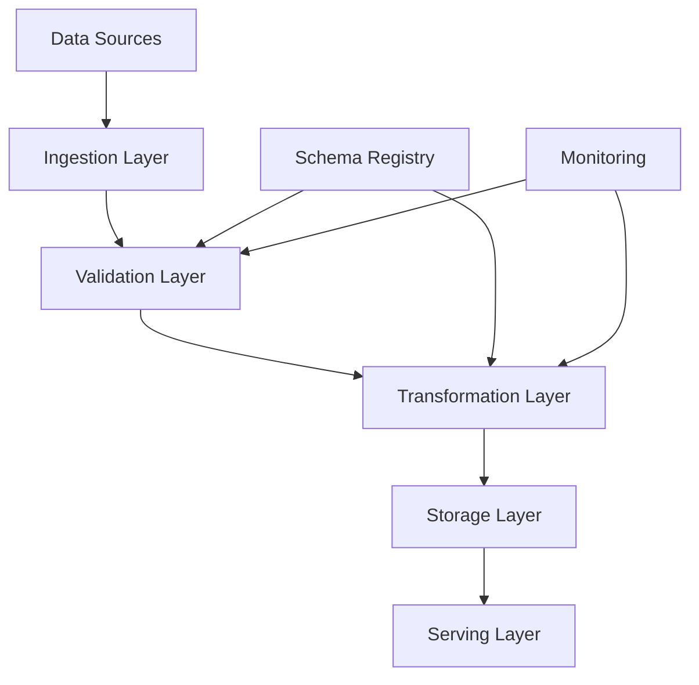
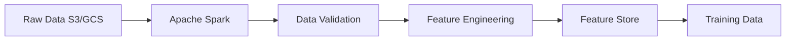

# Data Pipeline Design

## Overview

Data pipelines are the foundation of ML systems — they ingest, validate, transform, and deliver data for training and serving. A well-designed data pipeline ensures data quality, handles schema evolution, and scales to petabytes. This covers both batch and streaming data pipeline architectures.

## Pipeline Architecture



## Batch Pipeline



## Streaming Pipeline


## Data Validation

```python
import great_expectations as ge

def validate_pipeline_data(df):
    """Data quality checks in the pipeline"""
    ge_df = ge.from_pandas(df)

    # Schema checks
    ge_df.expect_column_to_exist("user_id")
    ge_df.expect_column_values_to_not_be_null("user_id")

    # Value checks
    ge_df.expect_column_values_to_be_between("age", 0, 150)
    ge_df.expect_column_values_to_be_in_set("status", ["active", "inactive"])

    # Statistical checks
    ge_df.expect_column_mean_to_be_between("purchase_amount", 10, 10000)
    ge_df.expect_column_unique_value_count_to_be_between("user_id", 1000, 10000000)

    result = ge_df.validate()
    if not result.success:
        raise DataQualityError(f"Validation failed: {result.results}")
```

## Interview Questions

1. **How do you design a data pipeline for ML?** — Ingestion (batch/streaming) → validation (schema, quality) → transformation (cleaning, feature engineering) → storage (data lake, feature store) → serving (training, inference).

2. **Batch vs streaming pipeline?** — Batch: daily/hourly, high throughput, simpler. Streaming: real-time, lower latency, more complex. Many systems use lambda architecture (both).

3. **How do you handle schema evolution?** — Schema registry (Avro, Protobuf), backward-compatible changes, data validation gates, and alerting on schema violations.

## Summary

Data pipelines are the backbone of ML systems. They must handle data ingestion, validation, transformation, and serving at scale. The choice between batch and streaming depends on latency requirements. Data quality validation is critical to prevent garbage-in-garbage-out.

## Cross-References

- [ML Pipeline](./pipeline.md) — ML pipeline orchestration
- [Feature Store](./feature-store.md) — Feature management
- [Data Drift](../mlops/drift.md) — Quality monitoring
- [Kafka](../../distributed/messaging/kafka.md) — Streaming
