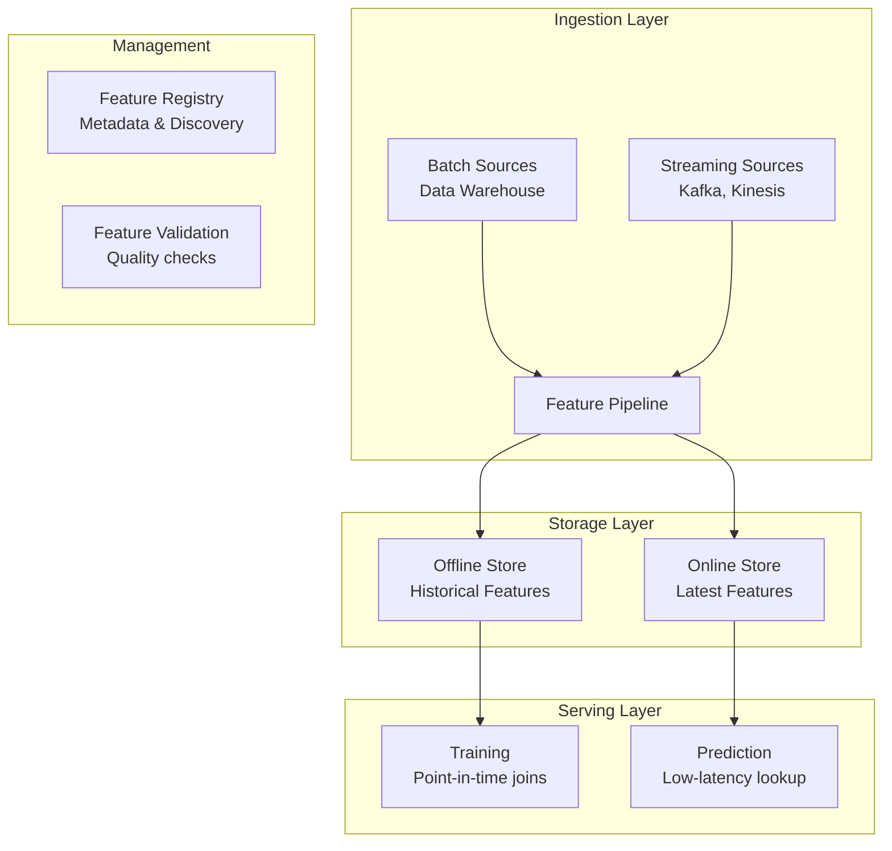
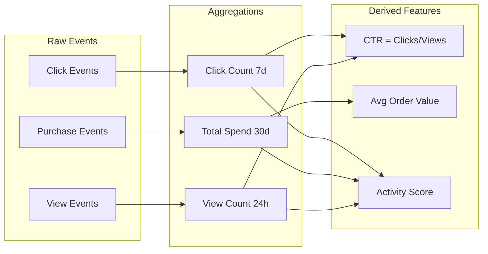
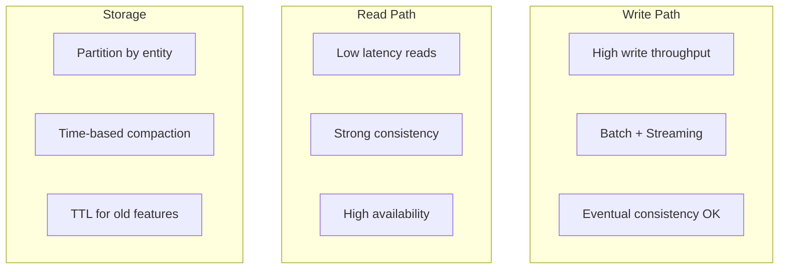

# Feature Store Design

## Overview

A Feature Store is a centralized system for storing, managing, and serving ML features. It solves the critical problem of feature consistency between training and serving, enables feature reuse, and provides point-in-time correct feature retrieval.

## Feature Store Architecture



## Key Design Decisions

### 1. Offline vs Online Store

| Aspect | Offline Store | Online Store |
|--------|--------------|--------------|
| Purpose | Training | Serving |
| Latency | Minutes | Milliseconds |
| Data | Historical | Latest |
| Storage | Data warehouse | Key-value store |
| Example | BigQuery, S3 | Redis, DynamoDB |

### 2. Point-in-Time Correctness

```python
# WRONG: Using future data (data leakage)
def get_features(user_id, prediction_time):
    # This might use data from after prediction_time!
    return get_latest_features(user_id)

# RIGHT: Point-in-time join
def get_features(user_id, prediction_time):
    return feature_store.get_historical_features(
        entity_df=pd.DataFrame({"user_id": [user_id]}),
        features=["user_avg_spend_30d"],
        timestamp=prediction_time
    )
```

### 3. Feature Computation



## Feature Store Schema

```yaml
# Feature definition
feature_group: user_features
entities:
  - name: user_id
    type: string
features:
  - name: total_purchases_30d
    type: int64
    description: "Number of purchases in last 30 days"
  - name: avg_order_value
    type: float64
    description: "Average order value"
  - name: preferred_category
    type: string
    description: "Most purchased category"
ttl: 90 days
online: true
offline: true
```

## Scaling Considerations



## Interview Questions

1. **How would you design a feature store for a large-scale recommendation system?**
2. **How do you handle point-in-time correctness?**
3. **What's the difference between offline and online stores?**
4. **How do you ensure feature consistency between training and serving?**
5. **How would you handle feature freshness requirements?**

## Common Mistakes

- **Training-serving skew**: Different computation logic in training vs serving
- **Data leakage**: Using future data in features
- **No TTL**: Feature store grows unbounded
- **Ignoring freshness**: Stale features lead to poor predictions

## Summary

A Feature Store is essential for production ML systems. It ensures feature consistency, enables reuse, and provides point-in-time correctness. Key design decisions include offline vs online storage, feature computation patterns, and scaling strategies. Use established solutions (Feast, Tecton) rather than building from scratch.
