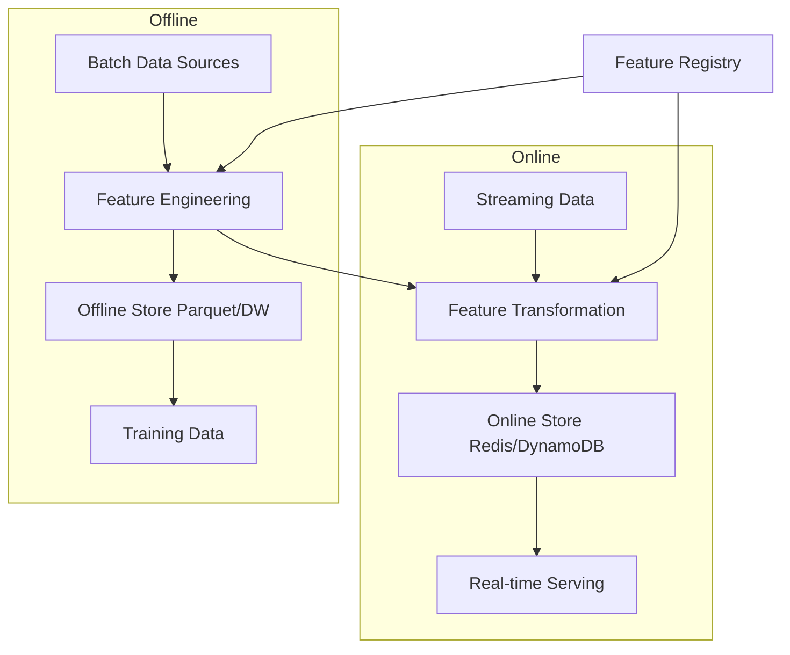

# Feature Store Design

## Overview

A feature store is a centralized system for storing, managing, and serving ML features. It solves training-serving skew, enables feature reuse, and ensures point-in-time correctness. Designing a feature store involves trade-offs between latency, consistency, cost, and complexity.

## Architecture

## Key Design Decisions

### Storage Layer

| Component | Technology | Latency | Cost |
|-----------|-----------|---------|------|
| Offline Store | Parquet/S3, BigQuery | Seconds | Low |
| Online Store | Redis, DynamoDB | Milliseconds | High |
| Feature Registry | PostgreSQL, API | N/A | Low |

### Feature Freshness

| Freshness | Method | Use Case |
|-----------|--------|----------|
| Hours | Batch jobs | User aggregate stats |
| Minutes | Micro-batch | Recent activity |
| Seconds | Streaming (Kafka) | Real-time features |
| Milliseconds | On-demand computation | Derived features |

## Interview Questions

1. **Design a feature store for a recommendation system** — Offline store for user/item historical features, online store for real-time features (recent clicks), feature registry for versioning, and point-in-time joins for training data.

2. **How do you ensure point-in-time correctness?** — When creating training data, join features as of the prediction timestamp, not the current timestamp. Use event_time columns and temporal joins.

3. **Online vs offline feature serving?** — Offline: batch queries on historical data for training. Online: low-latency lookups for real-time inference. Many features are computed offline and loaded into the online store.

## Summary

A feature store design must balance latency, freshness, cost, and consistency. The dual online/offline architecture serves both training and serving needs. Point-in-time correctness is critical for preventing data leakage.

## Cross-References

- [Feature Store (MLOps)](../mlops/feature-store.md) — Implementation details
- [Feature Engineering](../foundations/feature-engineering.md) — Creating features
- [Data Pipeline](./data-pipeline.md) — Data engineering
- [Model Serving](./model-serving.md) — Serving architecture
