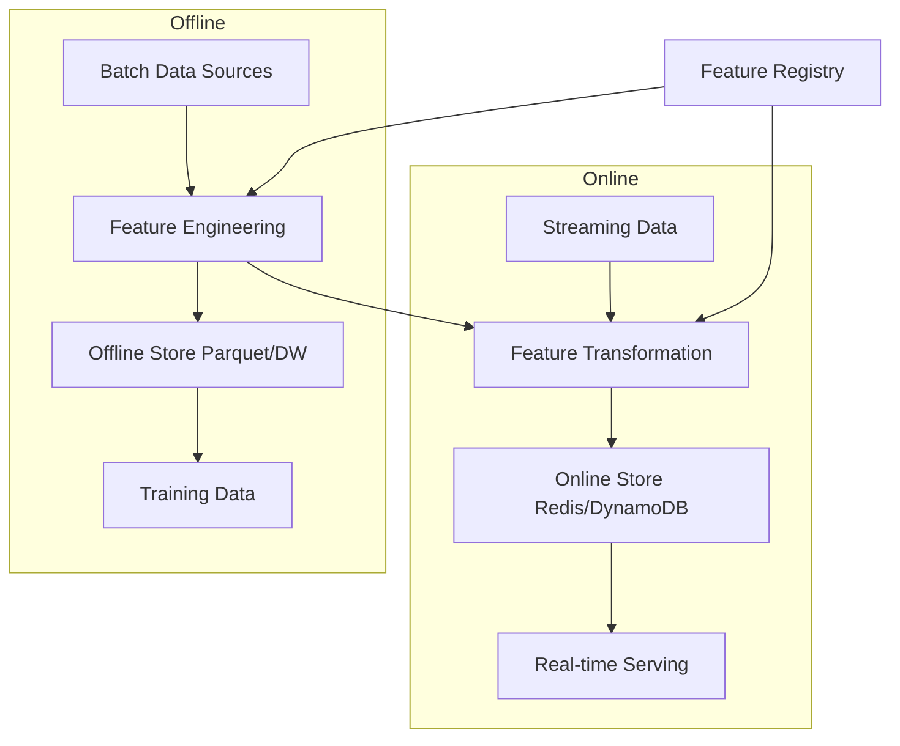
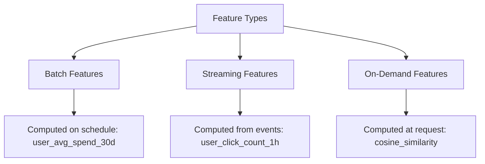
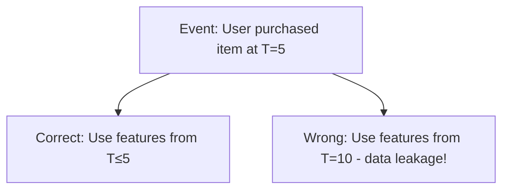

# Feature Store Design

## Overview

A feature store is a centralized system for storing, managing, and serving ML features. It solves training-serving skew, enables feature reuse, and ensures point-in-time correctness. Designing a feature store involves trade-offs between latency, consistency, cost, and complexity.

## Why Feature Stores?

Without a feature store:
- **Training-serving skew**: Features computed differently in training vs serving
- **Duplicated work**: Teams recompute the same features
- **No point-in-time correctness**: Accidental data leakage from future data
- **No feature discovery**: Hard to know what features exist

With a feature store:
- **Consistent features**: Same computation logic for training and serving
- **Feature reuse**: Compute once, use across teams
- **Point-in-time joins**: Prevent data leakage
- **Feature registry**: Discover and share features

## Architecture



### Dual Store Architecture

The feature store maintains two copies of features:

| Store | Purpose | Storage | Latency | Freshness |
|-------|---------|---------|---------|-----------|
| **Offline Store** | Training, batch inference | Parquet/S3, BigQuery, Snowflake | Seconds-hours | Hours-days |
| **Online Store** | Real-time serving | Redis, DynamoDB, Bigtable | Milliseconds | Seconds-minutes |

**Key insight:** Features are computed once (usually in batch) and loaded into both stores. The online store is a materialized view optimized for low-latency lookups.

## Key Design Decisions

### Storage Layer

| Component | Technology | Latency | Cost | Consistency |
|-----------|-----------|---------|------|-------------|
| Offline Store | Parquet/S3, BigQuery | Seconds | Low | Eventual |
| Online Store | Redis, DynamoDB | Milliseconds | High | Eventual/Strong |
| Feature Registry | PostgreSQL, API | N/A | Low | Strong |

### Feature Freshness

| Freshness | Method | Use Case | Cost |
|-----------|--------|----------|------|
| Hours | Batch jobs (Spark) | User aggregate stats, historical features | Low |
| Minutes | Micro-batch (Spark Streaming) | Recent activity | Medium |
| Seconds | Streaming (Kafka + Flink) | Real-time features | High |
| Milliseconds | On-demand computation | Derived features | Variable |

### Feature Computation Patterns



| Pattern | Example | Freshness | Complexity |
|---------|---------|-----------|------------|
| **Batch** | User's 30-day average spend | Hours | Low |
| **Streaming** | User's clicks in last hour | Seconds | Medium |
| **On-demand** | Similarity between query and item | Real-time | High |

## Point-in-Time Correctness

**The problem:** When creating training data, you must use features as they were at the time of prediction, not the current time. Using future data causes data leakage.



### How to Ensure Point-in-Time Correctness

```python
# WRONG: Join on current features
training_data = users.join(features, on="user_id")

# CORRECT: Join on features as of event time
training_data = events.join_asof(
    features,
    on="event_time",
    by="user_id",
    tolerance=pd.Timedelta("1h")  # Allow features up to 1h old
)
```

**Implementation approaches:**
1. **Event-time columns**: Every feature row has a timestamp
2. **Temporal joins**: Join features as of the prediction timestamp
3. **Feature snapshots**: Store feature values at regular intervals
4. **TTL (Time-to-Live)**: Expire stale features automatically

## Feature Store Data Model

```
Feature Store
├── Entity (user, item, transaction)
│   ├── Feature View: user_features
│   │   ├── Feature: age (int)
│   │   ├── Feature: avg_spend_30d (float)
│   │   ├── Feature: preferred_category (string)
│   │   └── Updated: batch (daily)
│   └── Feature View: user_realtime
│       ├── Feature: clicks_last_1h (int)
│       ├── Feature: session_duration (float)
│       └── Updated: streaming (seconds)
└── Entity: item
    ├── Feature View: item_features
    │   ├── Feature: category (string)
    │   ├── Feature: price (float)
    │   └── Updated: batch (daily)
```

## Feature Store Tools Comparison

| Tool | Type | Offline Store | Online Store | Best For |
|------|------|--------------|-------------|----------|
| **Feast** | Open-source | Any (S3, BQ) | Redis, DynamoDB | Lightweight, self-hosted |
| **Tecton** | Managed | Snowflake, S3 | DynamoDB, Redis | Production, real-time |
| **Hopsworks** | Open-source | Hudi, Delta | MySQL, RonDB | Full-featured platform |
| **Vertex AI** | GCP | BigQuery | Vertex Feature Store | GCP users |
| **SageMaker** | AWS | S3, Glue | SageMaker Feature Store | AWS users |
| **Databricks** | Managed | Delta Lake | Delta Lake | Unity Catalog ecosystem |

## Feature Store API

### Define Features

```python
# Feast example
from feast import FeatureView, Entity, Field
from feast.types import Float32, Int64

user = Entity(name="user", join_keys=["user_id"])

user_features = FeatureView(
    name="user_features",
    entities=[user],
    schema=[
        Field(name="avg_spend_30d", dtype=Float32),
        Field(name="purchase_count", dtype=Int64),
    ],
    source=batch_source,
    ttl=timedelta(days=1),
)
```

### Get Training Data

```python
# Point-in-time correct training data
training_df = store.get_historical_features(
    entity_df=events_df,  # Contains event_time column
    features=[
        "user_features:avg_spend_30d",
        "user_features:purchase_count",
        "item_features:category",
    ],
).to_df()
```

### Get Online Features

```python
# Low-latency serving
online_features = store.get_online_features(
    features=[
        "user_features:avg_spend_30d",
        "user_features:clicks_last_1h",
    ],
    entity_rows=[{"user_id": 12345}],
).to_dict()
```

## Scaling a Feature Store

| Scale | Users | Features | QPS | Architecture |
|-------|-------|----------|-----|-------------|
| Small | <10 | <100 | <100 | Single Redis + S3 |
| Medium | 10-50 | 100-1000 | 100-10K | Redis cluster + S3/Delta |
| Large | 50+ | 1000+ | 10K+ | Distributed (DynamoDB + custom) |

### Performance Optimization

1. **Feature caching**: Cache hot features in-memory
2. **Batch reads**: Fetch multiple features in one call
3. **Materialized views**: Pre-compute expensive features
4. **Partitioning**: Partition by entity or time
5. **Compression**: Use columnar formats (Parquet) for offline

## Interview Questions

1. **Design a feature store for a recommendation system.**
   Offline store for user/item historical features (purchase history, browsing stats), online store for real-time features (recent clicks, session info), feature registry for versioning, and point-in-time joins for training data. Use batch features for user profiles, streaming features for real-time behavior.

2. **How do you ensure point-in-time correctness?**
   When creating training data, join features as of the prediction timestamp, not the current timestamp. Use event_time columns and temporal joins (asof joins). Store feature snapshots at regular intervals. Implement TTL for stale features.

3. **Online vs offline feature serving?**
   Offline: batch queries on historical data for training, stored in Parquet/data warehouse. Online: low-latency lookups for real-time inference, stored in Redis/DynamoDB. Many features are computed offline and loaded into the online store. Streaming features are computed in real-time and written to both.

4. **How do you handle feature freshness?**
   Depends on the use case. Batch features (daily user stats) → Spark job, stored in offline store, loaded to online. Streaming features (clicks in last hour) → Kafka + Flink, written directly to online store. On-demand features (similarity) → computed at request time.

5. **How do you prevent training-serving skew?**
   (1) Use the same feature computation code for both. (2) Feature store enforces consistent transformations. (3) Validate features during serving (schema checks). (4) Monitor feature distributions in both pipelines.

## Summary

A feature store design must balance latency, freshness, cost, and consistency. The dual online/offline architecture serves both training and serving needs. Point-in-time correctness is critical for preventing data leakage. The choice of tools depends on scale, cloud provider, and real-time requirements.

## References

- Feast documentation (feast.dev) — Open-source feature store
- Huyen, C. (2022). *Designing Machine Learning Systems* — Chapter on feature engineering
- Drysdale, J. et al. (2023). "Feature Stores for ML" — Tecton blog series
- Airbnb's Zipline — Feature engineering framework
- Uber's Michelangelo — ML platform with feature store

## Cross-References

- [Feature Store (MLOps)](../mlops/feature-store.md) — Implementation details
- [Feature Engineering](../foundations/feature-engineering.md) — Creating features
- [Data Pipeline](./data-pipeline.md) — Data engineering
- [Model Serving](./model-serving.md) — Serving architecture
