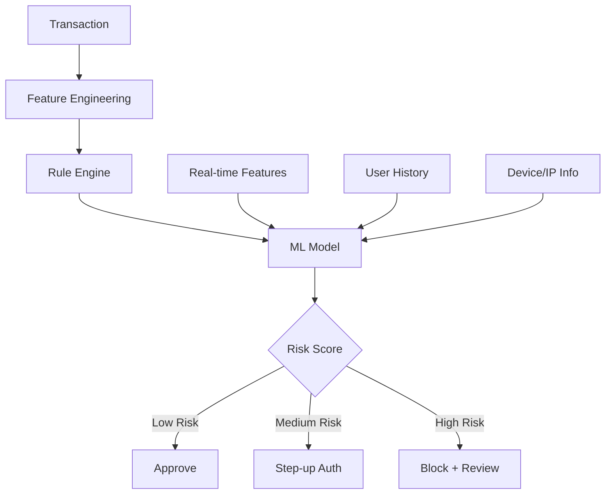

# Fraud Detection System Design

## Overview

Fraud detection systems identify fraudulent transactions in real-time, balancing detection accuracy with user experience. The challenge is extreme class imbalance (~0.1% fraud), adversarial evolution (fraudsters adapt), and strict latency requirements (<100ms). This is one of the most common ML system design interview questions.

## System Architecture



## Feature Engineering

```python
def engineer_fraud_features(transaction, user_history):
    features = {}

    # Transaction features
    features['amount'] = transaction['amount']
    features['hour_of_day'] = transaction['timestamp'].hour
    features['day_of_week'] = transaction['timestamp'].weekday()
    features['merchant_category'] = transaction['category']

    # Velocity features (aggregates over time windows)
    features['num_txns_last_hour'] = count_transactions(user_history, hours=1)
    features['num_txns_last_day'] = count_transactions(user_history, hours=24)
    features['amount_last_hour'] = sum_amounts(user_history, hours=1)
    features['unique_merchants_last_day'] = unique_merchants(user_history, hours=24)

    # Behavioral features
    features['avg_transaction_amount'] = mean(user_history['amount'])
    features['amount_deviation'] = (transaction['amount'] - features['avg_transaction_amount']) / std(user_history['amount'])
    features['is_new_merchant'] = transaction['merchant_id'] not in user_history['merchants']
    features['is_foreign'] = transaction['country'] != user_history['home_country']

    # Device/IP features
    features['is_new_device'] = transaction['device_id'] not in user_history['devices']
    features['is_vpn'] = transaction['ip'] in vpn_database
    features['device_risk_score'] = device_risk(transaction['device_id'])

    return features
```

## Model Design

### Handling Class Imbalance

```python
from imblearn.over_sampling import SMOTE
from sklearn.ensemble import GradientBoostingClassifier

# SMOTE oversampling
smote = SMOTE(sampling_strategy=0.1)  # 1:10 ratio
X_resampled, y_resampled = smote.fit_resample(X_train, y_train)

# Class weights
model = GradientBoostingClassifier(
    class_weight={0: 1, 1: 100},  # Weight fraud class 100x
    n_estimators=500
)

# Or use focal loss for neural networks
def focal_loss(pred, target, gamma=2, alpha=0.25):
    ce = F.cross_entropy(pred, target, reduction='none')
    pt = torch.exp(-ce)
    focal = alpha * (1 - pt) ** gamma * ce
    return focal.mean()
```

### Two-Stage Model

```python
# Stage 1: Fast rules + simple model (catches 80% of fraud)
def fast_screen(transaction):
    # Rule-based checks
    if transaction['amount'] > 10000:
        return 'high_risk'
    if velocity_check(transaction):
        return 'high_risk'

    # Simple model (logistic regression, fast)
    score = simple_model.predict_proba(features)[0][1]
    if score > 0.8:
        return 'high_risk'
    elif score < 0.1:
        return 'low_risk'
    return 'needs_deep_check'

# Stage 2: Complex model (for medium-risk transactions)
def deep_check(transaction, features):
    score = complex_model.predict_proba(features)[0][1]
    return score
```

## Real-Time Feature Store

```python
class FraudFeatureStore:
    def __init__(self, redis_client):
        self.redis = redis_client

    def get_velocity_features(self, user_id):
        """Get real-time velocity features"""
        key = f"user:{user_id}:velocity"
        data = self.redis.hgetall(key)
        return {
            'txn_count_1h': int(data.get('count_1h', 0)),
            'amount_1h': float(data.get('amount_1h', 0)),
            'txn_count_24h': int(data.get('count_24h', 0)),
        }

    def update_velocity(self, user_id, transaction):
        """Update velocity counters after transaction"""
        pipe = self.redis.pipeline()
        key = f"user:{user_id}:velocity"
        pipe.hincrby(key, 'count_1h', 1)
        pipe.hincrbyfloat(key, 'amount_1h', transaction['amount'])
        pipe.expire(key, 86400)  # 24h TTL
        pipe.execute()
```

## Evaluation Metrics

| Metric | Formula | Importance |
|--------|---------|------------|
| Precision | TP / (TP + FP) | Minimize false positives (user friction) |
| Recall | TP / (TP + FN) | Catch as much fraud as possible |
| F1 Score | 2 * P * R / (P + R) | Balance precision and recall |
| AUC-ROC | Area under ROC | Overall discrimination |
| $ Saved | Caught fraud amount | Business impact |

## Interview Questions

1. **Design a fraud detection system** — Feature engineering (velocity, behavioral, device) → Rules engine (fast screening) → ML model (gradient boosting) → Real-time serving (<100ms) → Human review queue.

2. **How do you handle class imbalance?** — Class weighting, SMOTE, focal loss, and evaluation with precision/recall (not accuracy). Business-driven threshold: optimize for dollars saved, not accuracy.

3. **How do you handle adversarial evolution?** — Continuous retraining, monitoring for concept drift, adversarial training, and ensemble of diverse models. Fraudsters adapt to rules.

4. **What features are most important?** — Velocity features (transaction frequency/amount in time windows), device/IP reputation, behavioral deviation from user history, and merchant risk scores.

5. **How do you balance fraud prevention with user experience?** — Multi-tier response: approve low-risk, step-up authentication (OTP) for medium-risk, block high-risk. Tune thresholds to minimize false positives while maintaining recall.

## Summary

Fraud detection systems combine rule engines with ML models for real-time transaction scoring. Key challenges include class imbalance, adversarial evolution, and latency requirements. Velocity features and behavioral deviation are the most predictive signals. A two-stage architecture (fast screening + deep analysis) balances speed and accuracy.

## Cross-References

- [Evaluation Metrics](../foundations/evaluation.md) — Precision, recall, F1
- [Feature Store](./feature-store.md) — Real-time features
- [Model Serving](./model-serving.md) — Real-time inference
- [Data Drift](../mlops/drift.md) — Concept drift detection
- [Time Series Anomaly Detection](../time-series/anomaly.md) — Anomaly methods
