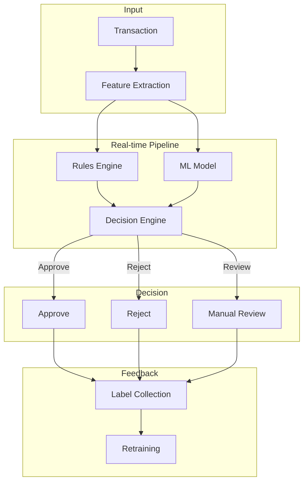
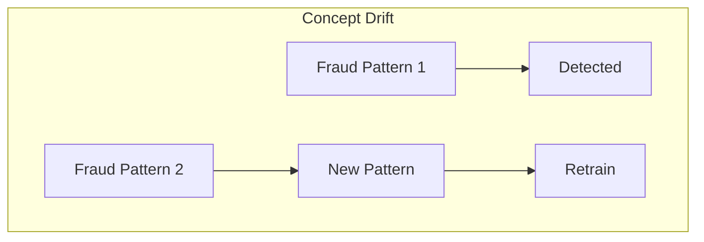
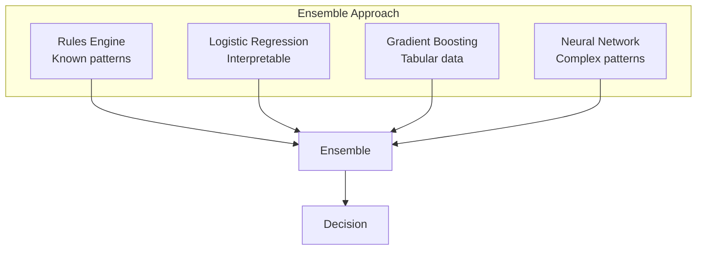

# Fraud Detection System Design

## Overview

Fraud Detection systems identify fraudulent transactions or activities in real-time. They must handle extreme class imbalance (99.9% legitimate), operate at low latency, and adapt to evolving fraud patterns.

## System Architecture



## Key Challenges

### 1. Class Imbalance
```python
# Handling imbalanced data
from imblearn.over_sampling import SMOTE
from imblearn.under_sampling import RandomUnderSampler

# SMOTE oversampling
smote = SMOTE(sampling_strategy=0.1)
X_resampled, y_resampled = smote.fit_resample(X_train, y_train)

# Class weights
model = RandomForestClassifier(class_weight='balanced')

# Evaluation metrics for imbalanced data
from sklearn.metrics import precision_recall_curve, average_precision_score
```

### 2. Real-time Latency


### 3. Evolving Patterns


## Feature Engineering

| Category | Features |
|----------|----------|
| Transaction | Amount, time, location, merchant |
| User | History, spending patterns, account age |
| Device | IP, device type, browser fingerprint |
| Behavioral | Typing speed, navigation patterns |
| Network | Connection to known fraud rings |

```python
# Velocity features
def compute_velocity_features(user_id, transaction):
    recent = get_recent_transactions(user_id, hours=24)
    
    return {
        'txn_count_1h': len([t for t in recent if t.age < 1]),
        'txn_count_24h': len(recent),
        'total_amount_24h': sum(t.amount for t in recent),
        'unique_merchants_24h': len(set(t.merchant for t in recent)),
        'avg_amount_30d': mean([t.amount for t in get_transactions(user_id, days=30)])
    }
```

## Model Architecture



## Rules vs ML

| Aspect | Rules | ML |
|--------|-------|-----|
| Speed | Very fast | Fast |
| Interpretability | High | Varies |
| Adaptability | Manual updates | Automatic learning |
| Coverage | Known patterns | Novel patterns |
| Maintenance | High | Low |

**Best Practice:** Combine both — rules for known fraud, ML for novel patterns.

## Evaluation

| Metric | Why Important |
|--------|---------------|
| Precision | Minimize false positives (blocking legitimate users) |
| Recall | Catch as much fraud as possible |
| F1 Score | Balance precision and recall |
| AUC-PR | Better than AUC-ROC for imbalanced data |
| Dollar Amount Caught | Business impact |

## Interview Questions

1. **Design a fraud detection system for a payment platform.**
2. **How do you handle class imbalance in fraud detection?**
3. **How do you ensure real-time latency requirements?**
4. **How do you adapt to new fraud patterns?**
5. **What's the trade-off between precision and recall in fraud detection?**

## Common Mistakes

- **Only optimizing for recall**: Blocking legitimate users is costly
- **Ignoring latency**: Real-time decisions require fast models
- **Not retraining**: Fraud patterns evolve constantly
- **No human-in-the-loop**: Edge cases need manual review

## Summary

Fraud Detection requires real-time processing, handling extreme class imbalance, and adapting to evolving patterns. Key components include feature engineering (especially velocity features), ensemble models (rules + ML), and continuous retraining. Balance precision (minimize false positives) and recall (catch fraud) based on business requirements.
