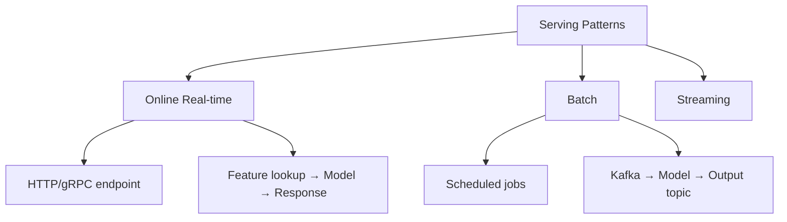

# Model Serving Design

## Overview

Model serving is the infrastructure that delivers ML model predictions to applications. Designing a model serving system involves trade-offs between latency, throughput, cost, and reliability. The architecture must handle varying traffic patterns, model updates, and feature lookups.

## Serving Architectures



## System Design


### Key Components

| Component | Purpose | Options |
|-----------|---------|---------|
| Load Balancer | Distribute traffic | Nginx, ALB, Envoy |
| API Gateway | Auth, rate limiting | Kong, AWS API Gateway |
| Feature Service | Fetch features | Feature store client |
| Model Server | Inference | TF Serving, TorchServe, Triton |
| Cache | Avoid recomputation | Redis, Memcached |

## Scaling Strategies

```python
# Auto-scaling configuration
autoscaling_config = {
    "min_replicas": 2,
    "max_replicas": 50,
    "target_cpu_utilization": 70,
    "target_latency_ms": 100,
    "scale_up_rate": 2,    # Double replicas
    "scale_down_rate": 0.5  # Halve replicas
}
```

## Interview Questions

1. **How do you design a low-latency model serving system?** — Use efficient model format (ONNX, TensorRT), feature caching, request batching, model optimization (quantization), and deployment close to users (edge/CDN).

2. **How do you handle traffic spikes?** — Auto-scaling based on latency/CPU, request queuing with backpressure, pre-warming instances, and caching frequent predictions.

3. **What is model server comparison?** — TF Serving: TensorFlow native. TorchServe: PyTorch native. Triton: multi-framework, GPU optimization. vLLM: LLM-specific.

## Summary

Model serving design must balance latency, throughput, and cost. Key decisions include serving pattern (online/batch/streaming), model format, caching strategy, and scaling approach. Production systems typically use a load balancer → API gateway → feature service → model server architecture.

## Cross-References

- [Model Deployment](../mlops/deployment.md) — Deployment patterns
- [ML Pipeline](./pipeline.md) — Training pipeline
- [Feature Store](./feature-store.md) — Feature serving
- [Monitoring](./monitoring.md) — Post-deployment monitoring
