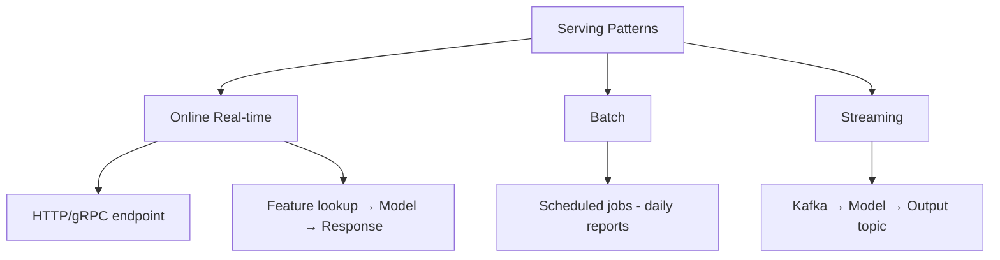
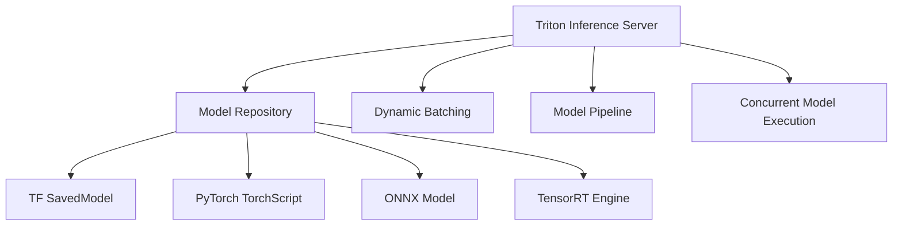
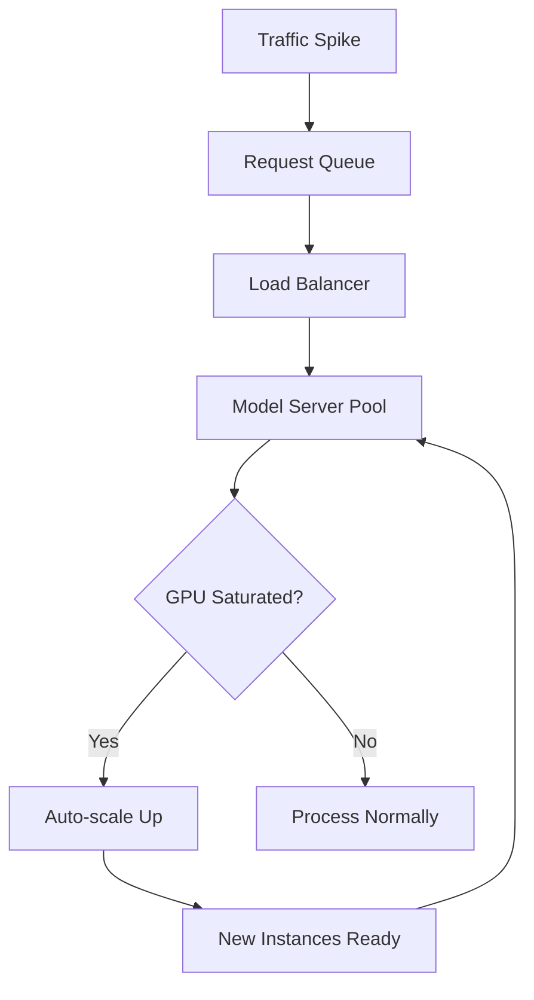
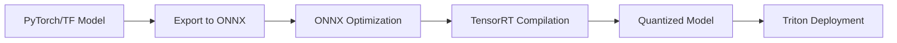
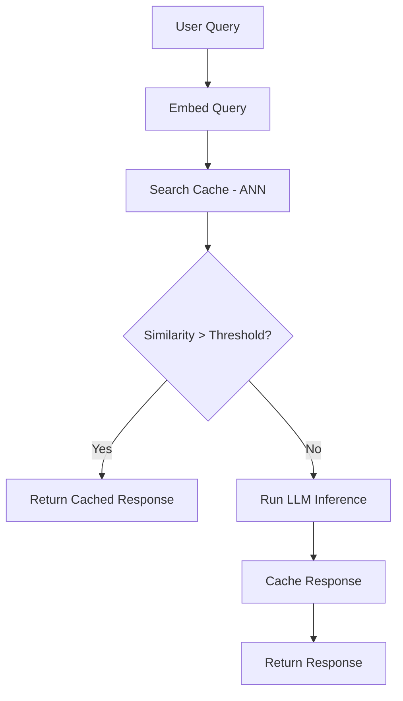
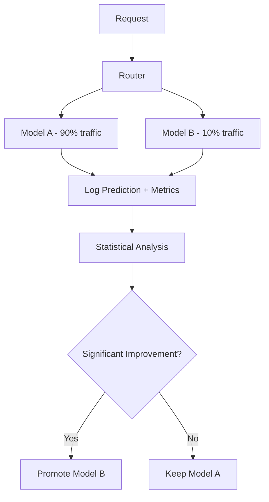

# Model Serving Design

## Overview

Model serving is the infrastructure that delivers ML model predictions to applications. Designing a model serving system involves trade-offs between latency, throughput, cost, and reliability. The architecture must handle varying traffic patterns, model updates, and feature lookups.

## Serving Architectures



### Pattern Comparison

| Pattern | Latency | Throughput | Complexity | Use Case |
|---------|---------|-----------|------------|----------|
| **Online/Synchronous** | <100ms | Medium | High | Search, fraud detection |
| **Online/Asynchronous** | Seconds | High | Medium | Email notifications |
| **Batch** | Hours | Very high | Low | Recommendations, reports |
| **Streaming** | Seconds | High | High | Event-driven, real-time features |

## System Design


### Key Components

| Component | Purpose | Options |
|-----------|---------|---------|
| Load Balancer | Distribute traffic | Nginx, ALB, Envoy |
| API Gateway | Auth, rate limiting, routing | Kong, AWS API Gateway |
| Feature Service | Fetch features for inference | Feature store client |
| Model Server | Run model inference | TF Serving, TorchServe, Triton, vLLM |
| Cache | Avoid recomputation | Redis, Memcached |

## Model Server Comparison

| Server | Framework | Protocol | GPU Support | Best For |
|--------|-----------|----------|-------------|----------|
| **TensorFlow Serving** | TensorFlow | gRPC, REST | Yes | TF models |
| **TorchServe** | PyTorch | REST | Yes | PyTorch models |
| **Triton Inference Server** | Multi-framework | gRPC, REST | Yes | Mixed models, production |
| **vLLM** | PyTorch (LLM) | OpenAI API | Yes | LLM inference |
| **ONNX Runtime** | ONNX | C++/Python | Yes | Cross-framework |
| **BentoML** | Multi-framework | REST | Yes | Easy packaging |

### Triton Inference Server Deep Dive

Triton is the most versatile production model server:



**Key features:**
- **Dynamic batching**: Automatically batches incoming requests for GPU efficiency
- **Model ensemble**: Chain pre-processing → model → post-processing
- **Concurrent execution**: Run multiple models simultaneously on different GPUs
- **Model warmup**: Pre-load models to avoid cold start latency

### vLLM for LLM Serving

vLLM is the standard for LLM inference:

| Feature | Description |
|---------|-------------|
| **PagedAttention** | Efficient KV cache management (inspired by OS virtual memory) |
| **Continuous batching** | Dynamic request batching for high throughput |
| **Tensor parallelism** | Split model across multiple GPUs |
| **Quantization** | GPTQ, AWQ, FP8 support |
| **OpenAI-compatible API** | Drop-in replacement for OpenAI API |

**PagedAttention explained:** Traditional LLM serving pre-allocates contiguous GPU memory for each request's KV cache, leading to memory waste. PagedAttention divides memory into fixed-size blocks and maps them non-contiguously, achieving near-optimal memory utilization.

## Scaling Strategies

### Auto-scaling Configuration

```python
autoscaling_config = {
    "min_replicas": 2,
    "max_replicas": 50,
    "target_cpu_utilization": 70,
    "target_gpu_utilization": 80,
    "target_latency_p99_ms": 200,
    "scale_up_rate": 2,      # Double replicas
    "scale_down_rate": 0.5,   # Halve replicas
    "scale_up_cooldown_sec": 60,
    "scale_down_cooldown_sec": 300,
}
```

### Scaling Dimensions

| Dimension | How | When |
|-----------|-----|------|
| **Horizontal** | Add more replicas | Traffic increases |
| **Vertical** | Bigger instances/GPUs | Model doesn't fit in memory |
| **Model parallelism** | Split model across GPUs | Very large models (LLMs) |
| **Data parallelism** | Same model, different data | High throughput needed |

### Traffic Management



## Model Optimization for Serving

### Optimization Pipeline



| Optimization | Speedup | Accuracy Loss | Effort |
|-------------|---------|---------------|--------|
| **ONNX export** | 2-3× | None | Low |
| **TensorRT** | 3-5× | Minimal | Medium |
| **INT8 quantization** | 2-4× | Small | Low |
| **FP16 inference** | 1.5-2× | Negligible | Low |
| **Operator fusion** | 1.5-2× | None | Automatic |
| **Knowledge distillation** | 2-10× | Small-Medium | High |

### Request Batching

| Strategy | Description | Trade-off |
|----------|-------------|-----------|
| **Static batching** | Fixed batch size | Simple, wastes GPU on small batches |
| **Dynamic batching** | Batch requests arriving within a time window | Better utilization, adds latency |
| **Continuous batching** | Add/remove requests from batch mid-generation | Best for LLMs, complex |

```python
# Dynamic batching configuration (Triton)
model_config = {
    "max_batch_size": 64,
    "preferred_batch_size": [8, 16, 32],
    "max_queue_delay_microseconds": 100000,  # 100ms
}
```

## Caching Strategies

| Cache Type | What to Cache | Hit Rate | Invalidation |
|-----------|---------------|----------|-------------|
| **Exact match** | Same input → same output | Low | TTL |
| **Semantic** | Similar inputs → cached output | Medium | Similarity threshold |
| **Feature cache** | Pre-computed features | High | On feature update |
| **Model cache** | Loaded model in GPU memory | N/A | On model update |

### Semantic Caching for LLMs



## Multi-Model Serving

| Strategy | Description | When to Use |
|----------|-------------|-------------|
| **Single model per server** | One model, dedicated resources | Simple, predictable |
| **Multi-model server** | Multiple models on same server | Low-traffic models, cost savings |
| **Model pipeline** | Chain models (preprocess → model → postprocess) | Complex workflows |
| **A/B testing** | Route % of traffic to different models | Experimentation |

### A/B Testing Architecture



## Deployment Patterns

| Pattern | Description | Rollback Speed | Risk |
|---------|-------------|---------------|------|
| **Blue-Green** | Two identical environments, switch traffic | Instant | Low |
| **Canary** | Gradually route traffic to new model | Fast | Low |
| **Shadow** | Run new model alongside, compare results | N/A (no traffic) | None |
| **Rolling** | Update instances one by one | Medium | Medium |

## Interview Questions

1. **How do you design a low-latency model serving system?**
   Use efficient model format (ONNX, TensorRT), feature caching, request batching, model optimization (quantization), and deployment close to users (edge/CDN). For LLMs, use vLLM with PagedAttention.

2. **How do you handle traffic spikes?**
   Auto-scaling based on latency/CPU/GPU metrics, request queuing with backpressure, pre-warming instances (predictable spikes), caching frequent predictions, and graceful degradation (serve cached/simpler model under extreme load).

3. **What is model server comparison?**
   TF Serving: TensorFlow native. TorchServe: PyTorch native. Triton: multi-framework, GPU optimization, production-grade. vLLM: LLM-specific, PagedAttention. BentoML: easy packaging, developer-friendly.

4. **How do you serve multiple models efficiently?**
   Use Triton's multi-model serving (share GPU memory), model ensemble pipelines, and dynamic batching. For LLMs, use vLLM's continuous batching. Route requests to appropriate model based on task type.

5. **How do you handle model versioning in serving?**
   Model registry with versioned artifacts. Serve multiple versions simultaneously (A/B testing). Use canary deployment for new versions. Keep previous version warm for instant rollback.

## Summary

Model serving design must balance latency, throughput, and cost. Key decisions include serving pattern (online/batch/streaming), model format, caching strategy, and scaling approach. Production systems typically use a load balancer → API gateway → feature service → model server architecture.

## References

- NVIDIA Triton Inference Server documentation
- vLLM: Easy, Fast, and Cheap LLM Serving (Kwon et al., 2023)
- TensorFlow Serving architecture guide
- BentoML documentation (bentoml.com)
- Clipper: A Low-Latency Online Prediction Serving System (Crankshaw et al., 2017)

## Cross-References

- [Model Deployment](../mlops/deployment.md) — Deployment patterns
- [ML Pipeline](./pipeline.md) — Training pipeline
- [Feature Store](./feature-store.md) — Feature serving
- [Monitoring](./monitoring.md) — Post-deployment monitoring
