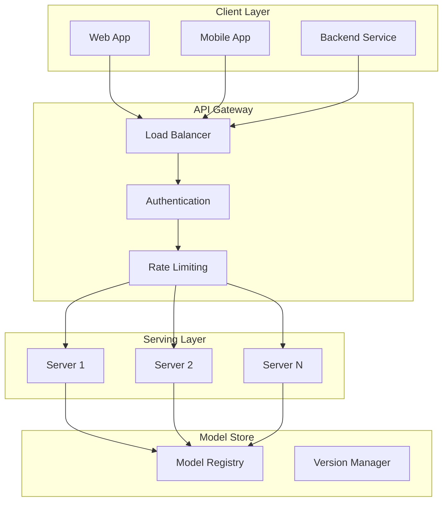
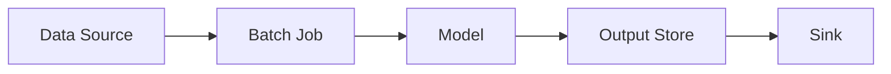
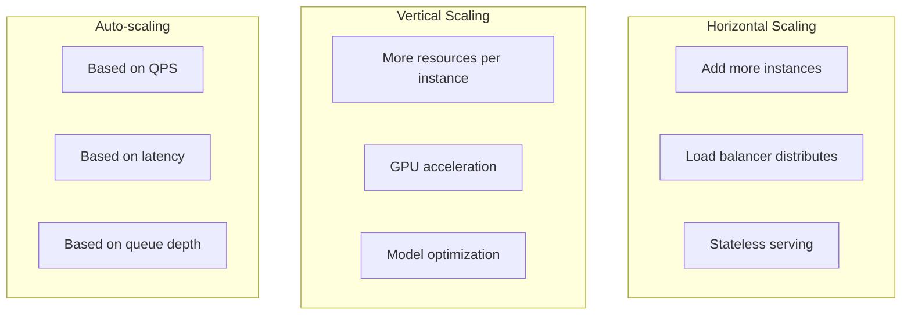

# Model Serving Design

## Overview

Model Serving is the process of making trained ML models available for inference in production. It involves designing scalable, low-latency systems that can handle high throughput while maintaining reliability.

## Serving Architecture



## Serving Patterns

### 1. Real-time Serving


**Requirements:**
- Latency: < 100ms (P99)
- Throughput: 1000+ QPS
- Availability: 99.9%+

### 2. Batch Serving


**Requirements:**
- Process millions of records
- Scheduled or triggered
- Cost-efficient

### 3. Streaming Serving


**Requirements:**
- Near real-time (seconds)
- Event-driven
- Scalable

## Model Optimization

| Technique | Description | Use Case |
|-----------|-------------|----------|
| Quantization | Reduce precision (FP32→INT8) | Edge devices, CPU serving |
| Pruning | Remove unnecessary weights | Model compression |
| Distillation | Train smaller model | Custom compression |
| ONNX Export | Framework-agnostic format | Cross-platform serving |
| TensorRT | NVIDIA GPU optimization | GPU serving |

## Serving Frameworks

| Framework | Language | Key Feature |
|-----------|----------|-------------|
| TensorFlow Serving | C++ | TF native, gRPC |
| TorchServe | Python | PyTorch native |
| Triton | C++ | Multi-framework, GPU |
| BentoML | Python | Easy packaging |
| Seldon Core | Python | Kubernetes-native |

## Scaling Strategies



## Caching Strategy

```python
# Feature caching
class FeatureCache:
    def __init__(self, ttl=300):
        self.cache = {}
        self.ttl = ttl
    
    def get(self, key):
        if key in self.cache:
            value, timestamp = self.cache[key]
            if time.time() - timestamp < self.ttl:
                return value
        return None
    
    def set(self, key, value):
        self.cache[key] = (value, time.time())
```

## Interview Questions

1. **How would you design a model serving system for 10K QPS?**
2. **What are the trade-offs between real-time and batch serving?**
3. **How do you handle model versioning in serving?**
4. **Explain model optimization techniques for deployment.**
5. **How do you ensure low latency in model serving?**

## Common Mistakes

- **No health checks**: Serving fails silently without monitoring
- **Ignoring latency**: Training accuracy means nothing if inference is too slow
- **No caching**: Repeated feature lookups waste resources
- **Over-provisioning**: Without auto-scaling, costs balloon

## Summary

Model Serving design requires balancing latency, throughput, and cost. Key decisions include serving pattern (real-time, batch, streaming), model optimization (quantization, pruning), and scaling strategy (horizontal, vertical, auto-scaling). Use established frameworks (TF Serving, Triton) and implement caching, health checks, and monitoring.
