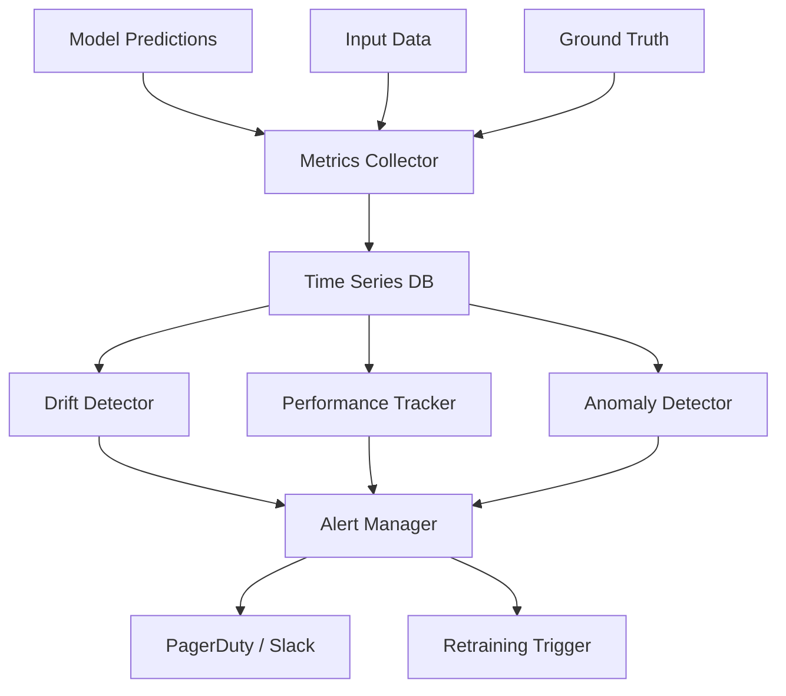

# ML Monitoring System Design

## Overview

ML monitoring tracks model health, data quality, and business impact in production. Unlike traditional software monitoring (CPU, memory), ML monitoring must detect data drift, concept drift, and prediction quality degradation. Designing a monitoring system involves choosing what to measure, how to detect anomalies, and when to alert.

## Monitoring Architecture



## What to Monitor

| Category | Metrics | Frequency |
|----------|---------|-----------|
| Data Quality | Missing rate, schema violations, range checks | Per request |
| Data Drift | PSI, KS test, distribution shift | Hourly/Daily |
| Prediction | Distribution, confidence, latency | Per request |
| Performance | Accuracy, F1 (if labels available) | Daily/Weekly |
| System | CPU, memory, GPU, error rate | Real-time |
| Business | Revenue, conversion, engagement | Daily |

## Alerting Rules

```python
alerting_rules = {
    "data_drift": {
        "condition": "PSI > 0.25",
        "severity": "WARNING",
        "action": "investigate"
    },
    "performance_drop": {
        "condition": "accuracy < baseline * 0.95",
        "severity": "CRITICAL",
        "action": "rollback_and_retrain"
    },
    "latency_spike": {
        "condition": "p99_latency > 500ms",
        "severity": "WARNING",
        "action": "scale_up"
    },
    "error_rate": {
        "condition": "error_rate > 1%",
        "severity": "CRITICAL",
        "action": "investigate_and_rollback"
    }
}
```

## Interview Questions

1. **Design an ML monitoring system** — Collect predictions, inputs, and ground truth. Store in time-series DB. Run drift detection (PSI, KS), performance tracking, and anomaly detection. Alert on degradation. Trigger retraining.

2. **How do you detect model degradation without ground truth?** — Monitor prediction distribution shifts, feature drift, confidence score changes, and business metric trends.

3. **How do you handle monitoring at scale?** — Sample predictions (don't log everything), aggregate metrics in windows, use efficient statistical tests, and separate real-time vs batch monitoring.

## Summary

ML monitoring goes beyond traditional system monitoring by tracking data drift, prediction quality, and business impact. A well-designed system detects degradation early, alerts the right team, and can trigger automated retraining.

## Cross-References

- [Model Monitoring (MLOps)](../mlops/monitoring.md) — Implementation details
- [Data Drift](../mlops/drift.md) — Drift detection methods
- [A/B Testing](./ab-testing.md) — Online evaluation
- [ML Pipeline](./pipeline.md) — Retraining automation
