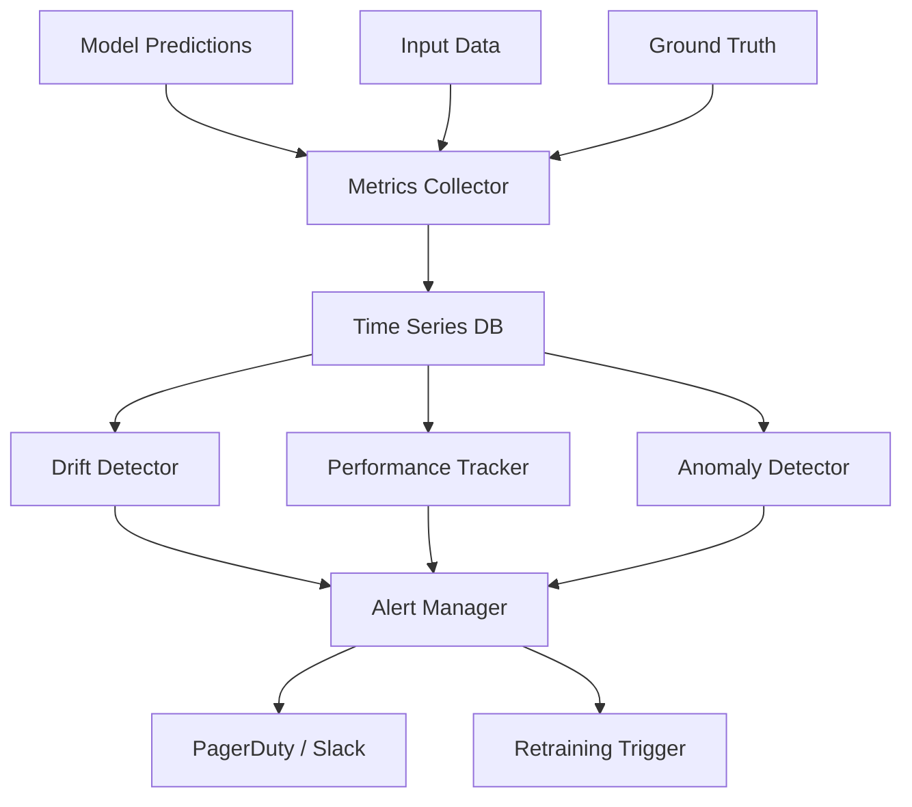
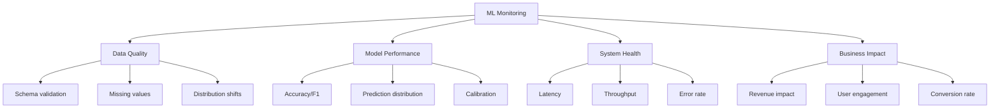
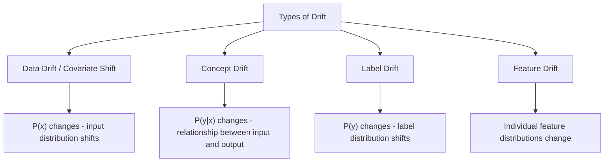
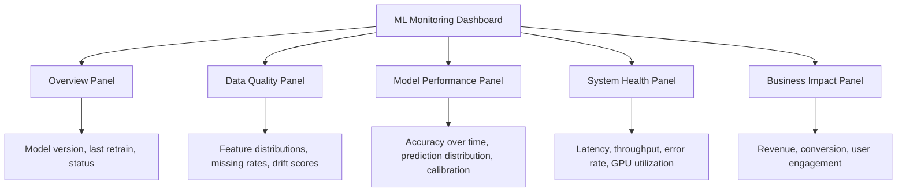
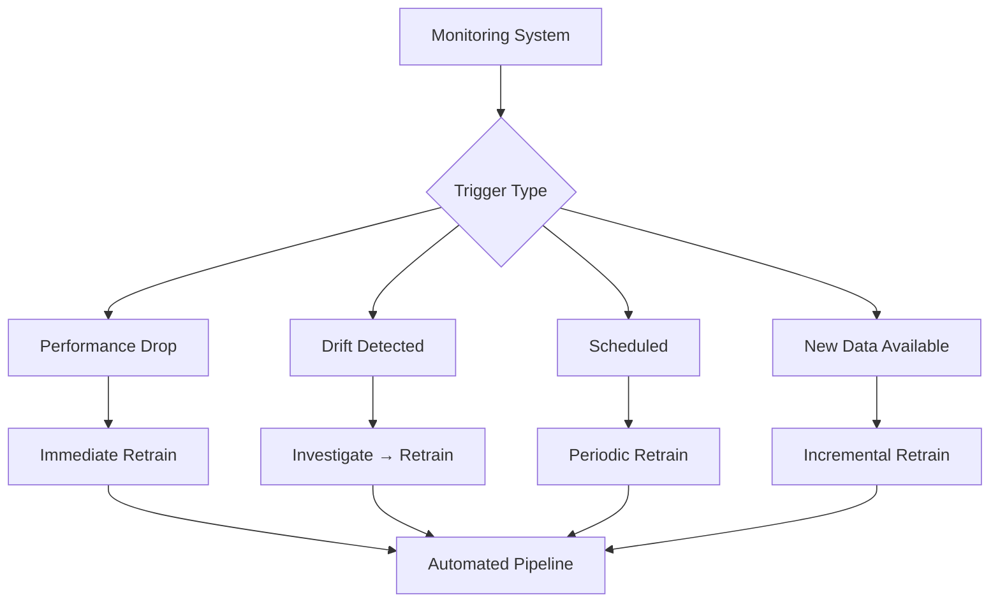

# ML Monitoring System Design

## Overview

ML monitoring tracks model health, data quality, and business impact in production. Unlike traditional software monitoring (CPU, memory), ML monitoring must detect data drift, concept drift, and prediction quality degradation. Designing a monitoring system involves choosing what to measure, how to detect anomalies, and when to alert.

## Why ML Monitoring is Different

| Aspect | Traditional Software | ML Systems |
|--------|---------------------|-----------|
| Failure mode | Errors, crashes | Silent degradation |
| Root cause | Code bugs | Data changes, drift |
| Metrics | CPU, memory, latency | + Drift, accuracy, calibration |
| Testing | Unit/integration tests | + Data validation, model evaluation |
| Debugging | Stack traces | Feature analysis, prediction inspection |

**Key insight:** ML models can degrade silently. The system returns predictions without errors, but the predictions become less accurate over time as data distributions shift.

## Monitoring Architecture



## What to Monitor

### The Four Pillars of ML Monitoring



### Detailed Metrics

| Category | Metrics | Frequency | Alert Threshold |
|----------|---------|-----------|-----------------|
| **Data Quality** | Missing rate, schema violations, range checks | Per request | >5% missing, schema change |
| **Data Drift** | PSI, KS test, distribution shift | Hourly/Daily | PSI > 0.25 |
| **Prediction** | Distribution, confidence, latency | Per request | Distribution shift, low confidence |
| **Performance** | Accuracy, F1, AUC (if labels available) | Daily/Weekly | >5% drop from baseline |
| **System** | CPU, memory, GPU, error rate | Real-time | CPU > 85%, errors > 1% |
| **Business** | Revenue, conversion, engagement | Daily | Significant drop |

## Drift Detection

### Types of Drift



| Drift Type | Example | Detection Method |
|-----------|---------|-----------------|
| **Data drift** | User demographics change | PSI, KS test, MMD |
| **Concept drift** | Fraud patterns evolve | Performance monitoring |
| **Label drift** | More fraud cases than usual | Label distribution comparison |
| **Feature drift** | Feature missing more often | Feature-level statistics |

### Drift Detection Methods

| Method | What It Measures | Range | Interpretation |
|--------|-----------------|-------|----------------|
| **PSI (Population Stability Index)** | Distribution shift | 0-∞ | <0.1: stable, 0.1-0.25: moderate, >0.25: significant |
| **KS Test (Kolmogorov-Smirnov)** | Maximum difference between CDFs | 0-1 | p-value < 0.05: significant drift |
| **Wasserstein Distance** | Earth mover's distance | 0-∞ | Lower is better, relative comparison |
| **MMD (Maximum Mean Discrepancy)** | Distribution distance in RKHS | 0-∞ | Lower is better |
| **Chi-Square Test** | Categorical distribution difference | 0-∞ | p-value < 0.05: significant |

### PSI Calculation

```python
def calculate_psi(expected, actual, buckets=10):
    """Population Stability Index between two distributions."""
    breakpoints = np.percentile(expected, np.linspace(0, 100, buckets + 1))
    
    expected_counts = np.histogram(expected, breakpoints)[0] / len(expected)
    actual_counts = np.histogram(actual, breakpoints)[0] / len(actual)
    
    # Avoid division by zero
    expected_counts = np.clip(expected_counts, 1e-4, None)
    actual_counts = np.clip(actual_counts, 1e-4, None)
    
    psi = np.sum((actual_counts - expected_counts) * np.log(actual_counts / expected_counts))
    return psi

# Interpretation
# PSI < 0.1: No significant change
# 0.1 <= PSI < 0.25: Moderate change, investigate
# PSI >= 0.25: Significant change, action needed
```

## Monitoring Without Ground Truth

In many production systems, ground truth labels arrive late or never. Here's how to detect degradation:

| Signal | What to Monitor | Interpretation |
|--------|----------------|-----------------|
| **Prediction distribution** | Shift in predicted classes/scores | Model may be confused |
| **Feature distribution** | Input data changes | Data drift |
| **Confidence scores** | Lower average confidence | Model uncertainty |
| **Business metrics** | Conversion, engagement drops | Proxy for model quality |
| **Human review** | Sample predictions for manual check | Gold standard but expensive |

## Alerting Rules

```python
alerting_rules = {
    "data_drift": {
        "condition": "PSI > 0.25",
        "severity": "WARNING",
        "action": "investigate",
        "window": "1h",
    },
    "performance_drop": {
        "condition": "accuracy < baseline * 0.95",
        "severity": "CRITICAL",
        "action": "rollback_and_retrain",
        "window": "24h",
    },
    "latency_spike": {
        "condition": "p99_latency > 500ms",
        "severity": "WARNING",
        "action": "scale_up",
        "window": "5m",
    },
    "error_rate": {
        "condition": "error_rate > 1%",
        "severity": "CRITICAL",
        "action": "investigate_and_rollback",
        "window": "5m",
    },
    "prediction_anomaly": {
        "condition": "prediction_distribution_shift > 3_sigma",
        "severity": "WARNING",
        "action": "investigate",
        "window": "1h",
    },
}
```

### Alert Fatigue Prevention

| Strategy | Description |
|----------|-------------|
| **Severity levels** | CRITICAL (page), WARNING (slack), INFO (dashboard) |
| **Alert grouping** | Group related alerts together |
| **Cooldown periods** | Don't re-alert within N minutes |
| **Escalation** | Escalate if not acknowledged |
| **Runbooks** | Link alerts to investigation steps |

## Monitoring Tools

| Tool | Type | Strengths |
|------|------|-----------|
| **Evidently** | Open-source | Drift detection, reports, easy to use |
| **WhyLabs / whylogs** | Open-source + managed | Data profiling, lightweight |
| **Arize** | Managed | Production monitoring, tracing |
| **Fiddler** | Managed | Explainability + monitoring |
| **Prometheus + Grafana** | Open-source | System metrics, flexible dashboards |
| **Datadog** | Managed | Full-stack monitoring |

### Evidently Example

```python
from evidently import ColumnMapping
from evidently.report import Report
from evidently.metric_preset import DataDriftPreset, DataQualityPreset

report = Report(metrics=[
    DataDriftPreset(),
    DataQualityPreset(),
])

report.run(
    reference_data=train_df,
    current_data=production_df,
    column_mapping=column_mapping,
)

# Generates HTML report with drift analysis
report.save_html("drift_report.html")
```

## Monitoring Dashboard Design

### Key Dashboard Sections



### Key Metrics to Display

| Metric | Visualization | Update Frequency |
|--------|--------------|-----------------|
| Prediction distribution | Histogram overlay (baseline vs current) | Hourly |
| Drift score over time | Line chart with threshold | Daily |
| Model accuracy (when labels available) | Line chart with baseline | Daily |
| Latency percentiles | Time series (p50, p95, p99) | Real-time |
| Feature importance changes | Bar chart comparison | Weekly |

## Retraining Triggers



| Trigger | Condition | Response |
|---------|-----------|----------|
| Performance drop | Accuracy < baseline × 0.95 | Immediate retrain |
| Drift detected | PSI > 0.25 for 3 consecutive windows | Investigate then retrain |
| Scheduled | Every N days/hours | Routine retrain |
| New labeled data | Significant new annotations | Incremental update |

## Interview Questions

1. **Design an ML monitoring system.**
   Collect predictions, inputs, and ground truth. Store in time-series DB. Run drift detection (PSI, KS), performance tracking, and anomaly detection. Alert on degradation. Trigger retraining. Dashboard with data quality, model performance, and business metrics.

2. **How do you detect model degradation without ground truth?**
   Monitor prediction distribution shifts, feature drift, confidence score changes, and business metric trends. Use human review on sampled predictions. Compare against a baseline period.

3. **How do you handle monitoring at scale?**
   Sample predictions (don't log everything), aggregate metrics in windows, use efficient statistical tests, separate real-time vs batch monitoring, and use streaming pipelines for real-time drift detection.

4. **What is the difference between data drift and concept drift?**
   Data drift: input distribution P(x) changes (e.g., user demographics shift). Concept drift: relationship P(y|x) changes (e.g., fraud patterns evolve). Data drift is easier to detect (compare feature distributions). Concept drift requires ground truth or proxy metrics.

5. **How do you set up automated retraining?**
   Define triggers (performance drop, drift, schedule). Build automated training pipeline. Add evaluation gates (must beat baseline). Use canary deployment for new model. Monitor after deployment. Rollback if degraded.

## Summary

ML monitoring goes beyond traditional system monitoring by tracking data drift, prediction quality, and business impact. A well-designed system detects degradation early, alerts the right team, and can trigger automated retraining.

## References

- Breck, E. et al. (2017). "The ML Test Score: A Rubric for ML Production Readiness" — Google's ML testing checklist
- Paleyes, A. et al. (2022). "Challenges in Deploying Machine Learning: A Survey of Case Studies" — Deployment challenges
- Evidently AI documentation (evidentlyai.com) — Open-source monitoring
- WhyLabs documentation (whylabs.ai) — Data logging and monitoring
- Rabanser, S. et al. (2019). "Failing Loudly: An Empirical Study of Methods for Detecting Dataset Shift" — Drift detection methods

## Cross-References

- [Model Monitoring (MLOps)](../mlops/monitoring.md) — Implementation details
- [Data Drift](../mlops/drift.md) — Drift detection methods
- [A/B Testing](./ab-testing.md) — Online evaluation
- [ML Pipeline](./pipeline.md) — Retraining automation
