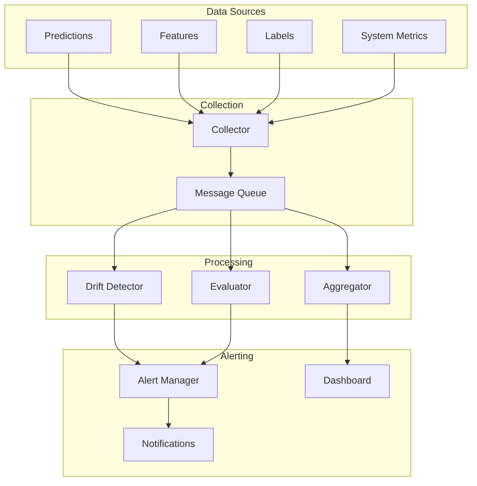
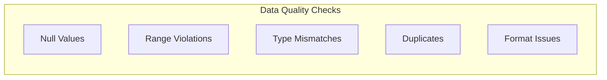
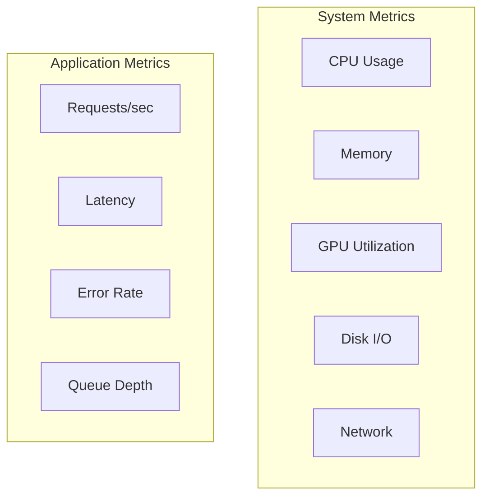
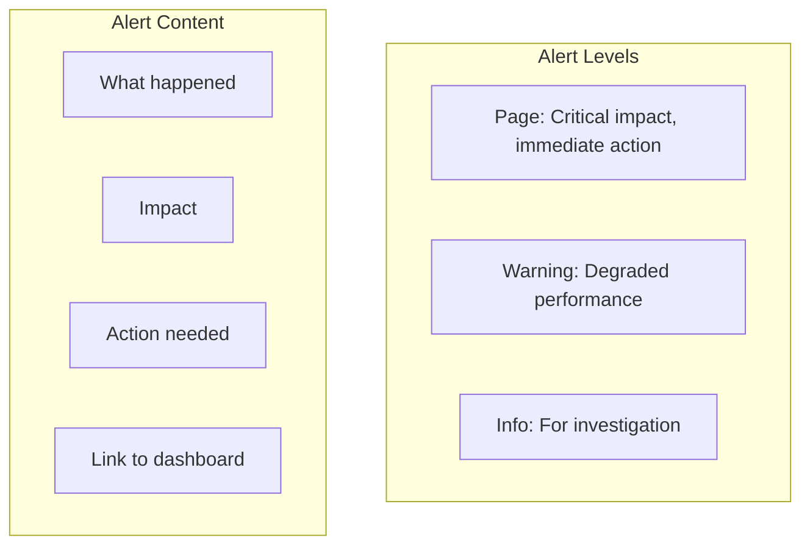

# ML System Monitoring Design

## Overview

ML System Monitoring goes beyond traditional software monitoring to track data quality, model performance, and business impact. It's critical for detecting model degradation, data drift, and system issues in production.

## Monitoring Architecture



## What to Monitor

### 1. Data Quality



```python
def check_data_quality(data):
    checks = {
        'null_rate': data.isnull().mean(),
        'range_violations': check_ranges(data),
        'type_errors': check_types(data),
        'duplicates': data.duplicated().mean()
    }
    
    for check, value in checks.items():
        if value > THRESHOLDS[check]:
            alert(f"Data quality issue: {check} = {value}")
```

### 2. Model Performance

| Metric | Threshold | Alert |
|--------|-----------|-------|
| Accuracy | < 90% of baseline | Critical |
| Latency P99 | > 200ms | Warning |
| Error Rate | > 1% | Critical |
| Prediction Distribution | PSI > 0.25 | Warning |

### 3. Data Drift

```python
def detect_drift(reference_data, production_data):
    """Detect drift using Population Stability Index."""
    psi_values = {}
    
    for feature in features:
        psi = calculate_psi(reference_data[feature], production_data[feature])
        psi_values[feature] = psi
        
        if psi > 0.25:
            alert(f"Significant drift in {feature}: PSI={psi:.3f}")
    
    return psi_values
```

### 4. System Health



## Monitoring Stack

| Component | Tools | Purpose |
|-----------|-------|---------|
| Metrics | Prometheus, Datadog | Collect time-series data |
| Visualization | Grafana, Kibana | Dashboards |
| Logging | ELK, Loki | Log aggregation |
| Alerting | PagerDuty, OpsGenie | Incident management |
| ML-specific | Evidently, Whylogs | ML monitoring |

## Alert Design



## Interview Questions

1. **How would you design monitoring for an ML system?**
2. **What metrics would you track for a recommendation model?**
3. **How do you detect and handle data drift?**
4. **What's the difference between model monitoring and system monitoring?**
5. **How do you set up alerting for ML models?**

## Common Mistakes

- **No baseline**: Without a reference, drift detection is meaningless
- **Alert fatigue**: Too many alerts lead to ignoring real issues
- **Delayed labels**: Ground truth arriving weeks later means late detection
- **Monitoring only accuracy**: Business metrics matter more

## Summary

ML System Monitoring requires tracking data quality, model performance, data drift, and system health. Key components include metrics collection, drift detection, alerting, and dashboards. Use tools like Prometheus, Grafana, and Evidently for comprehensive monitoring. Design alerts carefully to avoid fatigue while catching real issues.
