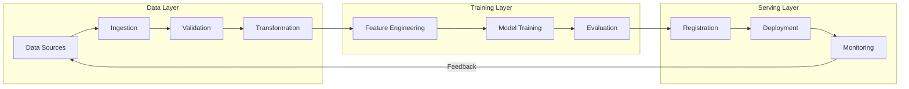
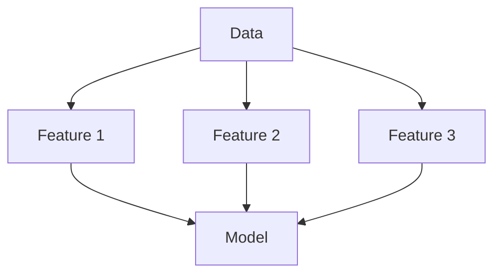
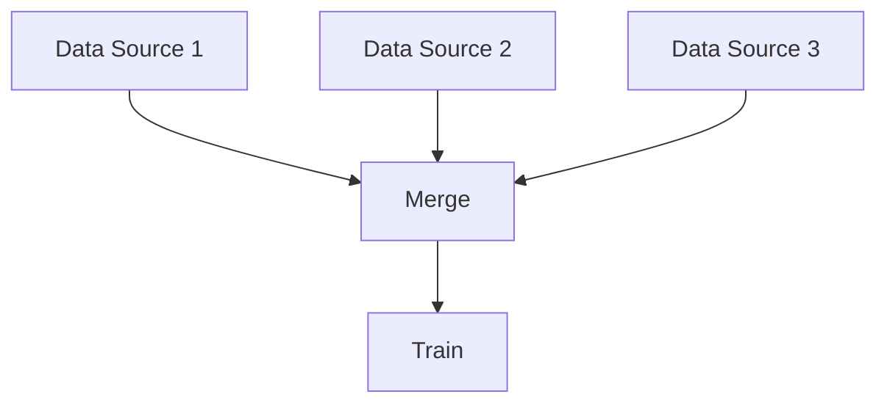

# ML Pipeline Design

## Overview

An ML Pipeline is an automated workflow that orchestrates the end-to-end ML lifecycle — from data ingestion to model deployment. Good pipeline design ensures reproducibility, scalability, and maintainability.

## Pipeline Architecture



## Pipeline Types

### 1. Batch Pipeline

- Runs on schedule (daily, weekly)
- Processes historical data
- Suitable for non-real-time models

### 2. Streaming Pipeline

- Processes data in real-time
- Low latency requirements
- Complex infrastructure

### 3. Hybrid Pipeline
- Batch for training, streaming for serving
- Most common in production
- Balances complexity and performance

## Pipeline Components

| Component | Purpose | Tools |
|-----------|---------|-------|
| Orchestrator | Schedule and manage workflows | Airflow, Kubeflow, Prefect |
| Data Validation | Ensure data quality | Great Expectations, TFX |
| Feature Store | Manage features | Feast, Tecton |
| Training | Model training | SageMaker, Vertex AI |
| Registry | Version models | MLflow, Neptune |
| Serving | Model inference | TF Serving, Triton |

## Pipeline Design Patterns

### Fan-Out Pattern


### Fan-In Pattern


## Error Handling

```python
# Pipeline with retry and error handling
from airflow import DAG
from airflow.operators.python import PythonOperator

def train_model(**context):
    try:
        model = train()
        metrics = evaluate(model)
        
        if metrics['accuracy'] < BASELINE:
            raise ValueError("Model below baseline")
        
        return model
    except Exception as e:
        log_error(e)
        alert_team(e)
        raise

with DAG('ml_pipeline', schedule_interval='@daily') as dag:
    train_task = PythonOperator(
        task_id='train_model',
        python_callable=train_model,
        retries=3,
        retry_delay=timedelta(minutes=5),
    )
```

## Interview Questions

1. **How would you design an ML pipeline for a recommendation system?**
2. **What are the key components of an ML pipeline?**
3. **How do you handle pipeline failures?**
4. **Batch vs streaming pipeline — when to use each?**
5. **How do you ensure reproducibility in ML pipelines?**

## Common Mistakes

- **No data validation**: Garbage in, garbage out
- **Tight coupling**: Changes in one step break others
- **No monitoring**: Silent failures in production
- **Missing idempotency**: Pipeline can't be safely re-run

## Summary

ML Pipeline design is critical for production ML systems. Key considerations include orchestration, data validation, error handling, and monitoring. Choose between batch, streaming, or hybrid based on requirements. Use established tools (Airflow, Kubeflow) rather than building from scratch.
