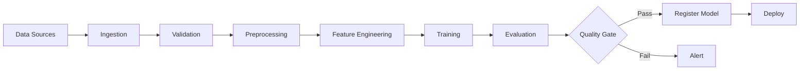
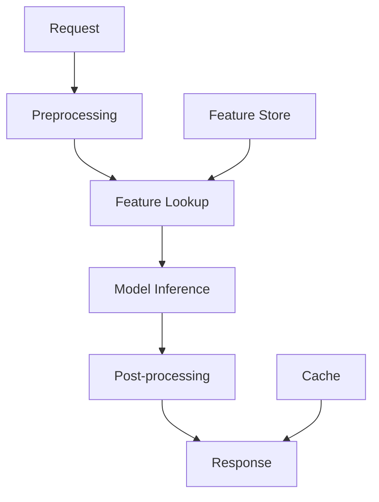
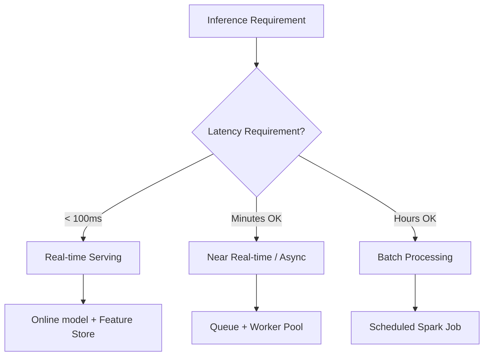
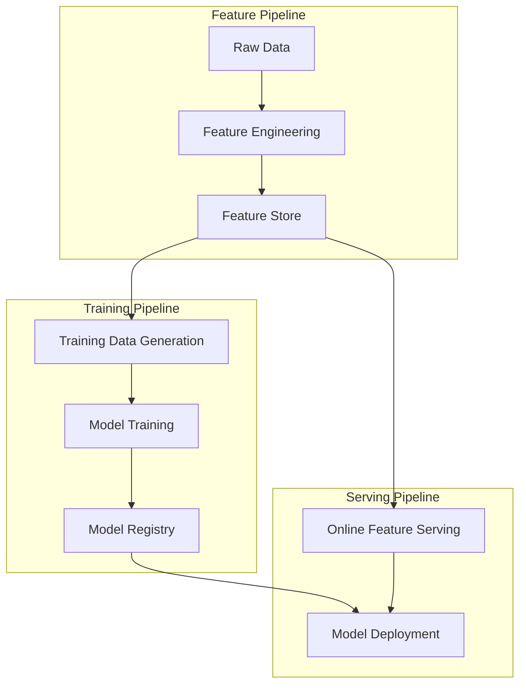
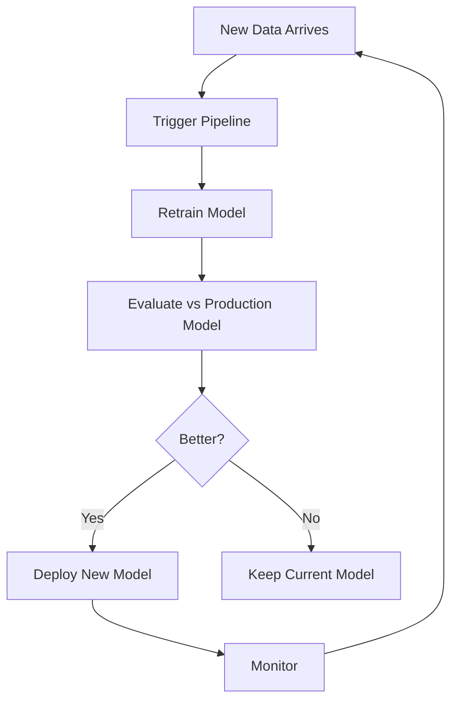
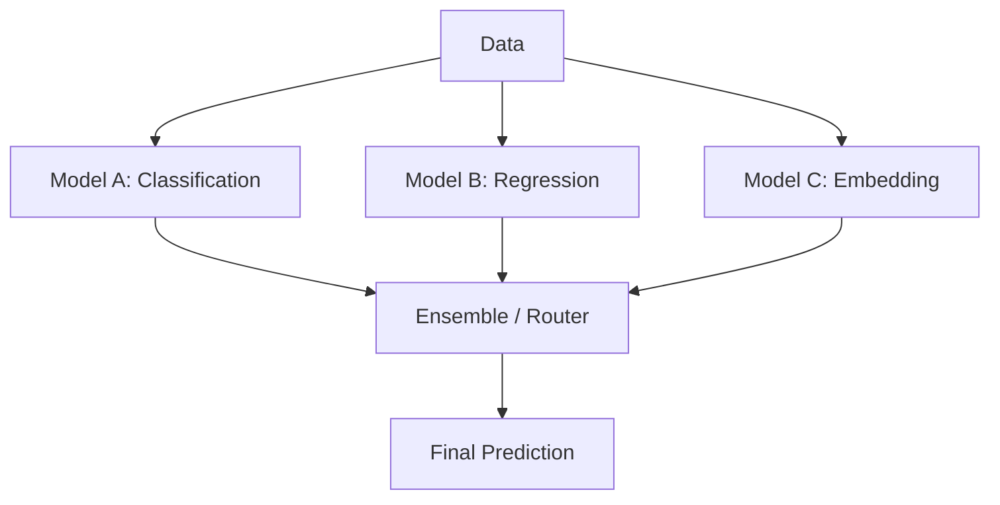

# ML Pipeline Design

## Overview

An ML pipeline automates the end-to-end workflow from raw data to deployed predictions. A well-designed pipeline ensures reproducibility, scalability, and maintainability. This covers the design of training pipelines, inference pipelines, and the orchestration connecting them.

## Why ML Pipelines Matter

Without pipelines:
- Manual, error-prone processes
- Can't reproduce results
- No versioning of data, code, or models
- Slow iteration cycles

With pipelines:
- Automated, repeatable workflows
- Full reproducibility (code + data + config)
- Continuous training and deployment
- Fast iteration and experimentation

## Training Pipeline Architecture



### Pipeline Stages in Detail

| Stage | Purpose | Key Tasks | Tools |
|-------|---------|-----------|-------|
| **Ingestion** | Collect data from sources | Extract from DB, APIs, files | Airflow, Spark, Kafka |
| **Validation** | Ensure data quality | Schema checks, null checks, range checks | Great Expectations, TFX |
| **Preprocessing** | Clean and transform | Handle missing values, normalize, encode | Pandas, Spark |
| **Feature Engineering** | Create ML features | Aggregations, embeddings, interactions | Feast, custom code |
| **Training** | Train model | Hyperparameter tuning, distributed training | PyTorch, TF, XGBoost |
| **Evaluation** | Assess model quality | Offline metrics, fairness checks | Scikit-learn, custom |
| **Registration** | Version model | Store artifacts, metadata | MLflow, W&B |
| **Deployment** | Serve predictions | Containerize, deploy to serving infra | K8s, Triton, vLLM |

## Inference Pipeline Architecture



### Inference Pipeline Components

| Component | Description | Latency Target |
|-----------|-------------|---------------|
| Preprocessing | Parse request, validate input | <5ms |
| Feature Lookup | Fetch features from feature store | <10ms |
| Model Inference | Run model prediction | <50ms |
| Post-processing | Format response, apply business rules | <5ms |
| Cache | Check for cached predictions | <1ms |

## Design Decisions

### Batch vs Real-time

| Aspect | Batch | Real-time |
|--------|-------|-----------|
| Latency | Minutes-hours | Milliseconds |
| Throughput | High (bulk processing) | Per-request |
| Complexity | Lower | Higher |
| Cost | Lower (scheduled compute) | Higher (always-on servers) |
| Use case | Recommendations, reports, features | Fraud detection, search, ads |
| Data freshness | Hours old | Current |

### When to Use Each



## Pipeline Orchestration

### Orchestration Tool Comparison

| Tool | Type | Strengths | Weaknesses |
|------|------|-----------|------------|
| **Airflow** | DAG-based | Mature, large community, many operators | Complex setup, DAG parsing overhead |
| **Prefect** | Modern DAG | Pythonic, easy to use, good DX | Smaller community |
| **Dagster** | Asset-centric | Type-safe, great testing, ML-focused | Learning curve |
| **Kubeflow Pipelines** | K8s-native | Scalable, reproducible, ML-specific | Complex K8s setup |
| **Metaflow** | Python-native | Easy to use, versioning built-in | Less flexible orchestration |
| **Argo Workflows** | K8s-native | Lightweight, container-native | Less ML-specific |

### Airflow DAG Example

```python
from airflow import DAG
from airflow.operators.python import PythonOperator
from datetime import datetime, timedelta

default_args = {
    'owner': 'ml-team',
    'retries': 3,
    'retry_delay': timedelta(minutes=5),
    'email_on_failure': True,
}

with DAG(
    'ml_training_pipeline',
    default_args=default_args,
    schedule_interval='@daily',
    start_date=datetime(2024, 1, 1),
    catchup=False,
) as dag:
    
    ingest = PythonOperator(
        task_id='ingest_data',
        python_callable=ingest_fn,
    )
    
    validate = PythonOperator(
        task_id='validate_data',
        python_callable=validate_fn,
    )
    
    transform = PythonOperator(
        task_id='transform_features',
        python_callable=transform_fn,
    )
    
    train = PythonOperator(
        task_id='train_model',
        python_callable=train_fn,
        op_kwargs={'hyperparams': '{{ dag_run.conf }}'},
    )
    
    evaluate = PythonOperator(
        task_id='evaluate_model',
        python_callable=evaluate_fn,
    )
    
    quality_gate = PythonOperator(
        task_id='quality_gate',
        python_callable=check_quality_fn,
    )
    
    deploy = PythonOperator(
        task_id='deploy_model',
        python_callable=deploy_fn,
    )
    
    ingest >> validate >> transform >> train >> evaluate >> quality_gate >> deploy
```

### Dagster Asset Example

```python
from dagster import asset, AssetIn

@asset
def raw_data():
    """Ingest raw data from source."""
    return load_from_data_warehouse()

@asset
def validated_data(raw_data):
    """Validate data quality."""
    assert raw_data.isnull().sum().sum() / raw_data.size < 0.05
    return raw_data

@asset
def features(validated_data):
    """Engineer features."""
    return compute_features(validated_data)

@asset
def trained_model(features):
    """Train the model."""
    return train_xgboost(features)

@asset
def evaluation(trained_model, features):
    """Evaluate model quality."""
    metrics = evaluate(trained_model, features)
    assert metrics["auc"] > 0.85, "Model quality gate failed"
    return metrics
```

## Pipeline Patterns

### Pattern 1: Feature Pipeline + Training Pipeline + Serving Pipeline



**Why separate?** Different cadences (features hourly, training daily, serving real-time), different teams own each, independent scaling.

### Pattern 2: Continuous Training (CT)



### Pattern 3: Multi-Model Pipeline



## Testing ML Pipelines

| Test Type | What to Test | When |
|-----------|-------------|------|
| **Unit tests** | Individual functions (feature engineering, transforms) | Every commit |
| **Integration tests** | Pipeline stages working together | Before merge |
| **Data validation** | Schema, distributions, quality | Every pipeline run |
| **Model validation** | Metrics meet threshold | After training |
| **Shadow testing** | New model vs production on live traffic | Before promotion |
| **A/B testing** | Statistical significance of improvement | After deployment |

### Data Validation Example

```python
import great_expectations as gx

context = gx.get_context()

# Define expectations
validator = context.sources.pandas_default.read_csv("data.csv")
validator.expect_column_values_to_not_be_null("user_id")
validator.expect_column_values_to_be_between("age", 0, 150)
validator.expect_column_values_to_be_in_set("gender", ["M", "F", "Other"])
validator.expect_table_row_count_to_be_between(1000, 1000000)

# Run validation
results = validator.validate()
if not results.success:
    raise ValueError("Data validation failed!")
```

## Error Handling and Reliability

| Strategy | Description |
|----------|-------------|
| **Idempotency** | Running the pipeline twice produces the same result |
| **Checkpointing** | Save intermediate results so you can resume from failure |
| **Retry logic** | Retry failed steps with exponential backoff |
| **Dead letter queue** | Capture failed records for manual review |
| **Circuit breakers** | Stop pipeline if too many failures |
| **Alerting** | Notify team on pipeline failures |

### Idempotency Example

```python
# BAD: Not idempotent (appends data)
def process_data():
    new_data = fetch_new_data()
    append_to_feature_store(new_data)

# GOOD: Idempotent (overwrites with version)
def process_data(date: str):
    data = fetch_data_for_date(date)
    features = compute_features(data)
    write_to_feature_store(features, partition=date)  # Overwrites partition
```

## Scaling ML Pipelines

| Scale | Data Size | Compute | Architecture |
|-------|-----------|---------|-------------|
| Small | <1GB | Single machine | Pandas + Airflow |
| Medium | 1GB-1TB | Spark cluster | Spark + Airflow + MLflow |
| Large | >1TB | Distributed | Spark/Beam + Kubeflow + Feature Store |
| Very Large | >100TB | Multi-cluster | Beam + K8s + custom orchestration |

## Interview Questions

1. **How do you design an ML training pipeline?**
   Data ingestion → validation → preprocessing → feature engineering → training → evaluation → registration → deployment. Each step should be idempotent and versioned. Use a feature store for consistent features. Add quality gates between steps.

2. **How do you ensure pipeline reliability?**
   Validation gates between steps, retry logic with exponential backoff, alerting on failures, checkpointing intermediate results, idempotent operations, and dead letter queues for failed records.

3. **When should you use batch vs real-time inference?**
   Batch: when latency isn't critical (daily recommendations), higher throughput, simpler. Real-time: when instant predictions are needed (fraud detection), more complex infrastructure. Many systems use both.

4. **How do you handle schema changes in the data pipeline?**
   Schema registry with versioning. Backward-compatible changes (add optional fields). Data validation with Great Expectations. Alert on unexpected schema changes. Migration scripts for breaking changes.

5. **How do you version ML pipelines?**
   Version code (git), data (DVC or partition-based), models (MLflow registry), and configuration (hydra or config files). Pin all dependencies. Use reproducible environments (Docker).

6. **How do you test ML pipelines?**
   Unit tests for individual functions, integration tests for pipeline stages, data validation for quality, model validation for metrics, shadow testing before promotion, and A/B testing for statistical significance.

## Summary

ML pipeline design connects data, features, training, and serving into automated workflows. Key decisions include batch vs real-time, orchestration tool choice, and validation strategy. A well-designed pipeline is the backbone of production ML systems.

## References

- Huyen, C. (2022). *Designing Machine Learning Systems* — Pipeline design patterns
- Polyzotis, N. et al. (2019). "Data Validation for Machine Learning" — TFX data validation
- Baylor, D. et al. (2017). "TFX: A TensorFlow-Based Production-Scale ML Pipeline Platform" — Google's ML pipeline
- Airflow documentation (airflow.apache.org)
- Dagster documentation (dagster.io)
- Kubeflow documentation (kubeflow.org)

## Cross-References

- [ML Pipelines (MLOps)](../mlops/pipelines.md) — Pipeline orchestration
- [Data Pipeline](./data-pipeline.md) — Data engineering
- [Feature Store](./feature-store.md) — Feature management
- [Model Serving](./model-serving.md) — Serving architecture
