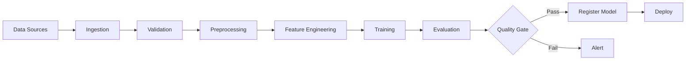
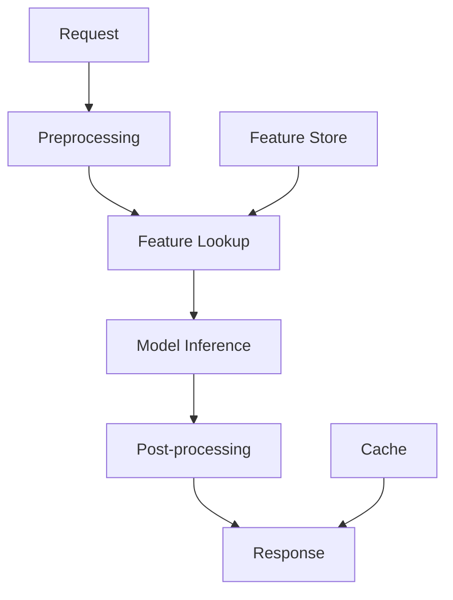

# ML Pipeline Design

## Overview

An ML pipeline automates the end-to-end workflow from raw data to deployed predictions. A well-designed pipeline ensures reproducibility, scalability, and maintainability. This covers the design of training pipelines, inference pipelines, and the orchestration connecting them.

## Training Pipeline Architecture



## Inference Pipeline Architecture



## Design Decisions

### Batch vs Real-time

| Aspect | Batch | Real-time |
|--------|-------|-----------|
| Latency | Minutes-hours | Milliseconds |
| Throughput | High | Per-request |
| Complexity | Lower | Higher |
| Use case | Recommendations, reports | Fraud detection, search |

### Pipeline Orchestration

```python
# Airflow DAG for ML pipeline
from airflow import DAG
from airflow.operators.python import PythonOperator

with DAG('ml_pipeline', schedule_interval='@daily') as dag:
    ingest = PythonOperator(task_id='ingest', python_callable=ingest_fn)
    validate = PythonOperator(task_id='validate', python_callable=validate_fn)
    transform = PythonOperator(task_id='transform', python_callable=transform_fn)
    train = PythonOperator(task_id='train', python_callable=train_fn)
    evaluate = PythonOperator(task_id='evaluate', python_callable=evaluate_fn)
    deploy = PythonOperator(task_id='deploy', python_callable=deploy_fn)

    ingest >> validate >> transform >> train >> evaluate >> deploy
```

## Interview Questions

1. **How do you design an ML training pipeline?** — Data ingestion → validation → preprocessing → feature engineering → training → evaluation → registration → deployment. Each step should be idempotent and versioned.

2. **How do you ensure pipeline reliability?** — Validation gates between steps, retry logic, alerting on failures, checkpointing intermediate results, and idempotent operations.

3. **When should you use batch vs real-time inference?** — Batch: when latency isn't critical (daily recommendations). Real-time: when instant predictions are needed (fraud detection). Consider the business requirement.

## Summary

ML pipeline design connects data, features, training, and serving into automated workflows. Key decisions include batch vs real-time, orchestration tool choice, and validation strategy. A well-designed pipeline is the backbone of production ML systems.

## Cross-References

- [ML Pipelines (MLOps)](../mlops/pipelines.md) — Pipeline orchestration
- [Data Pipeline](./data-pipeline.md) — Data engineering
- [Feature Store](./feature-store.md) — Feature management
- [Model Serving](./model-serving.md) — Serving architecture
