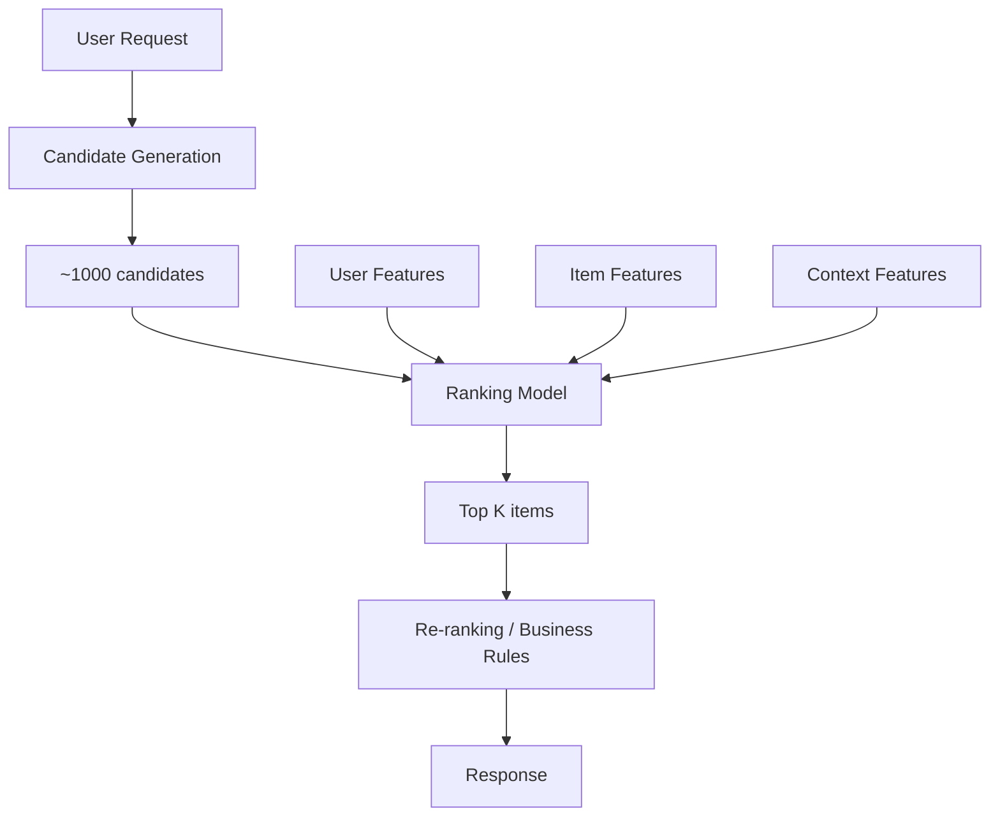

# Recommendation System Design

## Overview

Recommendation systems suggest relevant items (products, content, ads) to users based on their preferences and behavior. They power Netflix, YouTube, Amazon, Spotify, and TikTok. Designing a recommendation system involves candidate generation, ranking, and real-time serving at massive scale.

## System Architecture



## Three-Stage Architecture

### Stage 1: Candidate Generation

Narrow millions of items to ~1000 candidates:

```python
# Collaborative filtering (ALS)
from implicit.als import AlternatingLeastSquares

model = AlternatingLeastSquares(factors=128, iterations=50)
model.fit(user_item_matrix)

# Get candidates for a user
user_id = 123
candidates = model.recommend(user_id, user_item_matrix[user_id], N=1000)

# Or use embedding similarity (ANN search)
import faiss

index = faiss.IndexFlatIP(embedding_dim)  # Inner product
index.add(item_embeddings)

_, candidate_indices = index.search(user_embedding.reshape(1, -1), 1000)
```

### Stage 2: Ranking

Score candidates with a sophisticated model:

```python
class RankingModel(nn.Module):
    def __init__(self, user_dim, item_dim, context_dim):
        super().__init__()
        self.user_tower = nn.Sequential(
            nn.Linear(user_dim, 256), nn.ReLU(), nn.Linear(256, 128)
        )
        self.item_tower = nn.Sequential(
            nn.Linear(item_dim, 256), nn.ReLU(), nn.Linear(256, 128)
        )
        self.context_tower = nn.Sequential(
            nn.Linear(context_dim, 64), nn.ReLU(), nn.Linear(64, 32)
        )
        self.final = nn.Sequential(
            nn.Linear(128 + 128 + 32, 64), nn.ReLU(), nn.Linear(64, 1)
        )

    def forward(self, user_feat, item_feat, context_feat):
        user_emb = self.user_tower(user_feat)
        item_emb = self.item_tower(item_feat)
        ctx_emb = self.context_tower(context_feat)
        combined = torch.cat([user_emb, item_emb, ctx_emb], dim=-1)
        return torch.sigmoid(self.final(combined))
```

### Stage 3: Re-ranking

Apply business rules and diversity:

```python
def rerank(items, scores, rules):
    # Apply business rules
    items = apply_boost(items, rules.get('boost', {}))
    items = apply_filter(items, rules.get('filter', []))

    # Ensure diversity (MMR - Maximal Marginal Relevance)
    selected = []
    for _ in range(rules.get('top_k', 10)):
        best_idx = max(range(len(items)),
                      key=lambda i: scores[i] - 0.3 * max(
                          similarity(items[i], s) for s in selected) if selected else scores[i])
        selected.append(items[best_idx])

    return selected
```

## Feature Engineering

| Feature Type | Examples |
|-------------|----------|
| User | Age, location, historical clicks, purchase history |
| Item | Category, price, popularity, embeddings |
| Context | Time of day, device, location, session length |
| Cross | User-item interaction history, similar user preferences |

## Evaluation

| Metric | Type | Description |
|--------|------|-------------|
| Precision@K | Offline | Relevant items in top K |
| Recall@K | Offline | Coverage of relevant items |
| NDCG | Offline | Ranking quality |
| CTR | Online | Click-through rate |
| Conversion | Online | Purchase rate |
| Watch time | Online | Engagement |

## Interview Questions

1. **Design YouTube's recommendation system** — Candidate generation (collaborative filtering + content-based) → Ranking (deep learning with user/video/context features) → Re-ranking (diversity, freshness) → Serving (real-time with caching).

2. **How do you handle the cold-start problem?** — New users: use demographic features, popular items, or ask for preferences. New items: use content features, show to exploratory users.

3. **How do you ensure diversity in recommendations?** — MMR (Maximal Marginal Relevance), category constraints, exploration-exploitation trade-off, and deduplication.

4. **How do you scale to billions of items?** — Two-stage: fast candidate generation (ANN search, collaborative filtering) followed by precise ranking on a small candidate set.

## Summary

Recommendation systems use a multi-stage architecture: candidate generation (fast, broad) → ranking (precise, expensive) → re-ranking (business rules, diversity). Key challenges include cold-start, scalability, and balancing relevance with diversity. Real-world systems combine collaborative filtering, content-based methods, and deep learning.

## Cross-References

- [GNN](../gnn/README.md) — Graph-based recommendations
- [Embeddings](../../llm/llm-serving/embeddings.md) — Representation learning
- [Feature Store](./feature-store.md) — Feature management
- [Model Serving](./model-serving.md) — Serving architecture
- [A/B Testing](./ab-testing.md) — Online evaluation
