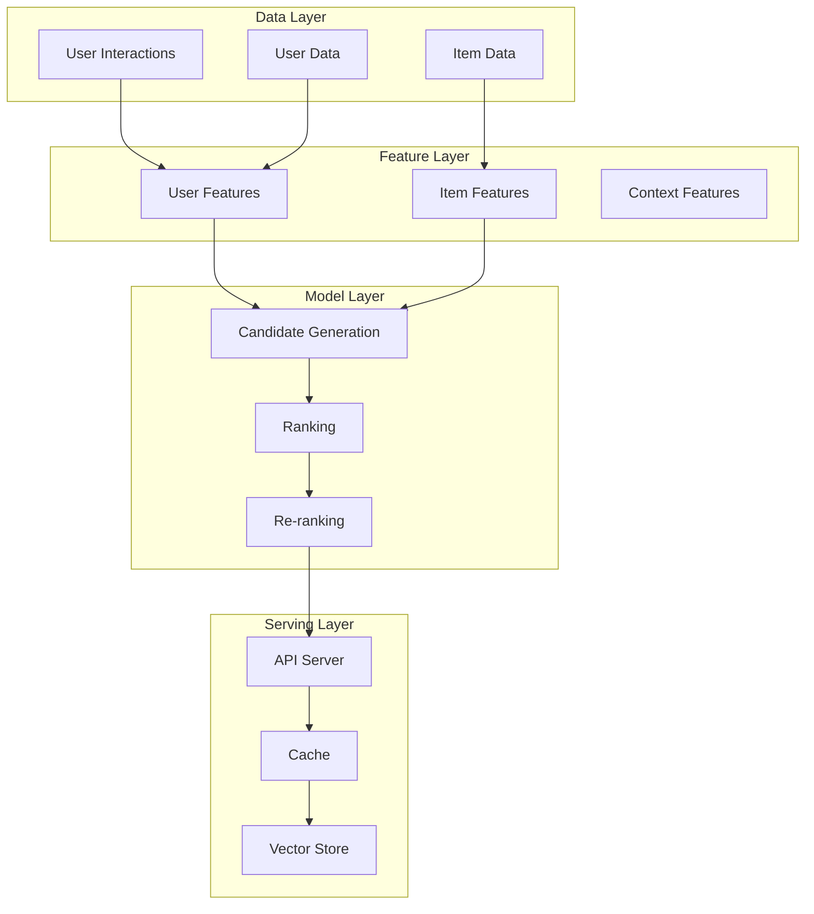
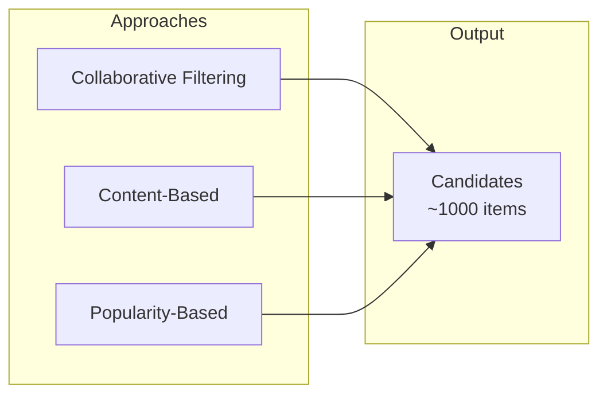
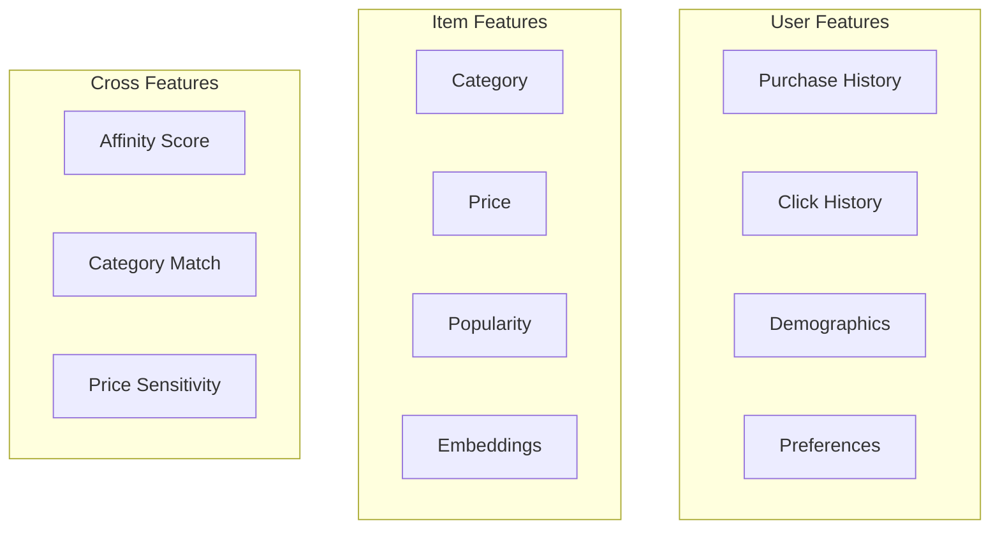

# Recommendation System Design

## Overview

Recommendation Systems suggest relevant items to users based on their preferences, behavior, and item characteristics. They power platforms like Netflix, Amazon, YouTube, and Spotify.

## System Architecture



## Two-Stage Architecture

### Stage 1: Candidate Generation


**Collaborative Filtering:**
```python
# Matrix Factorization
import implicit

model = implicit.als.AlternatingLeastSquares(factors=64)
model.fit(user_item_matrix)

# Get similar items
similar_items = model.similar_items(item_id, N=100)
```

**Content-Based:**
```python
# Embedding similarity
from sentence_transformers import SentenceTransformer

model = SentenceTransformer('all-MiniLM-L6-v2')
item_embeddings = model.encode(item_descriptions)

# Find similar items
similarities = cosine_similarity(query_embedding, item_embeddings)
```

### Stage 2: Ranking


**Features:**
| Type | Examples |
|------|----------|
| User | Age, history, preferences |
| Item | Category, price, popularity |
| Context | Time, device, location |
| Cross | User-item affinity |

**Model:**
```python
# Deep ranking model
class RankingModel(nn.Module):
    def __init__(self):
        self.user_embedding = nn.Embedding(num_users, 64)
        self.item_embedding = nn.Embedding(num_items, 64)
        self.fc = nn.Linear(128, 1)
    
    def forward(self, user_id, item_id, features):
        user_emb = self.user_embedding(user_id)
        item_emb = self.item_embedding(item_id)
        x = torch.cat([user_emb, item_emb, features], dim=1)
        return torch.sigmoid(self.fc(x))
```

### Stage 3: Re-ranking
- Business rules (diversity, freshness)
- Filter seen items
- Apply constraints

## Feature Engineering



## Evaluation Metrics

| Metric | Formula | Use Case |
|--------|---------|----------|
| Precision@K | Relevant in top K / K | Quality of recommendations |
| Recall@K | Relevant in top K / Total relevant | Coverage |
| NDCG | Normalized Discounted Cumulative Gain | Ranking quality |
| MAP | Mean Average Precision | Overall ranking |
| CTR | Clicks / Impressions | Online engagement |

## Interview Questions

1. **Design a recommendation system for an e-commerce platform.**
2. **How do you handle the cold-start problem?**
3. **Explain collaborative filtering vs content-based filtering.**
4. **How do you evaluate recommendation quality?**
5. **How would you scale a recommendation system to millions of users?**

## Common Mistakes

- **Popularity bias**: Always recommending popular items
- **Cold start**: New users/items have no data
- **Filter bubble**: Users only see similar items
- **Ignoring diversity**: Recommendations too similar

## Summary

Recommendation Systems use a multi-stage architecture: candidate generation → ranking → re-ranking. Key techniques include collaborative filtering, content-based filtering, and deep learning models. Critical considerations include feature engineering, evaluation metrics, and handling edge cases like cold start and diversity.
