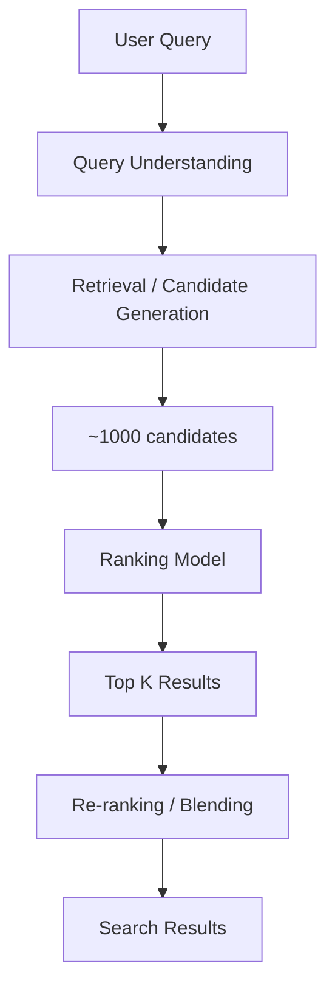

# Search Ranking System Design

## Overview

Search ranking systems order search results by relevance to a user's query. They power Google, Bing, Amazon product search, and enterprise search. The challenge is ranking billions of documents in milliseconds while handling ambiguous queries, personalization, and freshness.

## Architecture



## Stages

### 1. Query Understanding

```python
def process_query(query):
    # Spell correction
    corrected = spell_correct(query)

    # Query expansion (synonyms)
    expanded = expand_with_synonyms(corrected)

    # Intent classification
    intent = classify_intent(corrected)  # navigational, informational, transactional

    # Named entity recognition
    entities = extract_entities(corrected)

    return {
        'original': query,
        'corrected': corrected,
        'expanded': expanded,
        'intent': intent,
        'entities': entities
    }
```

### 2. Retrieval (BM25 + Embeddings)

```python
from rank_bm25 import BM25Okapi
import faiss

# BM25 (lexical retrieval)
bm25 = BM25Okapi(tokenized_corpus)
bm25_scores = bm25.get_scores(tokenized_query)

# Embedding retrieval (semantic search)
query_embedding = encode(query)
index = faiss.IndexFlatIP(embedding_dim)
_, embedding_indices = index.search(query_embedding.reshape(1, -1), 1000)

# Hybrid: combine BM25 + embedding candidates
candidates = merge_candidates(bm25_top_k, embedding_top_k)
```

### 3. Ranking Model (Learning to Rank)

```python
class SearchRanker(nn.Module):
    def __init__(self, query_dim, doc_dim):
        super().__init__()
        self.query_encoder = nn.Linear(query_dim, 128)
        self.doc_encoder = nn.Linear(doc_dim, 128)
        self.cross_attention = nn.MultiheadAttention(128, 8)
        self.ranker = nn.Sequential(
            nn.Linear(256, 128), nn.ReLU(),
            nn.Linear(128, 1)
        )

    def forward(self, query_feat, doc_feat):
        q = self.query_encoder(query_feat)
        d = self.doc_encoder(doc_feat)
        # Cross-attention between query and document
        attended, _ = self.cross_attention(q.unsqueeze(0), d.unsqueeze(0), d.unsqueeze(0))
        combined = torch.cat([q, attended.squeeze(0)], dim=-1)
        return self.ranker(combined)
```

### Learning to Rank Approaches

| Approach | Loss | Description |
|----------|------|-------------|
| Pointwise | MSE / BCE | Predict relevance score per doc |
| Pairwise | RankNet / LambdaRank | Predict relative order of doc pairs |
| Listwise | ListNet / LambdaMART | Optimize entire ranking list |

## Features

| Category | Features |
|----------|----------|
| Query | Keywords, intent, length, entity types |
| Document | Title, content, authority, freshness, click-through rate |
| Match | BM25 score, embedding similarity, term overlap |
| User | Search history, preferences, location |
| Context | Time, device, session |

## Interview Questions

1. **Design Google Search ranking** — Query understanding → Retrieval (BM25 + semantic) → Ranking (learning to rank) → Re-ranking (freshness, diversity) → Results.

2. **How do you handle query understanding?** — Spell correction, query expansion (synonyms), intent classification, and named entity recognition.

3. **BM25 vs embedding retrieval?** — BM25: exact term matching, fast, works well for specific queries. Embeddings: semantic matching, handles synonyms, better for vague queries. Hybrid is best.

4. **What is learning to rank?** — ML models that optimize ranking metrics (NDCG, MAP). Approaches: pointwise (predict score), pairwise (predict order), listwise (optimize list).

## Summary

Search ranking systems use multi-stage architectures: query understanding → retrieval → ranking → re-ranking. BM25 handles lexical matching, embeddings handle semantic matching. Learning to rank models optimize for ranking metrics. Personalization, freshness, and diversity are key considerations.

## Cross-References

- [Recommendation](./recommendation.md) — Similar architecture
- [Embeddings](../../llm/llm-serving/embeddings.md) — Vector representations
- [Transformers](../transformers/README.md) — Cross-attention for ranking
- [Model Serving](./model-serving.md) — Serving architecture
