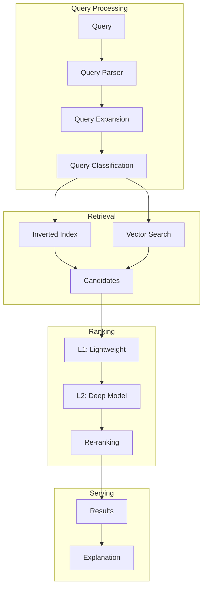
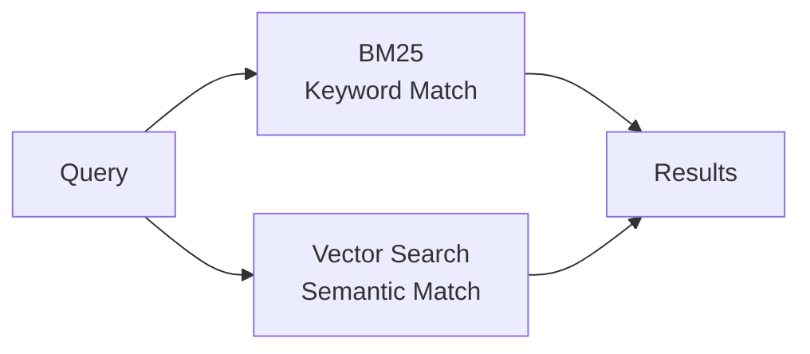

# Search Ranking System Design

## Overview

Search Ranking systems order search results by relevance to the user's query. They combine information retrieval with ML to deliver the most useful results, powering platforms like Google, Bing, and e-commerce search.

## System Architecture



## Multi-Stage Ranking

### Stage 1: Retrieval


```python
# BM25 retrieval
from rank_bm25 import BM25Okapi

tokenized_docs = [doc.split() for doc in documents]
bm25 = BM25Okapi(tokenized_docs)

query = "machine learning basics"
scores = bm25.get_scores(query.split())

# Vector search
from sentence_transformers import SentenceTransformer

model = SentenceTransformer('all-MiniLM-L6-v2')
doc_embeddings = model.encode(documents)
query_embedding = model.encode(query)

similarities = cosine_similarity([query_embedding], doc_embeddings)
```

### Stage 2: Lightweight Ranking
- Simple model (Logistic Regression, LightGBM)
- Score 1000s of candidates quickly
- Features: BM25 score, document quality, freshness

### Stage 3: Deep Ranking
```python
# Cross-encoder for re-ranking
from sentence_transformers import CrossEncoder

model = CrossEncoder('cross-encoder/ms-marco-MiniLM-L-6-v2')

pairs = [(query, doc) for doc in top_candidates]
scores = model.predict(pairs)

# Sort by score
ranked_results = sorted(zip(top_candidates, scores), key=lambda x: x[1], reverse=True)
```

### Stage 4: Re-ranking
- Business rules (promote/demote)
- Diversity
- Freshness
- Personalization

## Feature Engineering

| Category | Features |
|----------|----------|
| Query | Length, type, entities, intent |
| Document | PageRank, freshness, quality, length |
| Match | BM25 score, title match, URL match |
| User | History, preferences, location |
| Context | Device, time, session |

## Learning to Rank

### Pointwise
```python
# Predict relevance score for each document
model.predict(query_document_features)  # Score per doc
```

### Pairwise
```python
# Learn relative ordering
# RankNet, LambdaRank
loss = -log(sigmoid(score_doc1 - score_doc2))
```

### Listwise
```python
# Optimize entire list
# ListNet, LambdaMART
loss = cross_entropy(predicted_list_distribution, ideal_list_distribution)
```

## Evaluation Metrics

| Metric | Description |
|--------|-------------|
| NDCG@K | Normalized Discounted Cumulative Gain |
| MAP | Mean Average Precision |
| MRR | Mean Reciprocal Rank |
| Click-through Rate | User engagement |
| Abandonment Rate | Users leaving without clicking |

## Interview Questions

1. **Design a search ranking system for an e-commerce site.**
2. **How do you handle query understanding?**
3. **Explain the multi-stage ranking architecture.**
4. **What is learning to rank? Compare pointwise, pairwise, listwise.**
5. **How do you evaluate search quality?**

## Common Mistakes

- **No query understanding**: Treating all queries the same
- **Ignoring freshness**: Stale results for time-sensitive queries
- **No personalization**: Same results for all users
- **Over-optimizing for clicks**: Clicks ≠ satisfaction

## Summary

Search Ranking uses a multi-stage architecture: retrieval → lightweight ranking → deep ranking → re-ranking. Key techniques include BM25, vector search, cross-encoders, and learning to rank. Critical considerations include query understanding, feature engineering, and evaluation metrics like NDCG and MAP.
