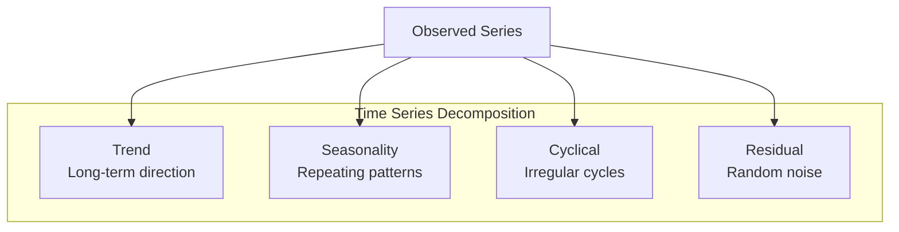
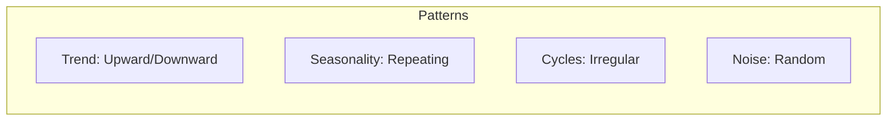
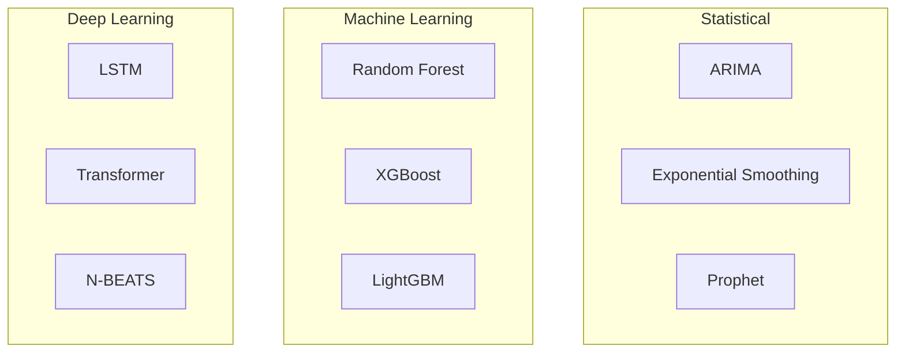

# Time Series Analysis

## Overview

Time Series Analysis involves analyzing data points collected over time to identify patterns, trends, and make forecasts. It's critical for applications like stock prediction, demand forecasting, anomaly detection, and resource planning.

## Time Series Components



## Types of Time Series

| Type | Description | Example |
|------|-------------|---------|
| Univariate | Single variable over time | Stock price |
| Multivariate | Multiple variables over time | Weather (temp, humidity, wind) |
| Stationary | Constant statistical properties | Differenced series |
| Non-stationary | Changing properties | Raw stock prices |

## Common Patterns



## Stationarity

A time series is stationary if its statistical properties (mean, variance) don't change over time.

```python
# Test for stationarity
from statsmodels.tsa.stattools import adfuller

result = adfuller(time_series)
print(f'ADF Statistic: {result[0]}')
print(f'p-value: {result[1]}')

if result[1] < 0.05:
    print("Series is stationary")
else:
    print("Series is non-stationary")
```

**Making series stationary:**
```python
# Differencing
diff_series = series.diff().dropna()

# Log transformation
log_series = np.log(series)

# Log + differencing
log_diff = np.log(series).diff().dropna()
```

## Forecasting Methods



## Evaluation Metrics

| Metric | Formula | Use Case |
|--------|---------|----------|
| MAE | Mean Absolute Error | General |
| MAPE | Mean Absolute Percentage Error | Percentage-based |
| RMSE | Root Mean Squared Error | Penalizes large errors |
| SMAPE | Symmetric MAPE | Balanced percentage |

```python
from sklearn.metrics import mean_absolute_error, mean_squared_error

mae = mean_absolute_error(y_true, y_pred)
rmse = np.sqrt(mean_squared_error(y_true, y_pred))
mape = np.mean(np.abs((y_true - y_pred) / y_true)) * 100
```

## Interview Questions

1. **What is stationarity and why is it important?**
2. **How do you handle seasonality in time series?**
3. **Compare ARIMA with machine learning methods for forecasting.**
4. **How do you evaluate time series models?**
5. **How do you handle missing data in time series?**

## Common Mistakes

- **Data leakage**: Using future data in training
- **Ignoring stationarity**: Many models require stationary data
- **Overfitting**: Model captures noise, not patterns
- **Wrong evaluation**: Must use time-based train/test split

## Summary

Time Series Analysis requires understanding components (trend, seasonality, noise), ensuring stationarity, and choosing appropriate models. Key considerations include proper train/test splitting (time-based), handling missing data, and selecting evaluation metrics. Methods range from statistical (ARIMA) to deep learning (Transformers).

## Cross-References

- [ARIMA](./arima.md)
- [Anomaly Detection](./anomaly.md)
- [Transformers for Time Series](./transformers.md)
- [Deep Learning RNN/LSTM](../deep-learning/rnn-lstm.md)
- [ML Foundations](../foundations/README.md)
