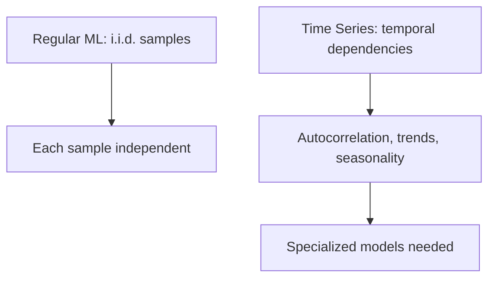
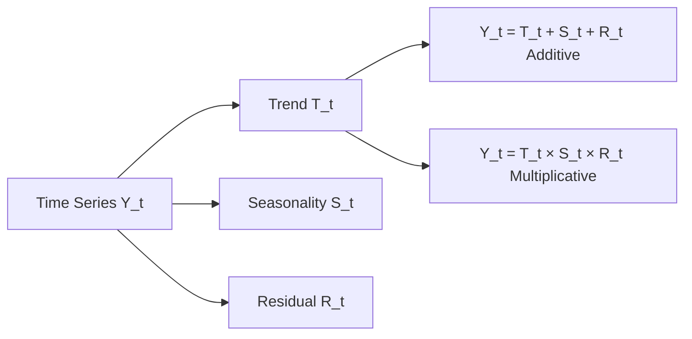
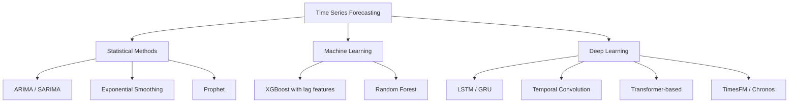

# Time Series Analysis

## Overview

Time series analysis deals with data points ordered by time — stock prices, sensor readings, web traffic, temperature, demand forecasts. Unlike standard ML where samples are i.i.d., time series data has **temporal dependencies**: past values influence future ones. This section covers classical statistical methods (ARIMA), modern tools (Prophet), deep learning approaches (Transformers), and anomaly detection.

## Why Time Series is Different



### Key Characteristics

| Property | Description | Example |
|----------|-------------|---------|
| Trend | Long-term increase/decrease | Stock market growth |
| Seasonality | Repeating periodic patterns | Retail sales peak in December |
| Cyclic | Non-fixed period fluctuations | Business cycles |
| Noise | Random variation | Measurement errors |
| Stationarity | Statistical properties don't change over time | Required for ARIMA |

## Decomposition



```python
from statsmodels.tsa.seasonal import seasonal_decompose

# Additive decomposition
result = seasonal_decompose(series, model='additive', period=12)
result.plot()
```

## Forecasting Approaches



## Evaluation Metrics

| Metric | Formula | Use Case |
|--------|---------|----------|
| MAE | $\frac{1}{n}\sum\|y - \hat{y}\|$ | Interpretable, robust to outliers |
| RMSE | $\sqrt{\frac{1}{n}\sum(y - \hat{y})^2}$ | Penalizes large errors |
| MAPE | $\frac{100}{n}\sum\|\frac{y - \hat{y}}{y}\|$ | Percentage error, fails at y=0 |
| SMAPE | Symmetric MAPE | Handles zero crossings |
| MASE | MAE / MAE of naive forecast | Scale-independent |

```python
import numpy as np

def mape(y_true, y_pred):
    return np.mean(np.abs((y_true - y_pred) / y_true)) * 100

def mase(y_true, y_pred, y_train):
    """Mean Absolute Scaled Error"""
    naive_mae = np.mean(np.abs(np.diff(y_train)))
    return np.mean(np.abs(y_true - y_pred)) / naive_mae
```

## Common Pitfalls

| Pitfall | Description | Solution |
|---------|-------------|----------|
| Data leakage | Using future data in features | Strict train/test split by time |
| Non-stationarity | Mean/variance change over time | Differencing, log transform |
| Look-ahead bias | Normalizing with future stats | Use only past data for scaling |
| Overfitting | Too many lags/complex model | Cross-validation with time splits |

## Interview Questions

1. **How do you handle non-stationarity?** — Differencing ($y_t - y_{t-1}$), log transforms, or detrending. ADF test checks stationarity.

2. **What is autocorrelation and why does it matter?** — Correlation of a series with its own lagged values. High autocorrelation means past values predict future ones. ACF/PACF plots help identify AR/MA orders.

3. **How do you do cross-validation for time series?** — Time-series split: train on past, test on future. Never shuffle. Walk-forward validation or expanding window.

4. **When would you use ARIMA vs LSTM?** — ARIMA: linear patterns, small data, interpretability. LSTM: complex nonlinear patterns, large data, multivariate.

5. **What is the difference between additive and multiplicative seasonality?** — Additive: seasonal amplitude is constant. Multiplicative: seasonal amplitude scales with the level. Use multiplicative when trend and seasonality interact.

## Summary

Time series forecasting requires specialized approaches due to temporal dependencies. Statistical methods (ARIMA, Prophet) work well for univariate series with clear patterns. Deep learning (Transformers, LSTMs) handles complex, multivariate data. Key considerations include stationarity, proper evaluation (time-based splits), and avoiding data leakage.

## Cross-References

- [RNNs & LSTMs](../deep-learning/rnn-lstm.md) — Sequential modeling basics
- [Transformers](../transformers/README.md) — Attention for sequences
- [XGBoost](../classical/xgboost.md) — ML approach with lag features
- [Evaluation Metrics](../foundations/evaluation.md) — MAE, RMSE, MAPE
- [Anomaly Detection](./anomaly.md) — Detecting outliers in time series
