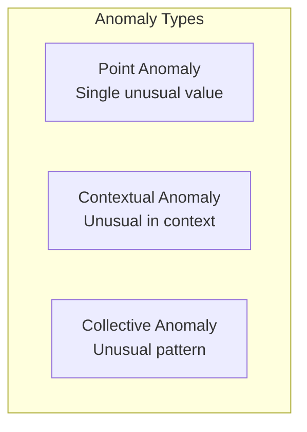
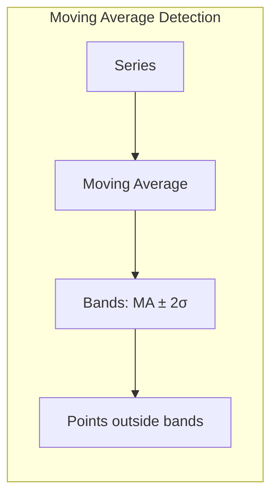
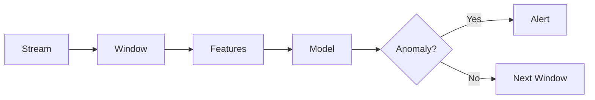

# Time Series Anomaly Detection

## Overview

Anomaly Detection in time series identifies unusual patterns, outliers, or unexpected behavior. It's critical for monitoring systems, fraud detection, network security, and predictive maintenance.

## Types of Anomalies



### Examples
| Type | Example |
|------|---------|
| Point | Sudden spike in CPU usage |
| Contextual | 30°C in winter (normal in summer) |
| Collective | Gradual increase indicating drift |

## Detection Methods

### 1. Statistical Methods

```python
# Z-Score method
def detect_anomalies_zscore(series, threshold=3):
    mean = series.mean()
    std = series.std()
    z_scores = (series - mean) / std
    return np.abs(z_scores) > threshold

# IQR method
def detect_anomalies_iqr(series, factor=1.5):
    Q1 = series.quantile(0.25)
    Q3 = series.quantile(0.75)
    IQR = Q3 - Q1
    lower = Q1 - factor * IQR
    upper = Q3 + factor * IQR
    return (series < lower) | (series > upper)
```

### 2. Moving Average Method
```python
def detect_anomalies_ma(series, window=20, threshold=2):
    ma = series.rolling(window=window).mean()
    std = series.rolling(window=window).std()
    upper = ma + threshold * std
    lower = ma - threshold * std
    return (series > upper) | (series < lower)
```



### 3. Isolation Forest
```python
from sklearn.ensemble import IsolationForest

# Features: value, hour, day_of_week, rolling_mean, rolling_std
features = create_features(series)

model = IsolationForest(contamination=0.01, random_state=42)
predictions = model.fit_predict(features)

anomalies = predictions == -1
```

### 4. LSTM Autoencoder
```python
class LSTMAutoencoder(nn.Module):
    def __init__(self, input_dim, hidden_dim):
        super().__init__()
        self.encoder = nn.LSTM(input_dim, hidden_dim, batch_first=True)
        self.decoder = nn.LSTM(hidden_dim, input_dim, batch_first=True)
    
    def forward(self, x):
        _, (hidden, _) = self.encoder(x)
        # Repeat hidden state for each timestep
        decoder_input = hidden.repeat(x.size(1), 1, 1).permute(1, 0, 2)
        output, _ = self.decoder(decoder_input)
        return output

# Anomaly = high reconstruction error
reconstruction = model(data)
error = torch.mean((data - reconstruction) ** 2, dim=(1, 2))
anomalies = error > threshold
```

### 5. Prophet for Anomaly Detection
```python
from prophet import Prophet

model = Prophet(interval_width=0.99)
model.fit(df)

forecast = model.predict(future)

# Points outside confidence interval are anomalies
forecast['anomaly'] = (forecast['y'] > forecast['yhat_upper']) | \
                      (forecast['y'] < forecast['yhat_lower'])
```

## Method Comparison

| Method | Pros | Cons |
|--------|------|------|
| Z-Score | Simple, fast | Assumes normal distribution |
| IQR | Robust to outliers | Static thresholds |
| Moving Average | Captures trends | Window size sensitive |
| Isolation Forest | No distribution assumption | Feature engineering needed |
| LSTM Autoencoder | Captures complex patterns | Needs lots of data |
| Prophet | Handles seasonality | Slow for large data |

## Evaluation Metrics

```python
from sklearn.metrics import precision_score, recall_score, f1_score

precision = precision_score(y_true, y_pred)
recall = recall_score(y_true, y_pred)
f1 = f1_score(y_true, y_pred)

# For imbalanced data, focus on precision and recall
print(f"Precision: {precision:.3f}")
print(f"Recall: {recall:.3f}")
print(f"F1: {f1:.3f}")
```

## Real-time Anomaly Detection



```python
class RealTimeAnomalyDetector:
    def __init__(self, window_size=100, threshold=3):
        self.window = deque(maxlen=window_size)
        self.threshold = threshold
    
    def update(self, value):
        self.window.append(value)
        
        if len(self.window) < self.window.maxlen:
            return False
        
        mean = np.mean(self.window)
        std = np.std(self.window)
        z_score = abs((value - mean) / std)
        
        return z_score > self.threshold
```

## Interview Questions

1. **What are the different types of anomalies in time series?**
2. **How would you design an anomaly detection system for server metrics?**
3. **Compare statistical and ML-based anomaly detection.**
4. **How do you handle seasonality in anomaly detection?**
5. **How do you evaluate anomaly detection systems?**

## Common Mistakes

- **Ignoring seasonality**: 30°C is normal in summer but anomalous in winter
- **Static thresholds**: Don't adapt to changing patterns
- **Too many false positives**: Alert fatigue leads to ignoring real issues
- **Not considering context**: Same value can be normal or anomalous depending on context

## Summary

Time Series Anomaly Detection identifies unusual patterns using statistical methods (Z-score, IQR), ML methods (Isolation Forest, LSTM Autoencoder), or hybrid approaches (Prophet). Key considerations include handling seasonality, choosing appropriate thresholds, and minimizing false positives. Real-time detection requires efficient windowed processing.

## Cross-References

- [Time Series Overview](./README.md)
- [ARIMA](./arima.md)
- [ML Evaluation](../foundations/evaluation.md)
- [MLOps Monitoring](../mlops/monitoring.md)
- [Cloud Observability](../../cloud/observability/README.md)
