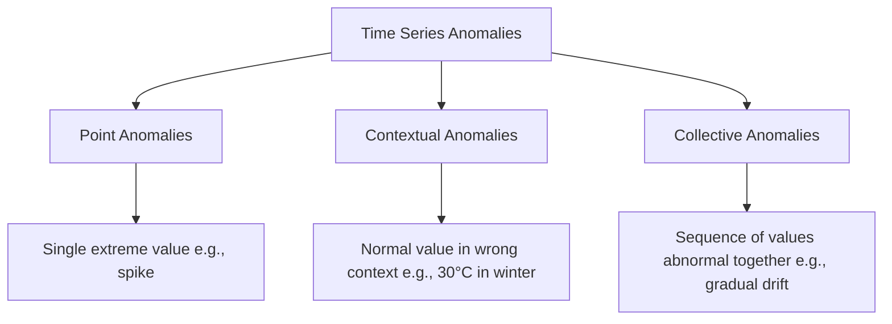
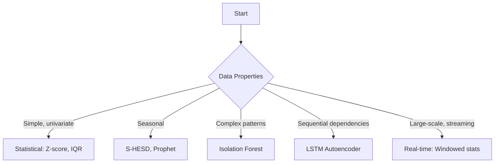

# Time Series Anomaly Detection

## Overview

Anomaly detection in time series identifies data points that deviate significantly from expected patterns. Unlike static anomaly detection, time series anomalies must account for **temporal context** — a value might be normal in one season but anomalous in another. Applications include fraud detection, system monitoring, manufacturing quality control, and network intrusion detection.

## Types of Anomalies



| Type | Example | Detection Method |
|------|---------|-----------------|
| Point | Sudden spike in CPU usage | Statistical thresholds |
| Contextual | Normal traffic at 3 AM (unusual time) | Seasonal decomposition |
| Collective | Gradual degradation over hours | Sequence modeling |

## Methods

### 1. Statistical Methods

#### Z-Score

```python
import numpy as np

def zscore_anomalies(series, threshold=3):
    """Detect anomalies using Z-score"""
    mean = np.mean(series)
    std = np.std(series)
    z_scores = (series - mean) / std
    return np.abs(z_scores) > threshold
```

#### Modified Z-Score (Robust to Outliers)

```python
def modified_zscore(series, threshold=3.5):
    """Uses median instead of mean (robust to outliers)"""
    median = np.median(series)
    mad = np.median(np.abs(series - median))  # Median Absolute Deviation
    modified_z = 0.6745 * (series - median) / mad
    return np.abs(modified_z) > threshold
```

#### IQR Method

```python
def iqr_anomalies(series, factor=1.5):
    Q1, Q3 = np.percentile(series, [25, 75])
    IQR = Q3 - Q1
    lower = Q1 - factor * IQR
    upper = Q3 + factor * IQR
    return (series < lower) | (series > upper)
```

### 2. Seasonal-Hybrid ESD (S-HESD)

Used by Twitter (now X) for detecting anomalies in seasonal data:

```python
from statsmodels.tsa.seasonal import seasonal_decompose

def shesd_anomalies(series, period=7, max_anomalies=10):
    """Seasonal Hybrid ESD"""
    # Decompose to remove seasonality
    result = seasonal_decompose(series, period=period, model='additive')
    residual = result.resid.dropna()

    # Apply Generalized ESD on residuals
    anomalies = []
    data = residual.copy()
    for _ in range(max_anomalies):
        if len(data) < 3:
            break
        mean = data.mean()
        std = data.std()
        test_stat = ((data - mean) / std).abs()
        max_idx = test_stat.idxmax()
        # Critical value from t-distribution
        from scipy.stats import t
        n = len(data)
        p = 1 - 0.05 / (2 * n)
        critical = t.ppf(p, n - 2)
        if test_stat[max_idx] > critical:
            anomalies.append(max_idx)
            data = data.drop(max_idx)
        else:
            break
    return anomalies
```

### 3. Isolation Forest

```python
from sklearn.ensemble import IsolationForest

def isolation_forest_anomalies(series, window_size=10):
    """Create features from sliding windows, apply Isolation Forest"""
    # Create lag features
    X = np.lib.stride_tricks.sliding_window_view(series, window_size)
    X = X.reshape(-1, window_size)

    clf = IsolationForest(contamination=0.05, random_state=42)
    labels = clf.fit_predict(X)  # -1 for anomalies, 1 for normal

    # Pad to original length
    full_labels = np.ones(len(series))
    full_labels[window_size - 1:] = labels
    return full_labels == -1
```

### 4. LSTM Autoencoder

```python
class LSTMAutoencoder(nn.Module):
    def __init__(self, input_dim, hidden_dim, num_layers=2):
        super().__init__()
        self.encoder = nn.LSTM(input_dim, hidden_dim, num_layers, batch_first=True)
        self.decoder = nn.LSTM(hidden_dim, hidden_dim, num_layers, batch_first=True)
        self.output_layer = nn.Linear(hidden_dim, input_dim)

    def forward(self, x):
        # Encode
        _, (hidden, cell) = self.encoder(x)
        # Repeat last hidden state for decoder input
        decoder_input = hidden[-1].unsqueeze(1).repeat(1, x.size(1), 1)
        # Decode
        decoded, _ = self.decoder(decoder_input, (hidden, cell))
        reconstructed = self.output_layer(decoded)
        return reconstructed

def detect_anomalies_lstm(model, data, threshold_percentile=95):
    """Detect anomalies by reconstruction error"""
    model.eval()
    with torch.no_grad():
        reconstructed = model(data)
        mse = ((data - reconstructed) ** 2).mean(dim=-1)
        threshold = np.percentile(mse.numpy(), threshold_percentile)
        return mse > threshold
```

### 5. Prophet-Based Detection

```python
from prophet import Prophet

def prophet_anomalies(df):
    """Use Prophet's uncertainty intervals for anomaly detection"""
    model = Prophet(interval_width=0.95)
    model.fit(df)
    forecast = model.predict(df)

    # Points outside 95% confidence interval
    df['yhat'] = forecast['yhat']
    df['yhat_lower'] = forecast['yhat_lower']
    df['yhat_upper'] = forecast['yhat_upper']
    df['anomaly'] = (df['y'] < df['yhat_lower']) | (df['y'] > df['yhat_upper'])
    return df
```

## Evaluation

```python
from sklearn.metrics import precision_recall_fscore_support

def evaluate_anomaly_detection(true_labels, predicted):
    precision, recall, f1, _ = precision_recall_fscore_support(
        true_labels, predicted, average='binary'
    )
    print(f"Precision: {precision:.4f}")
    print(f"Recall: {recall:.4f}")
    print(f"F1 Score: {f1:.4f}")
    return precision, recall, f1
```

### Metrics for Imbalanced Data

Since anomalies are rare, accuracy is misleading. Use:
- **Precision**: Of detected anomalies, how many are real?
- **Recall**: Of real anomalies, how many were detected?
- **F1**: Harmonic mean of precision and recall
- **AUC-ROC**: Area under ROC curve

## Method Selection Guide



## Interview Questions

1. **How do you detect anomalies in seasonal time series?** — Decompose into trend + seasonality + residual, then apply anomaly detection on residuals. Methods like S-HESD or Prophet's uncertainty intervals handle this.

2. **What is the difference between point and contextual anomalies?** — Point anomalies are globally extreme values. Contextual anomalies are only anomalous in context (e.g., 30°C is normal in summer but anomalous in winter).

3. **Why use LSTM Autoencoder for anomaly detection?** — It learns to reconstruct normal patterns. Anomalies have high reconstruction error because the model hasn't seen such patterns during training.

4. **How do you handle real-time anomaly detection?** — Use sliding windows with online statistics (rolling mean/std), or maintain a model that updates incrementally. Avoid look-ahead bias.

5. **What metrics should you use for anomaly detection evaluation?** — Precision, recall, F1 (not accuracy, since data is imbalanced). AUC-ROC for threshold-independent evaluation.

## Common Mistakes

- Using future data in the detection window (look-ahead bias)
- Setting thresholds too aggressively (too many false positives)
- Not accounting for seasonality (false alarms on seasonal peaks)
- Using accuracy on imbalanced data (always high, misleading)
- Not adapting thresholds over time (concept drift)

## Summary

Time series anomaly detection requires accounting for temporal context, seasonality, and trends. Methods range from simple statistical thresholds (Z-score, IQR) to deep learning (LSTM autoencoders). The choice depends on data complexity: statistical methods for simple series, ML for complex patterns, and streaming approaches for real-time detection. Proper evaluation uses precision/recall/F1 due to class imbalance.

## Cross-References

- [Time Series Overview](./README.md) — General time series concepts
- [ARIMA](./arima.md) — Decomposition and residuals
- [Prophet](./prophet.md) — Uncertainty-based detection
- [Isolation Forest](../classical/ensemble.md) — Ensemble anomaly detection
- [Evaluation Metrics](../foundations/evaluation.md) — Precision, recall, F1
