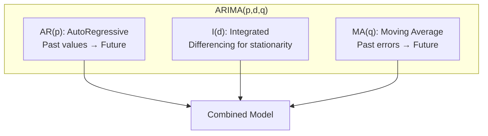
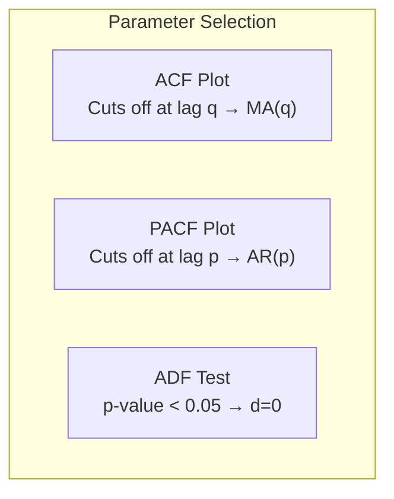
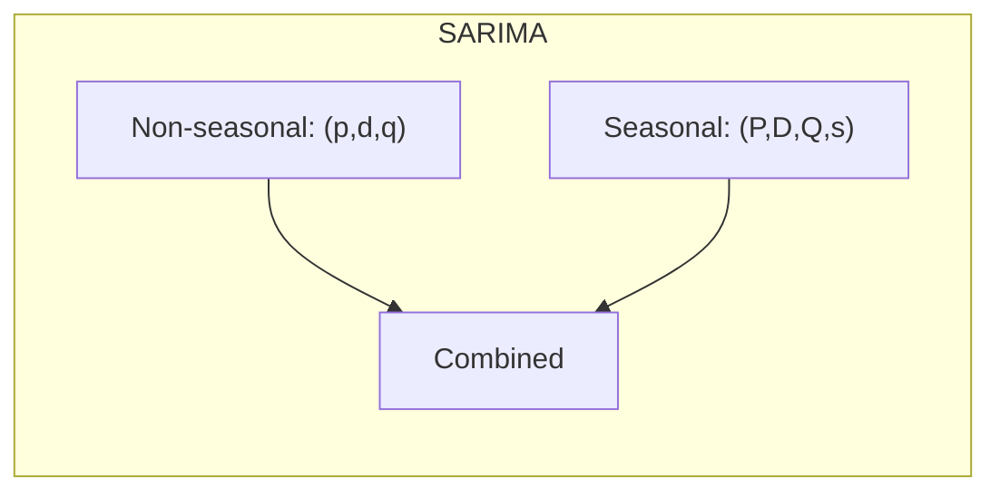

# ARIMA (AutoRegressive Integrated Moving Average)

## Overview

ARIMA is a classical statistical method for time series forecasting. It combines three components: AutoRegressive (AR), Integrated (I), and Moving Average (MA) to model time-dependent data.

## ARIMA Components



## Component Breakdown

### 1. AutoRegressive (AR) - p
```python
# AR(p): Y_t = c + φ₁Y_{t-1} + φ₂Y_{t-2} + ... + φₚY_{t-p} + ε
from statsmodels.tsa.ar_model import AutoReg

model = AutoReg(series, lags=5)
result = model.fit()
```

### 2. Integrated (I) - d
```python
# Differencing to achieve stationarity
d1 = series.diff(1)   # First difference
d2 = series.diff().diff()   # Second difference (if needed)
```

### 3. Moving Average (MA) - q
```python
# MA(q): Y_t = c + εₜ + θ₁ε_{t-1} + θ₂ε_{t-2} + ... + θqε_{t-q}
```

## ARIMA Model

```python
from statsmodels.tsa.arima.model import ARIMA

# Fit ARIMA(1,1,1)
model = ARIMA(series, order=(1, 1, 1))
result = model.fit()

# Forecast
forecast = result.forecast(steps=10)
print(result.summary())
```

## Parameter Selection

### 1. ACF and PACF Plots
```python
from statsmodels.graphics.tsaplots import plot_acf, plot_pacf
import matplotlib.pyplot as plt

fig, (ax1, ax2) = plt.subplots(2, 1, figsize=(12, 8))
plot_acf(series, ax=ax1)   # For MA(q) order
plot_pacf(series, ax=ax2)  # For AR(p) order
plt.show()
```



### 2. Auto ARIMA
```python
from pmdarima import auto_arima

model = auto_arima(
    series,
    start_p=0, max_p=5,
    start_q=0, max_q=5,
    d=None,           # Let model determine
    seasonal=False,
    stepwise=True,
    trace=True
)

print(model.summary())
```

## SARIMA (Seasonal ARIMA)

```python
from statsmodels.tsa.statespace.sarimax import SARIMAX

# SARIMA(p,d,q)(P,D,Q,s)
# s = seasonal period (12 for monthly, 7 for daily)
model = SARIMAX(
    series,
    order=(1, 1, 1),
    seasonal_order=(1, 1, 1, 12)
)
result = model.fit()
```



## Model Diagnostics

```python
# Check residuals
residuals = result.resid

# Ljung-Box test for autocorrelation
from statsmodels.stats.diagnostic import acorr_ljungbox
lb_test = acorr_ljungbox(residuals, lags=10)
print(lb_test)  # p-value > 0.05 → No autocorrelation

# Residual plots
fig, axes = plt.subplots(2, 2, figsize=(12, 8))
axes[0,0].plot(residuals)
axes[0,1].hist(residuals, bins=30)
plot_acf(residuals, ax=axes[1,0])
sm.qqplot(residuals, line='s', ax=axes[1,1])
plt.show()
```

## ARIMA vs SARIMA vs SARIMAX

| Model | Handles Seasonality | External Variables |
|-------|---------------------|-------------------|
| ARIMA | ❌ | ❌ |
| SARIMA | ✅ | ❌ |
| SARIMAX | ✅ | ✅ |

## Interview Questions

1. **What is ARIMA and what are its components?**
2. **How do you select p, d, q parameters?**
3. **When would you use SARIMA over ARIMA?**
4. **What are the limitations of ARIMA?**
5. **How do you validate an ARIMA model?**

## Common Mistakes

- **Non-stationary data**: ARIMA requires stationarity (differencing needed)
- **Wrong parameters**: Use ACF/PACF or auto_arima
- **Ignoring seasonality**: Use SARIMA for seasonal data
- **Overfitting**: Too many parameters capture noise

## Summary

ARIMA is a powerful classical method for time series forecasting. It combines autoregression, differencing, and moving averages. Key steps include achieving stationarity, selecting parameters (p,d,q) using ACF/PACF, and validating with residual diagnostics. For seasonal data, use SARIMA; for external variables, use SARIMAX.

## Cross-References

- [Time Series Overview](./README.md)
- [Prophet](./prophet.md)
- [Anomaly Detection](./anomaly.md)
- [Transformers for Time Series](./transformers.md)
- [ML Foundations Probability](../foundations/probability.md)
