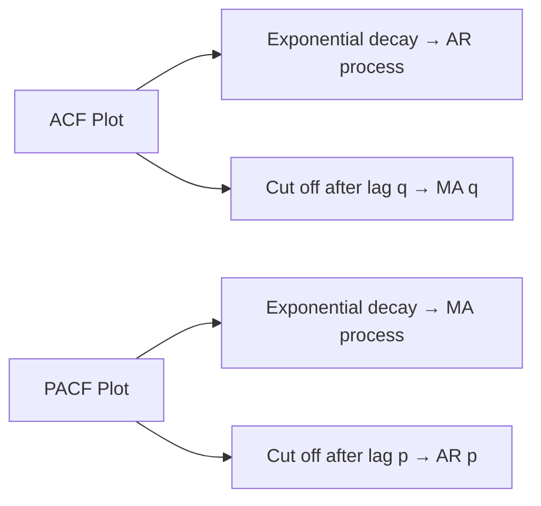

# ARIMA

## Overview

ARIMA (AutoRegressive Integrated Moving Average) is a classical statistical model for time series forecasting. It combines three components: **AR** (autoregression — using past values), **I** (differencing — making the series stationary), and **MA** (moving average — using past errors). ARIMA is the workhorse of univariate time series forecasting and remains a strong baseline.

## ARIMA(p, d, q) Components

```mermaid
graph TD
    A[ARIMA p, d, q] --> B[AR p: AutoRegressive]
    A --> C[I d: Integrated Differencing]
    A --> D[MA q: Moving Average]
    B --> E[y_t = c + φ₁y_{t-1} + ... + φₚy_{t-p}]
    C --> F[y_t' = y_t - y_{t-1} applied d times]
    D --> G[y_t = c + θ₁ε_{t-1} + ... + θqε_{t-q}]
```

### Component Breakdown

| Component | Parameter | Meaning | Identification |
|-----------|-----------|---------|----------------|
| AR(p) | p = order | Number of past values used | PACF plot cuts off at lag p |
| I(d) | d = degree | Number of differencing steps | ADF test for stationarity |
| MA(q) | q = order | Number of past errors used | ACF plot cuts off at lag q |

## The ARIMA Equation

$$y_t' = c + \phi_1 y_{t-1}' + \ldots + \phi_p y_{t-p}' + \theta_1 \varepsilon_{t-1} + \ldots + \theta_q \varepsilon_{t-q} + \varepsilon_t$$

where $y_t'$ is the differenced series.

### Special Cases

- **ARIMA(0,0,0)**: White noise
- **ARIMA(1,0,0)**: AR(1) — first-order autoregression
- **ARIMA(0,0,1)**: MA(1) — first-order moving average
- **ARIMA(0,1,0)**: Random walk ($y_t = y_{t-1} + \varepsilon_t$)
- **ARIMA(1,1,0)**: Differenced AR(1)
- **ARIMA(p,d,q) + Seasonal(P,D,Q,s)**: SARIMA

## Implementation

### Step 1: Check Stationarity

```python
from statsmodels.tsa.stattools import adfuller

def check_stationarity(series):
    result = adfuller(series)
    print(f'ADF Statistic: {result[0]:.4f}')
    print(f'p-value: {result[1]:.4f}')
    print(f'Critical Values:')
    for key, value in result[4].items():
        print(f'  {key}: {value:.4f}')
    return result[1] < 0.05  # True if stationary

# If not stationary, difference the series
diff_series = series.diff().dropna()
```

### Step 2: Identify Orders with ACF/PACF

```python
import matplotlib.pyplot as plt
from statsmodels.graphics.tsaplots import plot_acf, plot_pacf

fig, axes = plt.subplots(1, 2, figsize=(12, 4))
plot_acf(diff_series, ax=axes[0], lags=20)   # For MA order (q)
plot_pacf(diff_series, ax=axes[1], lags=20)   # For AR order (p)
plt.show()
```



### Step 3: Fit ARIMA

```python
from statsmodels.tsa.arima.model import ARIMA

# Fit ARIMA(2,1,2)
model = ARIMA(train_series, order=(2, 1, 2))
fitted = model.fit()
print(fitted.summary())

# Forecast
forecast = fitted.forecast(steps=30)
print(forecast)
```

### Step 4: Auto ARIMA

```python
from pmdarima import auto_arima

# Automatically find best (p,d,q)
auto_model = auto_arima(
    train_series,
    start_p=0, max_p=5,
    start_q=0, max_q=5,
    d=None,           # Let auto_arima determine d
    seasonal=True,     # For SARIMA
    m=12,              # Seasonal period
    stepwise=True,     # Faster search
    trace=True,        # Print search progress
    error_action='ignore',
    suppress_warnings=True
)
print(auto_model.summary())
forecast = auto_model.predict(n_periods=30)
```

## SARIMA (Seasonal ARIMA)

Extends ARIMA with seasonal components:

$$\text{SARIMA}(p,d,q)(P,D,Q)_s$$

| Parameter | Meaning |
|-----------|---------|
| P | Seasonal autoregressive order |
| D | Seasonal differencing |
| Q | Seasonal moving average order |
| s | Seasonal period (12 for monthly, 7 for daily) |

```python
from statsmodels.tsa.statespace.sarimax import SARIMAX

# SARIMA(1,1,1)(1,1,1,12)
model = SARIMAX(
    train_series,
    order=(1, 1, 1),
    seasonal_order=(1, 1, 1, 12)
)
fitted = model.fit()
forecast = fitted.forecast(steps=24)
```

## Diagnostic Checks

```python
# Residual diagnostics
residuals = fitted.resid

# 1. Residuals should be white noise (no autocorrelation)
from statsmodels.stats.diagnostic import acorr_ljungbox
lb_test = acorr_ljungbox(residuals, lags=10)
print("Ljung-Box p-values:", lb_test['lb_pvalue'].values)

# 2. Residuals should be normally distributed
from scipy.stats import shapiro
stat, p_value = shapiro(residuals)
print(f"Shapiro-Wilk p-value: {p_value:.4f}")

# 3. ACF of residuals should show no significant autocorrelation
plot_acf(residuals, lags=20)
```

## Interview Questions

1. **What do ACF and PACF plots tell you?** — ACF shows correlation of a series with its lags (helps identify MA order). PACF shows direct correlation after removing intermediate effects (helps identify AR order). ACF cutting off at lag q suggests MA(q); PACF cutting off at lag p suggests AR(p).

2. **How do you determine the differencing order d?** — Use the ADF test: if p-value > 0.05, the series is non-stationary and needs differencing. Apply differencing until the series is stationary (typically d=0, 1, or 2).

3. **What is the difference between ARIMA and SARIMA?** — SARIMA adds seasonal components (P, D, Q, s) to capture periodic patterns. For monthly data with yearly seasonality, use SARIMA(p,d,q)(P,D,Q,12).

4. **When does ARIMA fail?** — Non-linear patterns, multiple seasonalities, exogenous variables (use SARIMAX), high-frequency data, very long-range dependencies.

5. **How do you handle missing values in time series for ARIMA?** — Interpolation (linear, spline), forward fill, or model-based imputation. ARIMA requires equally-spaced observations.

## Common Mistakes

- Not checking stationarity before fitting (ADF test required)
- Using future data for differencing or normalization
- Overfitting with high p and q orders (use AIC/BIC for selection)
- Ignoring seasonal patterns (use SARIMA)
- Not validating residuals (should be white noise)

## Summary

ARIMA(p,d,q) models time series as a combination of autoregressive terms, differencing, and moving averages. The workflow is: check stationarity → identify orders via ACF/PACF → fit model → check diagnostics. Auto ARIMA automates order selection. SARIMA extends ARIMA for seasonal data. Despite the rise of deep learning, ARIMA remains a strong baseline for univariate forecasting.

## Cross-References

- [Time Series Overview](./README.md) — General time series concepts
- [Prophet](./prophet.md) — Facebook's automated forecasting
- [Transformers for Time Series](./transformers.md) — Deep learning approach
- [Anomaly Detection](./anomaly.md) — Finding outliers
- [Probability](../foundations/probability.md) — Stationarity, distributions
