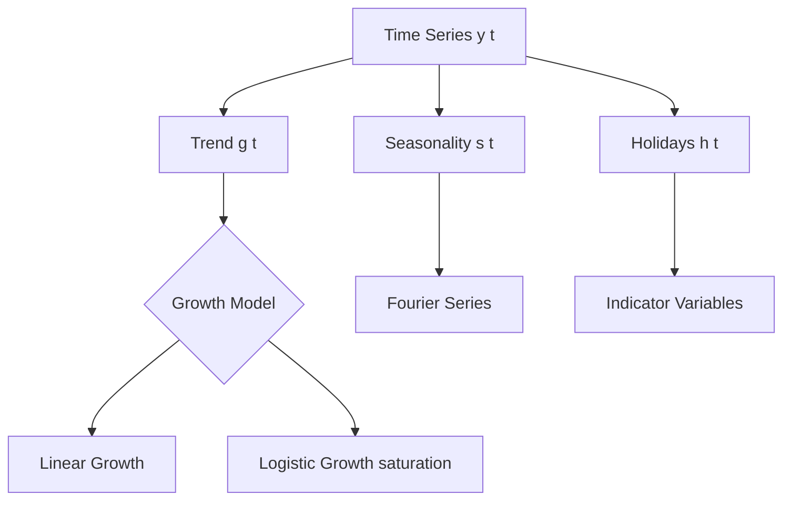
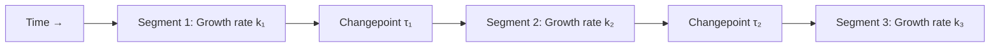

# Prophet

## Overview

Prophet is Facebook's (Meta's) open-source time series forecasting tool, released in 2017. It's designed for **business forecasting** with strong seasonal effects, holiday impacts, and trend changes. Prophet is robust to missing data, outliers, and trend shifts — common in real-world business data. It uses an additive regression model decomposing the time series into trend, seasonality, and holiday effects.

## Prophet Model

$$y(t) = g(t) + s(t) + h(t) + \varepsilon_t$$

| Component | Symbol | Description |
|-----------|--------|-------------|
| Trend | $g(t)$ | Long-term growth pattern |
| Seasonality | $s(t)$ | Periodic patterns (weekly, yearly) |
| Holidays | $h(t)$ | Irregular events (Black Friday, Super Bowl) |
| Error | $\varepsilon_t$ | Random noise |



## Trend Models

### Linear Trend

$$g(t) = (k + a(t)^T \delta) t + (m + a(t)^T \gamma)$$

where $k$ is the growth rate and $m$ is the offset.

### Logistic Growth (Saturating)

$$g(t) = \frac{C(t)}{1 + \exp(-k(t - m))}$$

where $C(t)$ is the carrying capacity (maximum).

### Automatic Changepoint Detection

Prophet automatically detects **trend changepoints** (e.g., product launches, market crashes):

```python
from prophet import Prophet

model = Prophet(
    changepoint_prior_scale=0.05,  # Flexibility of trend changes
    n_changepoints=25,              # Number of potential changepoints
    changepoint_range=0.9           # Where changepoints can occur
)
```



## Seasonality

Prophet models seasonality using **Fourier series**:

$$s(t) = \sum_{n=1}^{N} \left(a_n \cos\left(\frac{2\pi n t}{P}\right) + b_n \sin\left(\frac{2\pi n t}{P}\right)\right)$$

| Seasonality | Period P | Fourier Order N |
|-------------|----------|-----------------|
| Weekly | 7 | 3 |
| Yearly | 365.25 | 10 |
| Daily | 1 | 4 |

```python
# Built-in seasonalities
model = Prophet(
    yearly_seasonality=True,
    weekly_seasonality=True,
    daily_seasonality=False
)

# Custom seasonality
model.add_seasonality(
    name='monthly',
    period=30.5,
    fourier_order=5
)

# Conditional seasonality (e.g., different weekly pattern on weekends)
model.add_seasonality(
    name='weekend',
    period=7,
    fourier_order=3,
    condition_name='is_weekend'
)
```

## Holidays and Events

```python
# Define holidays
holidays = pd.DataFrame({
    'holiday': 'black_friday',
    'ds': pd.to_datetime(['2023-11-24', '2024-11-29', '2025-11-28']),
    'lower_window': -1,  # Effect starts 1 day before
    'upper_window': 3,   # Effect ends 3 days after
})

# Multiple holidays
super_bowl = pd.DataFrame({
    'holiday': 'super_bowl',
    'ds': pd.to_datetime(['2023-02-12', '2024-02-11']),
    'lower_window': 0,
    'upper_window': 1,
})

holidays = pd.concat([holidays, super_bowl])

model = Prophet(holidays=holidays)
```

## Usage

```python
import pandas as pd
from prophet import Prophet

# Prepare data (columns must be 'ds' and 'y')
df = pd.DataFrame({
    'ds': pd.date_range('2020-01-01', periods=1000, freq='D'),
    'y': your_time_series_data
})

# Create and fit model
model = Prophet(
    growth='linear',
    yearly_seasonality=True,
    weekly_seasonality=True,
    changepoint_prior_scale=0.05
)
model.fit(df)

# Make future dataframe
future = model.make_future_dataframe(periods=365)
forecast = model.predict(future)

# Components plot
model.plot_components(forecast)
```

### Adding Regressors (External Variables)

```python
# Add external regressors
df['marketing_spend'] = marketing_data
model = Prophet()
model.add_regressor('marketing_spend', prior_scale=0.5, mode='multiplicative')
model.fit(df)
```

## Hyperparameters

| Parameter | Default | Effect |
|-----------|---------|--------|
| `changepoint_prior_scale` | 0.05 | Higher = more flexible trend |
| `seasonality_prior_scale` | 10 | Higher = more flexible seasonality |
| `holidays_prior_scale` | 10 | Higher = more flexible holiday effects |
| `seasonality_mode` | 'additive' | 'multiplicative' for scaling seasonality |
| `changepoint_range` | 0.9 | Fraction of history where changepoints allowed |

```python
from prophet.diagnostics import cross_validation, performance_metrics

# Cross-validation
df_cv = cross_validation(
    model,
    initial='730 days',   # Training period
    period='180 days',     # Cut every 180 days
    horizon='365 days'     # Forecast 365 days
)

# Performance metrics
df_p = performance_metrics(df_cv)
print(df_p[['horizon', 'mape', 'rmse', 'mae']].head())
```

## Interview Questions

1. **How does Prophet model seasonality?** — Using Fourier series: sinusoidal functions of different frequencies that can capture any periodic pattern. The order N controls flexibility.

2. **What are changepoints and how does Prophet handle them?** — Changepoints are moments where the trend rate changes. Prophet automatically detects them and allows the trend to shift. The `changepoint_prior_scale` controls flexibility.

3. **When would you choose Prophet over ARIMA?** — Prophet: multiple seasonalities, holiday effects, missing data, automatic changepoints, business users. ARIMA: simple univariate series, need for statistical rigor, smaller datasets.

4. **What is the difference between additive and multiplicative seasonality in Prophet?** — Additive: seasonal effect is constant regardless of trend level. Multiplicative: seasonal effect scales with the trend (e.g., 10% increase during holidays).

5. **How do you handle missing data in Prophet?** — Prophet handles missing data natively — just leave gaps in the 'ds' column. It doesn't require equally-spaced observations.

## Common Mistakes

- Not setting `seasonality_mode='multiplicative'` when seasonality scales with trend
- Using too high `changepoint_prior_scale` (overfitting to noise)
- Not including relevant holidays for business data
- Ignoring the `cap` and `floor` for logistic growth
- Not cross-validating (just fitting and hoping)

## Summary

Prophet is a powerful, user-friendly forecasting tool designed for business time series. Its additive decomposition (trend + seasonality + holidays) is intuitive and interpretable. Automatic changepoint detection and Fourier-based seasonality make it robust to real-world data quirks. While less statistically rigorous than ARIMA, Prophet excels at rapid prototyping and handling messy business data.

## Cross-References

- [Time Series Overview](./README.md) — General concepts
- [ARIMA](./arima.md) — Classical statistical approach
- [Transformers for Time Series](./transformers.md) — Deep learning alternative
- [Feature Engineering](../foundations/feature-engineering.md) — Adding regressors
- [Cross-Validation](../foundations/cross-validation.md) — Time series CV
