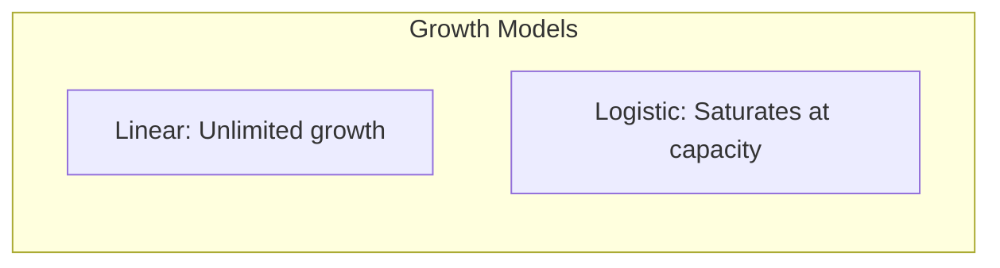

# Facebook Prophet

## Overview

Prophet is Facebook's open-source time series forecasting library designed for business time series with strong seasonal effects, holidays, and missing data. It's user-friendly and handles common time series challenges automatically.

## Prophet Model

```mermaid
graph TB
    subgraph "Prophet Decomposition"
        Y[y(t)] --> T[Trend g(t)]
        Y --> S[Seasonality s(t)]
        Y --> H[Holiday Effects h(t)]
        Y --> E[Error ε(t)]
    end
    
    T --> F["y(t) = g(t) + s(t) + h(t) + ε(t)"]
    S --> F
    H --> F
    E --> F
```

## Trend Models

### 1. Linear Trend
```python
# Default: Linear trend with changepoints
from prophet import Prophet

model = Prophet(growth='linear')
model.fit(df)
```

### 2. Logistic Growth
```python
# For data with saturation (carrying capacity)
df['cap'] = 10000  # Maximum value
df['floor'] = 0    # Minimum value

model = Prophet(growth='logistic')
model.fit(df)
```



## Key Features

### 1. Seasonality
```python
# Built-in seasonality
model = Prophet(
    yearly_seasonality=True,
    weekly_seasonality=True,
    daily_seasonality=False
)

# Custom seasonality
model.add_seasonality(
    name='monthly',
    period=30.5,
    fourier_order=5
)
```

### 2. Holidays
```python
# Add holidays
holidays = pd.DataFrame({
    'holiday': 'black_friday',
    'ds': pd.to_datetime(['2023-11-24', '2024-11-29']),
    'lower_window': -1,
    'upper_window': 1,
})

model = Prophet(holidays=holidays)
```

### 3. Changepoints
```python
# Automatic changepoint detection
model = Prophet(
    changepoint_prior_scale=0.05,  # Flexibility
    n_changepoints=25               # Number of changepoints
)

# Manual changepoints
model = Prophet(
    changepoints=['2023-03-15', '2023-06-01']
)
```

## Usage Example

```python
from prophet import Prophet
import pandas as pd

# Prepare data (must have 'ds' and 'y' columns)
df = pd.DataFrame({
    'ds': pd.date_range('2023-01-01', periods=365),
    'y': time_series_data
})

# Create and fit model
model = Prophet(
    yearly_seasonality=True,
    weekly_seasonality=True,
    changepoint_prior_scale=0.05
)

# Add regressors (external variables)
model.add_regressor('temperature')
model.add_regressor('is_holiday')

model.fit(df)

# Make future dataframe
future = model.make_future_dataframe(periods=30)
future['temperature'] = temperature_data
future['is_holiday'] = holiday_data

# Predict
forecast = model.predict(future)

# Plot
model.plot(forecast)
model.plot_components(forecast)
```

## Prophet vs ARIMA

| Aspect | Prophet | ARIMA |
|--------|---------|-------|
| Ease of use | Very easy | Moderate |
| Seasonality | Built-in | Manual specification |
| Holidays | Built-in | Manual |
| Missing data | Handles well | Needs imputation |
| Interpretability | High (components) | Moderate |
| Speed | Fast | Fast |

## Interview Questions

1. **What is Prophet and when would you use it?**
2. **How does Prophet handle seasonality?**
3. **What are changepoints in Prophet?**
4. **How do you add external variables to Prophet?**
5. **Compare Prophet with ARIMA for business forecasting.**

## Common Mistakes

- **Not setting cap for logistic growth**: Prophet needs explicit capacity
- **Ignoring changepoint_prior_scale**: Too high = overfit, too low = underfit
- **Not validating with time split**: Always use temporal validation
- **Over-relying on defaults**: Tune parameters for your specific data

## Summary

Prophet is an excellent choice for business time series forecasting. It handles seasonality, holidays, and missing data automatically. Key features include trend models (linear/logistic), automatic changepoint detection, and easy addition of external regressors. It's particularly useful when you need interpretable forecasts with component decomposition.

## Cross-References

- [ARIMA](./arima.md)
- [Time Series Overview](./README.md)
- [Anomaly Detection](./anomaly.md)
- [Feature Engineering](../foundations/feature-engineering.md)

