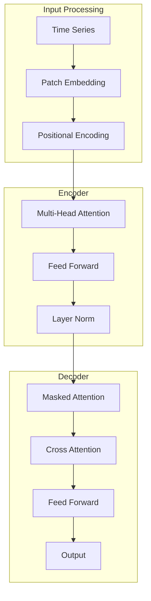
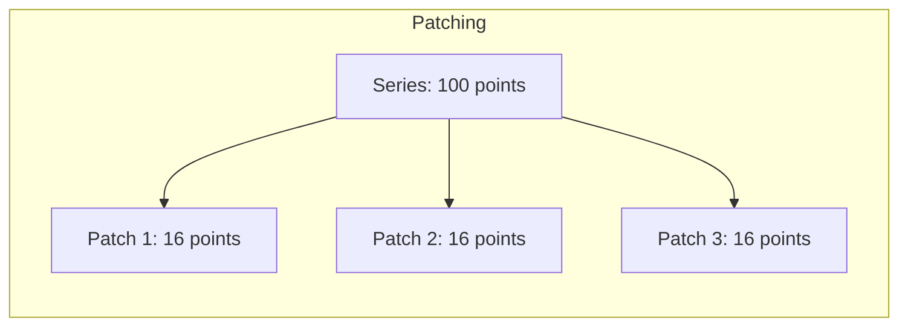

# Transformers for Time Series

## Overview

Transformers, originally designed for NLP, have been adapted for time series forecasting. They capture long-range dependencies and complex patterns through self-attention mechanisms, achieving state-of-the-art results on many benchmarks.

## Transformer Architecture for Time Series



## Key Adaptations for Time Series

### 1. Patching
```python
# Convert time series into patches
def create_patches(series, patch_size, stride):
    patches = []
    for i in range(0, len(series) - patch_size + 1, stride):
        patches.append(series[i:i+patch_size])
    return np.array(patches)

# Example: 100 timesteps → 11 patches of size 16 with stride 8
patches = create_patches(series, patch_size=16, stride=8)
```



### 2. Positional Encoding
```python
# Sinusoidal positional encoding
def positional_encoding(max_len, d_model):
    PE = np.zeros((max_len, d_model))
    for pos in range(max_len):
        for i in range(0, d_model, 2):
            PE[pos, i] = np.sin(pos / (10000 ** (i / d_model)))
            PE[pos, i+1] = np.cos(pos / (10000 ** (i / d_model)))
    return PE
```

## Popular Models

### 1. Informer
```python
# Informer: Efficient Transformer for long sequences
# Key: ProbSparse attention reduces O(L²) to O(L log L)
class Informer(nn.Module):
    def __init__(self):
        self.encoder = ProbSparseEncoder()
        self.decoder = Decoder()
    
    def forward(self, x):
        enc_out = self.encoder(x)
        dec_out = self.decoder(enc_out)
        return dec_out
```

### 2. Autoformer
- Auto-correlation mechanism replaces self-attention
- Series decomposition block
- More efficient for long sequences

### 3. PatchTST
```python
# PatchTST: Channel-independent patching
class PatchTST(nn.Module):
    def __init__(self, patch_size=16, stride=8):
        self.patch_embed = nn.Linear(patch_size, d_model)
        self.transformer = nn.TransformerEncoder(...)
    
    def forward(self, x):
        # x: (batch, channels, time)
        patches = self.create_patches(x)
        embeddings = self.patch_embed(patches)
        output = self.transformer(embeddings)
        return output
```

### 4. iTransformer
- Inverted Transformer: attention across variables, not time
- Better for multivariate time series
- Captures cross-variable dependencies

## Comparison with Traditional Methods

| Aspect | Transformers | LSTM | ARIMA |
|--------|--------------|------|-------|
| Long-range dependencies | Excellent | Limited | Limited |
| Parallelization | High | Low | N/A |
| Data requirements | High | Medium | Low |
| Interpretability | Moderate | Low | High |
| Training cost | High | Low | Low |

## Implementation Example

```python
import torch
import torch.nn as nn

class TimeSeriesTransformer(nn.Module):
    def __init__(self, input_dim, d_model, nhead, num_layers, pred_len):
        super().__init__()
        self.patch_size = 16
        self.patch_embed = nn.Linear(self.patch_size, d_model)
        self.pos_embed = nn.Parameter(torch.randn(1, 100, d_model))
        
        encoder_layer = nn.TransformerEncoderLayer(
            d_model=d_model,
            nhead=nhead,
            dim_feedforward=d_model * 4,
            dropout=0.1
        )
        self.transformer = nn.TransformerEncoder(encoder_layer, num_layers)
        self.head = nn.Linear(d_model, pred_len)
    
    def forward(self, x):
        # x: (batch, time, features)
        patches = self.create_patches(x)
        embeddings = self.patch_embed(patches) + self.pos_embed
        output = self.transformer(embeddings)
        predictions = self.head(output[:, -1, :])
        return predictions
```

## Interview Questions

1. **How are Transformers adapted for time series?**
2. **What is patching and why is it important?**
3. **Compare Informer, Autoformer, and PatchTST.**
4. **When would you use Transformers over traditional methods?**
5. **What are the limitations of Transformers for time series?**

## Common Mistakes

- **Too much data needed**: Transformers need large datasets
- **Ignoring efficiency**: Standard attention is O(L²), use efficient variants
- **Not using patches**: Processing point-by-point is inefficient
- **Overfitting**: Complex models overfit on small datasets

## Summary

Transformers have revolutionized time series forecasting by capturing long-range dependencies through self-attention. Key adaptations include patching, positional encoding, and efficient attention mechanisms. Models like Informer, Autoformer, and PatchTST address efficiency concerns. Use Transformers when you have sufficient data and need to capture complex temporal patterns.

## Cross-References

- [Transformer Architecture](../transformers/architecture.md)
- [Attention Mechanism](../deep-learning/attention.md)
- [Time Series Overview](./README.md)
- [ARIMA](./arima.md)
- [LLM Architecture](../../llm/llm-serving/architecture.md)
