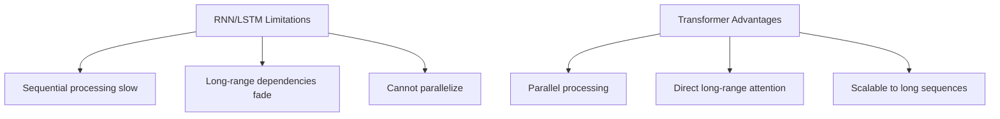
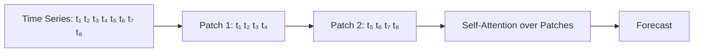

# Transformers for Time Series

## Overview

Transformers have revolutionized time series forecasting by capturing long-range dependencies through self-attention. Unlike RNNs that process sequences step-by-step, Transformers attend to all positions simultaneously, enabling parallel computation and better modeling of distant temporal relationships. Key architectures include Informer, Autoformer, PatchTST, and foundation models like TimesFM and Chronos.

## Why Transformers for Time Series?



## Core Adaptations

### Positional Encoding for Time Series

Standard sinusoidal positional encoding works, but time-specific encodings are more informative:

```python
class TimeFeatureEmbedding(nn.Module):
    """Encode time-specific features"""
    def __init__(self, d_model):
        super().__init__()
        self.hour_embed = nn.Embedding(24, d_model)
        self.day_embed = nn.Embedding(7, d_model)
        self.month_embed = nn.Embedding(12, d_model)

    def forward(self, timestamps):
        hour = self.hour_embed(timestamps.hour)
        day = self.day_embed(timestamps.dayofweek)
        month = self.month_embed(timestamps.month)
        return hour + day + month
```

### Patching (PatchTST)

Instead of attending to individual time steps, divide the series into **patches** (like ViT for images):



```python
class PatchEmbedding(nn.Module):
    def __init__(self, patch_size, d_model):
        super().__init__()
        self.patch_size = patch_size
        self.projection = nn.Linear(patch_size, d_model)

    def forward(self, x):
        # x: (batch, seq_len, 1)
        B, L, C = x.shape
        # Create patches
        num_patches = L // self.patch_size
        patches = x[:, :num_patches * self.patch_size]
        patches = patches.reshape(B, num_patches, self.patch_size * C)
        return self.projection(patches)  # (B, num_patches, d_model)
```

## Key Architectures

### Informer (2021)

Solves the $O(L^2)$ attention complexity problem with **ProbSparse attention**:

$$\text{Attention}(Q, K, V) = \text{softmax}\left(\frac{\bar{Q}K^T}{\sqrt{d_k}}\right)V$$

where $\bar{Q}$ contains only the top-u most active queries.

```python
class ProbSparseAttention(nn.Module):
    def __init__(self, d_model, n_heads, factor=5):
        super().__init__()
        self.factor = factor
        self.scale = (d_model // n_heads) ** -0.5

    def forward(self, queries, keys, values):
        B, L_Q, _ = queries.shape
        _, L_K, _ = keys.shape

        # Sample top-u queries
        u = self.factor * int(np.log(L_Q))
        U = min(u, L_Q)

        # Compute KL divergence to find most active queries
        scores = (queries @ keys.transpose(-2, -1)) * self.scale
        # Select top-U queries by max attention score
        top_scores, top_idx = scores.max(dim=-1).topk(U, dim=1)
        # Only attend with selected queries
        sparse_scores = scores[top_idx]
        attn = sparse_scores.softmax(dim=-1)
        return attn @ values
```

### Autoformer (2021)

Replaces self-attention with **auto-correlation** mechanism:

```python
def auto_correlation(x, lag):
    """Compute autocorrelation-based attention"""
    B, L, D = x.shape
    # FFT-based autocorrelation
    x_fft = torch.fft.rfft(x, dim=1)
    acf = torch.fft.irfft(x_fft * x_fft.conj(), dim=1)
    # Top-k lag selection
    top_lags = acf.topk(k=lag, dim=1).indices
    return top_lags
```

### PatchTST (2023)

Channel-independent patching with Transformer encoder:

```python
class PatchTST(nn.Module):
    def __init__(self, seq_len, pred_len, patch_size=16, d_model=128, n_heads=8, n_layers=3):
        super().__init__()
        self.patch_embed = PatchEmbedding(patch_size, d_model)
        self.pos_embed = nn.Parameter(torch.randn(1, seq_len // patch_size, d_model))
        encoder_layer = nn.TransformerEncoderLayer(d_model, n_heads, dim_feedforward=d_model*4, batch_first=True)
        self.encoder = nn.TransformerEncoder(encoder_layer, n_layers)
        self.head = nn.Linear(d_model, pred_len)

    def forward(self, x):
        # x: (batch, seq_len, channels)
        B, L, C = x.shape
        # Process each channel independently
        outputs = []
        for c in range(C):
            xc = x[:, :, c:c+1]  # (B, L, 1)
            patches = self.patch_embed(xc)  # (B, num_patches, d_model)
            patches = patches + self.pos_embed
            encoded = self.encoder(patches)
            # Use last patch for prediction
            out = self.head(encoded[:, -1, :])  # (B, pred_len)
            outputs.append(out)
        return torch.stack(outputs, dim=-1)  # (B, pred_len, C)
```

## Foundation Models

### TimesFM (Google, 2024)

Pre-trained on 100B real-world time series points. Zero-shot forecasting without task-specific training.

### Chronos (Amazon, 2024)

Treats time series as a language modeling problem — tokenizes values and predicts probability distributions over future values.

```python
# Chronos usage
from chronos import ChronosPipeline

pipeline = ChronosPipeline.from_pretrained("amazon/chronos-t5-small")
forecast = pipeline.predict(
    context=torch.tensor(history),
    prediction_length=30,
    num_samples=20  # Probabilistic forecasts
)
```

## Comparison

| Model | Attention | Complexity | Best For |
|-------|-----------|------------|----------|
| Vanilla Transformer | Full $O(L^2)$ | $O(L^2)$ | Short sequences |
| Informer | ProbSparse | $O(L \log L)$ | Long sequences |
| Autoformer | Auto-correlation | $O(L \log L)$ | Periodic series |
| PatchTST | Patch-based | $O((L/P)^2)$ | Multivariate |
| TimesFM | Pre-trained | Varies | Zero-shot |

## Interview Questions

1. **Why use Transformers over LSTMs for time series?** — Transformers can attend to any time step directly (no vanishing gradient), parallelize computation, and scale to long sequences. LSTMs are sequential and struggle with very long dependencies.

2. **What is PatchTST and why does patching help?** — PatchTST divides the time series into fixed-size patches and applies attention over patches. This reduces sequence length (fewer tokens), captures local patterns within patches, and is more efficient than point-wise attention.

3. **How does Informer reduce attention complexity?** — ProbSparse attention selects only the top-u most informative queries based on KL divergence, reducing complexity from $O(L^2)$ to $O(L \log L)$.

4. **What are foundation models for time series?** — Models like TimesFM and Chronos are pre-trained on massive time series datasets and can forecast new series zero-shot, similar to how GPT handles text.

5. **How do you handle multivariate time series with Transformers?** — Channel-independent (PatchTST): process each variable separately. Channel-dependent: attend across variables. The former often generalizes better.

## Common Mistakes

- Using full attention on very long sequences (quadratic memory)
- Not normalizing per-variate for multivariate series
- Ignoring temporal position information (time features matter)
- Applying standard Transformers without patching (inefficient)
- Not using proper time series cross-validation

## Summary

Transformers for time series offer powerful long-range dependency modeling through self-attention. Key innovations include patching (PatchTST), sparse attention (Informer), and auto-correlation (Autoformer). Foundation models (TimesFM, Chronos) enable zero-shot forecasting. While computationally more expensive than ARIMA, Transformers excel at complex, multivariate, long-horizon forecasting.

## Cross-References

- [Transformer Architecture](../transformers/architecture.md) — Core Transformer design
- [Self-Attention](../transformers/self-attention.md) — Attention mechanism details
- [Vision Transformers](../transformers/vit.md) — Patching concept from ViT
- [ARIMA](./arima.md) — Classical baseline
- [RNNs & LSTMs](../deep-learning/rnn-lstm.md) — Sequential alternative
