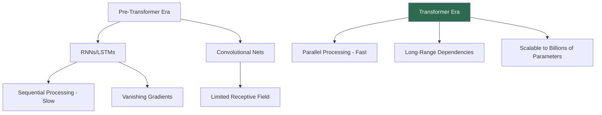
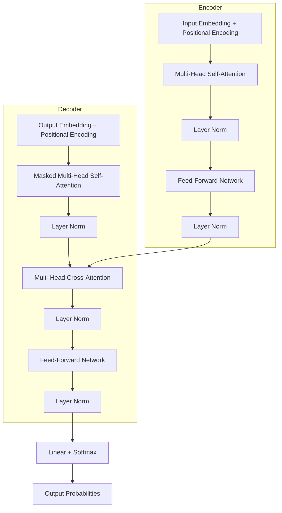
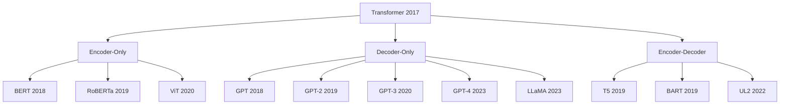

# Transformers

## Overview

The Transformer architecture, introduced in the landmark 2017 paper *"Attention Is All You Need"* by Vaswani et al., replaced recurrent and convolutional architectures with **pure attention mechanisms**. It is the foundation of modern NLP, computer vision, and multimodal AI — powering models like BERT, GPT, T5, ViT, and every major LLM.

## Why Transformers Matter

## Architecture at a Glance

## Topics in This Section

| Topic | Key Concepts | Interview Frequency |
|-------|-------------|-------------------|
| [Architecture](architecture.md) | Encoder-decoder, residual connections, layer norm | ⭐⭐⭐⭐⭐ |
| [Self-Attention](self-attention.md) | Scaled dot-product, multi-head attention | ⭐⭐⭐⭐⭐ |
| [Positional Encoding](positional-encoding.md) | Sinusoidal, learned, RoPE, ALiBi | ⭐⭐⭐⭐ |
| [BERT](bert.md) | Masked LM, NSP, fine-tuning | ⭐⭐⭐⭐⭐ |
| [GPT](gpt.md) | Autoregressive, causal masking, scaling | ⭐⭐⭐⭐⭐ |
| [T5](t5.md) | Text-to-text, encoder-decoder | ⭐⭐⭐⭐ |
| [ViT](vit.md) | Patch embedding, vision transformers | ⭐⭐⭐⭐ |
| [Training](training.md) | Pre-training, fine-tuning, RLHF | ⭐⭐⭐⭐⭐ |

## Transformer Family Tree

## Key Innovation: Self-Attention

The core idea is **self-attention** — every token attends to every other token in the sequence, enabling direct modeling of long-range dependencies.

\\[\text{Attention}(Q, K, V) = \text{softmax}\left(\frac{QK^T}{\sqrt{d_k}}\right)V\\]

Where:
- $Q$ (Query): "What am I looking for?"
- $K$ (Key): "What do I contain?"
- $V$ (Value): "What information do I provide?"
- $d_k$: Dimension of keys (scaling factor)

## Complexity Comparison

| Model | Time Complexity | Parallel? | Long-Range |
|-------|----------------|-----------|------------|
| RNN | $O(n \cdot d^2)$ | No (sequential) | Weak |
| LSTM | $O(n \cdot d^2)$ | No (sequential) | Moderate |
| CNN | $O(k \cdot n \cdot d^2)$ | Yes | Limited by kernel |
| **Transformer** | $O(n^2 \cdot d)$ | **Yes** | **Strong** |

## Interview Questions

### Q1: Why did Transformers replace RNNs?
**Answer:** Three key reasons:
1. **Parallelism**: RNNs process tokens sequentially ($O(n)$ steps); Transformers process all tokens simultaneously
2. **Long-range dependencies**: Self-attention creates direct connections between any two tokens, regardless of distance
3. **Scalability**: Transformers scale efficiently to billions of parameters with GPU/TPU hardware

### Q2: What is the "Attention Is All You Need" paper about?
**Answer:** It introduced the Transformer architecture, which uses only attention mechanisms (no recurrence, no convolution) for sequence transduction. Key innovations: multi-head self-attention, positional encoding, and the encoder-decoder structure.

### Q3: Name three variants of the Transformer architecture.
**Answer:**
1. **Encoder-only** (BERT): Bidirectional attention, good for understanding tasks
2. **Decoder-only** (GPT): Causal attention, good for generation tasks
3. **Encoder-decoder** (T5): Both, good for sequence-to-sequence tasks

## Common Mistakes

- ❌ Confusing self-attention with cross-attention
- ❌ Forgetting the $\sqrt{d_k}$ scaling factor (causes softmax saturation)
- ❌ Not understanding why positional encoding is necessary
- ❌ Thinking Transformers can handle infinite context (quadratic complexity)
- ❌ Mixing up BERT (bidirectional) and GPT (causal) attention patterns

## Summary

Transformers are the dominant architecture in modern AI. They use self-attention for parallel processing of sequences, enabling training on massive datasets. The architecture comes in three flavors: encoder-only (BERT), decoder-only (GPT), and encoder-decoder (T5). Understanding Transformers is essential for any ML interview.

## Cross-References

- [Self-Attention →](self-attention.md) The core mechanism
- [Architecture →](architecture.md) Detailed architecture breakdown
- [BERT →](bert.md) Encoder-only applications
- [GPT →](gpt.md) Decoder-only applications
- [Deep Learning: Attention →](../deep-learning/attention.md) Attention fundamentals
- [RL: RLHF →](../rl/rlhf.md) Training Transformers with human feedback
