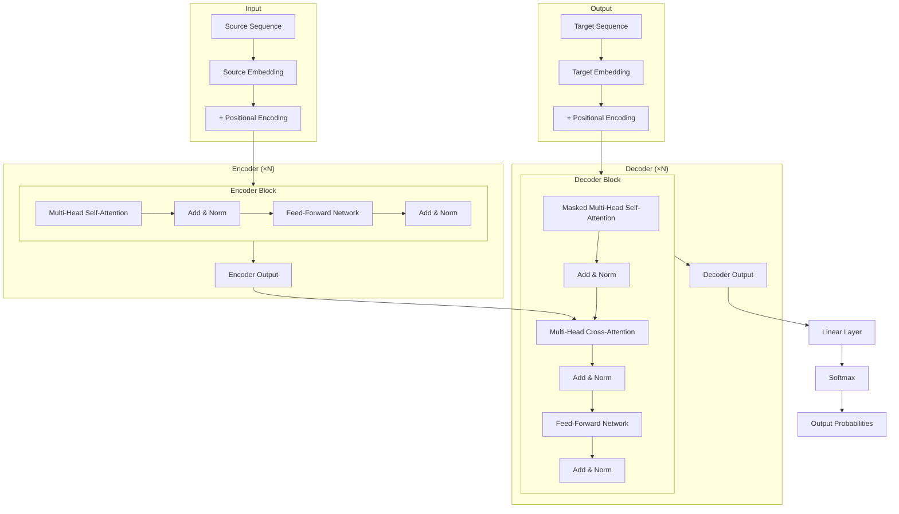
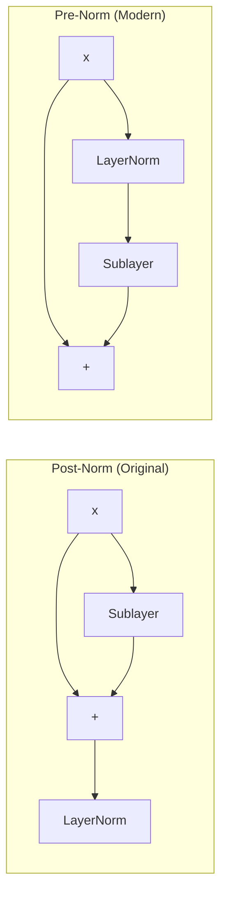

# Transformer Architecture

## Overview

The Transformer architecture, introduced in "Attention Is All You Need" (Vaswani et al., 2017), consists of an **encoder** and a **decoder**, each composed of stacked layers with identical structure. The encoder maps an input sequence to a continuous representation, and the decoder generates an output sequence autoregressively. The key building blocks are multi-head self-attention, position-wise feed-forward networks, residual connections, and layer normalization.

## Full Architecture



## Component Deep Dive

### 1. Embedding Layer

Converts discrete tokens to dense vectors of dimension $d_{\text{model}}$:

$$\mathbf{x}_i = \text{Embedding}(w_i) \in \mathbb{R}^{d_{\text{model}}}$$

In the original Transformer, the embedding weights are multiplied by $\sqrt{d_{\text{model}}}$ to scale them before adding positional encodings. This is because the positional encodings have values in $[-1, 1]$, while the embeddings (trained with Xavier init) have much smaller magnitudes.

```python
import torch.nn as nn

class TransformerEmbedding(nn.Module):
    def __init__(self, vocab_size, d_model, max_len, dropout=0.1):
        super().__init__()
        self.token_embed = nn.Embedding(vocab_size, d_model)
        self.scale = d_model ** 0.5
        self.dropout = nn.Dropout(dropout)
    
    def forward(self, x):
        # Scale embeddings by sqrt(d_model) before adding positional encoding
        return self.dropout(self.token_embed(x) * self.scale)
```

### 2. Positional Encoding

Since the Transformer has no recurrence, it needs explicit position information. The original paper uses sinusoidal encodings:

$$PE_{(pos, 2i)} = \sin\left(\frac{pos}{10000^{2i/d_{\text{model}}}}\right)$$

$$PE_{(pos, 2i+1)} = \cos\left(\frac{pos}{10000^{2i/d_{\text{model}}}}\right)$$

**Intuition**: Each dimension corresponds to a different frequency. The encoding for position $pos$ is a unique point on a high-dimensional circle. The relative position between two tokens can be expressed as a linear transformation of their encodings:

$$PE_{pos+k} = T_k \cdot PE_{pos}$$

where $T_k$ is a rotation matrix that depends only on $k$ (the offset), not on $pos$.

```python
import torch
import math

class SinusoidalPositionalEncoding(nn.Module):
    def __init__(self, d_model, max_len=5000):
        super().__init__()
        pe = torch.zeros(max_len, d_model)
        position = torch.arange(0, max_len, dtype=torch.float).unsqueeze(1)
        div_term = torch.exp(
            torch.arange(0, d_model, 2).float() * (-math.log(10000.0) / d_model)
        )
        pe[:, 0::2] = torch.sin(position * div_term)  # Even dimensions
        pe[:, 1::2] = torch.cos(position * div_term)  # Odd dimensions
        pe = pe.unsqueeze(0)  # (1, max_len, d_model)
        self.register_buffer('pe', pe)
    
    def forward(self, x):
        # x: (batch, seq_len, d_model)
        return x + self.pe[:, :x.size(1), :]
```

### Learned Positional Embeddings

Modern models (BERT, GPT-2+) use **learned** positional embeddings instead:

```python
class LearnedPositionalEncoding(nn.Module):
    def __init__(self, d_model, max_len=512):
        super().__init__()
        self.pos_embed = nn.Embedding(max_len, d_model)
    
    def forward(self, x):
        positions = torch.arange(x.size(1), device=x.device)
        return x + self.pos_embed(positions)
```

**Sinusoidal vs Learned**: Sinusoidal generalizes to unseen lengths; learned may capture patterns better for fixed lengths. Most modern LLMs use learned or rotary (RoPE) embeddings.

### 3. Multi-Head Self-Attention

Instead of a single attention function, the Transformer uses **$h$ parallel attention heads**:

$$\text{MultiHead}(Q, K, V) = \text{Concat}(\text{head}_1, \dots, \text{head}_h)W^O$$

$$\text{head}_i = \text{Attention}(QW_i^Q, KW_i^K, VW_i^V)$$

$$\text{Attention}(Q, K, V) = \text{softmax}\left(\frac{QK^T}{\sqrt{d_k}}\right)V$$

Where:
- $W_i^Q \in \mathbb{R}^{d_{\text{model}} \times d_k}$, $W_i^K \in \mathbb{R}^{d_{\text{model}} \times d_k}$, $W_i^V \in \mathbb{R}^{d_{\text{model}} \times d_v}$
- $W^O \in \mathbb{R}^{hd_v \times d_{\text{model}}}$
- Typically $d_k = d_v = d_{\text{model}} / h$

**Why multiple heads?** Each head can specialize in different types of relationships (syntactic, semantic, positional), and the output projection $W^O$ learns to combine these diverse signals.

### 4. Position-Wise Feed-Forward Network

Applied independently to each position:

$$\text{FFN}(x) = \max(0, xW_1 + b_1)W_2 + b_2$$

This is equivalent to two 1×1 convolutions. The inner dimension $d_{ff}$ is typically $4 \times d_{\text{model}}$ (e.g., 2048 for $d_{\text{model}} = 512$).

**Intuition**: The attention layer mixes information across positions. The FFN processes each position independently, applying a non-linear transformation. Think of it as: attention decides *what* to look at, FFN decides *what to do* with that information.

Modern variants use **GLU (Gated Linear Unit)** variants for better performance:

$$\text{SwiGLU}(x) = (\text{Swish}(xW_1) \odot (xW_3)) W_2$$

```python
class FeedForward(nn.Module):
    def __init__(self, d_model, d_ff, dropout=0.1):
        super().__init__()
        self.linear1 = nn.Linear(d_model, d_ff)
        self.linear2 = nn.Linear(d_ff, d_model)
        self.dropout = nn.Dropout(dropout)
    
    def forward(self, x):
        return self.linear2(self.dropout(torch.relu(self.linear1(x))))

class SwiGLUFeedForward(nn.Module):
    """Modern FFN variant used in LLaMA, PaLM, etc."""
    def __init__(self, d_model, d_ff, dropout=0.1):
        super().__init__()
        self.w1 = nn.Linear(d_model, d_ff, bias=False)
        self.w2 = nn.Linear(d_ff, d_model, bias=False)
        self.w3 = nn.Linear(d_model, d_ff, bias=False)
        self.dropout = nn.Dropout(dropout)
    
    def forward(self, x):
        return self.dropout(self.w2(F.silu(self.w1(x)) * self.w3(x)))
```

### 5. Residual Connections

Each sub-layer has a residual connection around it:

$$\text{output} = \text{LayerNorm}(x + \text{Sublayer}(x))$$

**Why they work**: Residual connections solve the vanishing gradient problem in deep networks. They provide a "shortcut" for gradients to flow directly:

$$\frac{\partial \mathcal{L}}{\partial x} = \frac{\partial \mathcal{L}}{\partial \text{output}} \left(1 + \frac{\partial \text{Sublayer}(x)}{\partial x}\right)$$

The gradient always has a direct path (the "1" term), regardless of what the sublayer's gradient is. This enables training Transformers with 96+ layers (GPT-3).

### 6. Layer Normalization

$$\text{LayerNorm}(x) = \gamma \odot \frac{x - \mu}{\sqrt{\sigma^2 + \epsilon}} + \beta$$

Where $\mu$ and $\sigma^2$ are computed over the last dimension (the feature dimension), not across the batch.

**LayerNorm vs BatchNorm**:

| Property | BatchNorm | LayerNorm |
|----------|-----------|-----------|
| Normalizes over | Batch dimension | Feature dimension |
| Depends on batch size | Yes | No |
| Works with batch size 1 | No | Yes |
| Training vs inference | Different behavior | Same behavior |
| Preferred in | CNNs | Transformers, RNNs |

**Why LayerNorm for Transformers?** Variable-length sequences make batch statistics unreliable. LayerNorm normalizes each token independently, regardless of other tokens in the batch.

**Pre-norm vs Post-norm:**



- **Post-norm** (original): $\text{LN}(x + \text{Sublayer}(x))$ — harder to train, needs warmup
- **Pre-norm** (modern): $x + \text{Sublayer}(\text{LN}(x))$ — more stable, used in GPT-2+, LLaMA

**Why pre-norm is more stable**: In post-norm, the residual path goes through LayerNorm, which can amplify or dampen gradients. In pre-norm, the residual path is clean — gradients flow directly through the skip connection.

### 7. Full Transformer Walkthrough

Let's trace a single encoder layer step by step:

```python
class TransformerEncoderLayer(nn.Module):
    def __init__(self, d_model, n_heads, d_ff, dropout=0.1):
        super().__init__()
        self.self_attn = MultiHeadAttention(d_model, n_heads)
        self.ffn = FeedForward(d_model, d_ff, dropout)
        self.norm1 = nn.LayerNorm(d_model)
        self.norm2 = nn.LayerNorm(d_model)
        self.dropout1 = nn.Dropout(dropout)
        self.dropout2 = nn.Dropout(dropout)
    
    def forward(self, x, mask=None):
        # Step 1: Self-attention
        # x: (batch, seq_len, d_model)
        # Q, K, V all come from x (self-attention!)
        attn_output = self.self_attn(x, x, x, mask)
        
        # Step 2: Residual + LayerNorm (pre-norm style)
        x = self.norm1(x + self.dropout1(attn_output))
        
        # Step 3: Feed-forward network
        ffn_output = self.ffn(x)
        
        # Step 4: Residual + LayerNorm
        x = self.norm2(x + self.dropout2(ffn_output))
        
        return x  # (batch, seq_len, d_model)
```

And a single decoder layer:

```python
class TransformerDecoderLayer(nn.Module):
    def __init__(self, d_model, n_heads, d_ff, dropout=0.1):
        super().__init__()
        self.masked_self_attn = MultiHeadAttention(d_model, n_heads)
        self.cross_attn = MultiHeadAttention(d_model, n_heads)
        self.ffn = FeedForward(d_model, d_ff, dropout)
        self.norm1 = nn.LayerNorm(d_model)
        self.norm2 = nn.LayerNorm(d_model)
        self.norm3 = nn.LayerNorm(d_model)
        self.dropout = nn.Dropout(dropout)
    
    def forward(self, x, encoder_output, src_mask=None, tgt_mask=None):
        # Step 1: Masked self-attention (can't look at future tokens)
        attn_output = self.masked_self_attn(x, x, x, tgt_mask)
        x = self.norm1(x + self.dropout(attn_output))
        
        # Step 2: Cross-attention (decoder attends to encoder output)
        # Q from decoder, K and V from encoder
        cross_output = self.cross_attn(x, encoder_output, encoder_output, src_mask)
        x = self.norm2(x + self.dropout(cross_output))
        
        # Step 3: Feed-forward
        ffn_output = self.ffn(x)
        x = self.norm3(x + self.dropout(ffn_output))
        
        return x
```

## Encoder vs Decoder

| Aspect | Encoder | Decoder |
|--------|---------|---------|
| Attention | Bidirectional (full) | Causal (masked) |
| Cross-attention | No | Yes (attends to encoder output) |
| Output | Contextual embeddings | Next-token probabilities |
| Used in | BERT, RoBERTa | GPT, LLaMA |
| Both | T5, BART, mBART |  |

### Encoder-Only (BERT)

- Bidirectional self-attention over the full input
- Good for: classification, NER, question answering
- Pre-trained with masked language modeling

### Decoder-Only (GPT)

- Causal (left-to-right) self-attention only
- Good for: text generation, few-shot learning
- Pre-trained with next-token prediction

### Encoder-Decoder (T5)

- Encoder processes input, decoder generates output
- Good for: translation, summarization, structured generation
- Pre-trained with span corruption

## Hyperparameter Configurations

| Config | $d_{\text{model}}$ | $h$ | $d_{ff}$ | Layers | Params |
|--------|-----|-----|---------|--------|--------|
| Transformer-Base | 512 | 8 | 2048 | 6+6 | ~65M |
| Transformer-Big | 1024 | 16 | 4096 | 6+6 | ~213M |
| BERT-Base | 768 | 12 | 3072 | 12 | ~110M |
| BERT-Large | 1024 | 16 | 4096 | 24 | ~340M |
| GPT-3 | 12288 | 96 | 49152 | 96 | ~175B |
| LLaMA-2-7B | 4096 | 32 | 11008 | 32 | ~7B |

## Code: Full Transformer in PyTorch

```python
import torch
import torch.nn as nn
import math

class MultiHeadAttention(nn.Module):
    def __init__(self, d_model, n_heads, dropout=0.1):
        super().__init__()
        assert d_model % n_heads == 0
        self.d_k = d_model // n_heads
        self.n_heads = n_heads
        
        self.W_q = nn.Linear(d_model, d_model)
        self.W_k = nn.Linear(d_model, d_model)
        self.W_v = nn.Linear(d_model, d_model)
        self.W_o = nn.Linear(d_model, d_model)
        self.dropout = nn.Dropout(dropout)
    
    def forward(self, query, key, value, mask=None):
        batch_size = query.size(0)
        
        Q = self.W_q(query).view(batch_size, -1, self.n_heads, self.d_k).transpose(1, 2)
        K = self.W_k(key).view(batch_size, -1, self.n_heads, self.d_k).transpose(1, 2)
        V = self.W_v(value).view(batch_size, -1, self.n_heads, self.d_k).transpose(1, 2)
        
        scores = torch.matmul(Q, K.transpose(-2, -1)) / math.sqrt(self.d_k)
        if mask is not None:
            scores = scores.masked_fill(mask == 0, float('-inf'))
        attn = self.dropout(torch.softmax(scores, dim=-1))
        context = torch.matmul(attn, V)
        
        context = context.transpose(1, 2).contiguous().view(batch_size, -1, self.n_heads * self.d_k)
        return self.W_o(context)


class TransformerBlock(nn.Module):
    def __init__(self, d_model, n_heads, d_ff, dropout=0.1):
        super().__init__()
        self.attention = MultiHeadAttention(d_model, n_heads, dropout)
        self.norm1 = nn.LayerNorm(d_model)
        self.norm2 = nn.LayerNorm(d_model)
        self.ffn = nn.Sequential(
            nn.Linear(d_model, d_ff),
            nn.ReLU(),
            nn.Dropout(dropout),
            nn.Linear(d_ff, d_model),
            nn.Dropout(dropout)
        )
    
    def forward(self, x, mask=None):
        # Self-attention with residual (pre-norm)
        x = self.norm1(x + self.attention(x, x, x, mask))
        # FFN with residual (pre-norm)
        x = self.norm2(x + self.ffn(x))
        return x
```

## Common Mistakes

- ❌ Confusing layer norm with batch norm (different normalization axes)
- ❌ Forgetting the $\sqrt{d_k}$ scaling in attention
- ❌ Not masking future positions in the decoder
- ❌ Using too few attention heads (limits representational capacity)
- ❌ Ignoring the embedding scaling factor $\sqrt{d_{\text{model}}}$
- ❌ Applying dropout during inference (set `model.eval()`)
- ❌ Not using causal mask for autoregressive generation

## Interview Questions

### Q1: Why do we need residual connections in Transformers?
**Answer:** Residual connections solve the vanishing gradient problem in deep networks. They provide a "shortcut" for gradients to flow directly through the network, enabling training of Transformers with many layers (e.g., 96 layers in GPT-3). Without them, gradients would diminish exponentially through layers, making deep Transformers untrainable.

### Q2: What is the difference between pre-norm and post-norm Transformers?
**Answer:**
- **Post-norm** (original paper): LayerNorm is applied *after* the residual addition: $\text{LN}(x + \text{Sublayer}(x))$. Requires careful learning rate warmup. Can be unstable for deep models.
- **Pre-norm** (GPT-2+): LayerNorm is applied *before* the sublayer: $x + \text{Sublayer}(\text{LN}(x))$. More stable training, allows higher learning rates. The residual path is clean, enabling direct gradient flow.

### Q3: Why does the FFN expand to $4 \times d_{\text{model}}$ then project back?
**Answer:** The expansion creates a higher-dimensional space where the model can learn more complex transformations. Think of it as a "bottleneck" in reverse — the model first expands to a richer representation, applies a nonlinearity, then compresses back. This is parameter-efficient while maintaining expressiveness. The 4× ratio is a practical sweet spot found empirically.

### Q4: What role does layer normalization play?
**Answer:** Layer normalization stabilizes training by normalizing activations across the feature dimension (not the batch). It prevents internal covariate shift, enables higher learning rates, and acts as a form of regularization. Unlike batch normalization, it works well with variable-length sequences and doesn't depend on batch size.

### Q5: Why does the Transformer need positional encoding?
**Answer:** Self-attention is permutation-equivariant — it treats the input as a set, not a sequence. Without positional encoding, "the cat sat on the mat" and "mat the on sat cat the" would produce identical outputs. Positional encoding injects order information, allowing the model to distinguish between different arrangements of the same tokens.

## Summary

The Transformer architecture uses stacked encoder and decoder layers, each containing multi-head self-attention and feed-forward sub-layers with residual connections and layer normalization. The encoder uses bidirectional attention while the decoder uses causal (masked) attention with cross-attention to encoder outputs. Pre-norm variants are preferred for training stability. The architecture's parallelizability and ability to capture long-range dependencies have made it the foundation of modern NLP and beyond.

## References

1. Vaswani, A., et al. (2017). Attention Is All You Need. *NeurIPS*. *arXiv:1706.03762*.
2. Ba, J. L., Kiros, J. R., & Hinton, G. E. (2016). Layer Normalization. *arXiv:1607.06450*.
3. He, K., et al. (2016). Deep Residual Learning for Image Recognition. *CVPR*.
4. Shazeer, N. (2020). GLU Variants Improve Transformer. *arXiv:2002.05202*.
5. Xiong, R., et al. (2020). On Layer Normalization in the Transformer Architecture. *ICML*.
6. Su, J., et al. (2021). RoFormer: Enhanced Transformer with Rotary Position Embedding. *arXiv:2104.09864*.
7. Touvron, H., et al. (2023). LLaMA: Open and Efficient Foundation Language Models. *arXiv:2302.13971*.

## Cross-References

- [Self-Attention →](self-attention.md) Deep dive into attention mechanisms
- [Positional Encoding →](positional-encoding.md) How position information is injected
- [BERT →](bert.md) Encoder-only Transformer
- [GPT →](gpt.md) Decoder-only Transformer
- [Training →](training.md) How Transformers are trained
- [Attention Mechanism](../deep-learning/attention.md) Attention fundamentals
