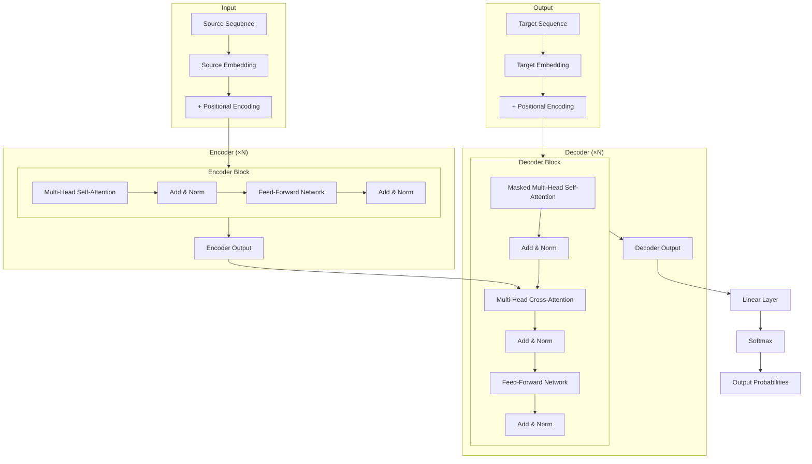
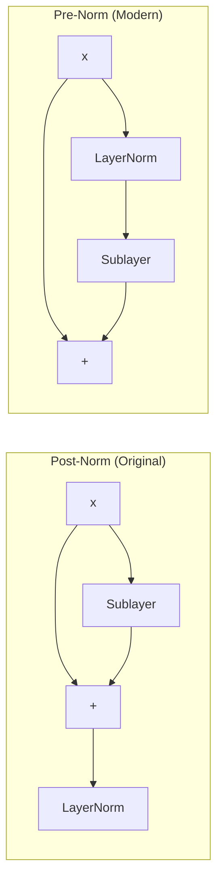

# Transformer Architecture

## Overview

The Transformer architecture consists of an **encoder** and a **decoder**, each composed of stacked layers with identical structure. The encoder maps an input sequence to a continuous representation, and the decoder generates an output sequence autoregressively. The key building blocks are multi-head self-attention, position-wise feed-forward networks, residual connections, and layer normalization.

## Full Architecture



## Component Deep Dive

### 1. Embedding Layer

Converts discrete tokens to dense vectors of dimension $d_{\text{model}}$:

$$\mathbf{x}_i = \text{Embedding}(w_i) \in \mathbb{R}^{d_{\text{model}}}$$

In the original Transformer, the embedding weights are multiplied by $\sqrt{d_{\text{model}}}$ to scale them before adding positional encodings.

### 2. Multi-Head Self-Attention

Instead of a single attention function, the Transformer uses **$h$ parallel attention heads**:

$$\text{MultiHead}(Q, K, V) = \text{Concat}(\text{head}_1, \dots, \text{head}_h)W^O$$

$$\text{head}_i = \text{Attention}(QW_i^Q, KW_i^K, VW_i^V)$$

Where:
- $W_i^Q \in \mathbb{R}^{d_{\text{model}} \times d_k}$, $W_i^K \in \mathbb{R}^{d_{\text{model}} \times d_k}$, $W_i^V \in \mathbb{R}^{d_{\text{model}} \times d_v}$
- $W^O \in \mathbb{R}^{hd_v \times d_{\text{model}}}$
- Typically $d_k = d_v = d_{\text{model}} / h$

### 3. Position-Wise Feed-Forward Network

Applied independently to each position:

$$\text{FFN}(x) = \max(0, xW_1 + b_1)W_2 + b_2$$

This is equivalent to two 1×1 convolutions. The inner dimension $d_{ff}$ is typically $4 \times d_{\text{model}}$ (e.g., 2048 for $d_{\text{model}} = 512$).

Modern variants use **GLU (Gated Linear Unit)** variants:

$$\text{SwiGLU}(x) = (\text{Swish}(xW_1)) \odot (xW_3)) W_2$$

### 4. Residual Connections

Each sub-layer has a residual connection around it:

$$\text{output} = \text{LayerNorm}(x + \text{Sublayer}(x))$$

This enables training of deep networks by providing gradient shortcuts.

### 5. Layer Normalization

$$\text{LayerNorm}(x) = \gamma \odot \frac{x - \mu}{\sqrt{\sigma^2 + \epsilon}} + \beta$$

Where $\mu$ and $\sigma^2$ are computed over the last dimension (the feature dimension), not across the batch.

**Pre-norm vs Post-norm:**
- **Post-norm** (original): $\text{LN}(x + \text{Sublayer}(x))$ — harder to train, needs warmup
- **Pre-norm** (modern): $x + \text{Sublayer}(\text{LN}(x))$ — more stable, used in GPT-2+



## Encoder vs Decoder

| Aspect | Encoder | Decoder |
|--------|---------|---------|
| Attention | Bidirectional (full) | Causal (masked) |
| Cross-attention | No | Yes (attends to encoder output) |
| Output | Contextual embeddings | Next-token probabilities |
| Used in | BERT, RoBERTa | GPT, LLaMA |
| Both | T5, BART, mBART |  |

## Hyperparameter Configurations

| Config | $d_{\text{model}}$ | $h$ | $d_{ff}$ | Layers | Params |
|--------|-----|-----|---------|--------|--------|
| Transformer-Base | 512 | 8 | 2048 | 6+6 | ~65M |
| Transformer-Big | 1024 | 16 | 4096 | 6+6 | ~213M |
| BERT-Base | 768 | 12 | 3072 | 12 | ~110M |
| BERT-Large | 1024 | 16 | 4096 | 24 | ~340M |
| GPT-3 | 12288 | 96 | 49152 | 96 | ~175B |

## Code: Transformer Block in PyTorch

```python
import torch
import torch.nn as nn
import math

class MultiHeadAttention(nn.Module):
    def __init__(self, d_model, n_heads, dropout=0.1):
        super().__init__()
        assert d_model % n_heads == 0
        self.d_k = d_model // n_heads
        self.n_heads = n_heads
        
        self.W_q = nn.Linear(d_model, d_model)
        self.W_k = nn.Linear(d_model, d_model)
        self.W_v = nn.Linear(d_model, d_model)
        self.W_o = nn.Linear(d_model, d_model)
        self.dropout = nn.Dropout(dropout)
    
    def forward(self, query, key, value, mask=None):
        batch_size = query.size(0)
        
        # Linear projections and reshape to (batch, heads, seq, d_k)
        Q = self.W_q(query).view(batch_size, -1, self.n_heads, self.d_k).transpose(1, 2)
        K = self.W_k(key).view(batch_size, -1, self.n_heads, self.d_k).transpose(1, 2)
        V = self.W_v(value).view(batch_size, -1, self.n_heads, self.d_k).transpose(1, 2)
        
        # Scaled dot-product attention
        scores = torch.matmul(Q, K.transpose(-2, -1)) / math.sqrt(self.d_k)
        if mask is not None:
            scores = scores.masked_fill(mask == 0, float('-inf'))
        attn = self.dropout(torch.softmax(scores, dim=-1))
        context = torch.matmul(attn, V)
        
        # Reshape and project
        context = context.transpose(1, 2).contiguous().view(batch_size, -1, self.n_heads * self.d_k)
        return self.W_o(context)


class TransformerBlock(nn.Module):
    def __init__(self, d_model, n_heads, d_ff, dropout=0.1):
        super().__init__()
        self.attention = MultiHeadAttention(d_model, n_heads, dropout)
        self.norm1 = nn.LayerNorm(d_model)
        self.norm2 = nn.LayerNorm(d_model)
        self.ffn = nn.Sequential(
            nn.Linear(d_model, d_ff),
            nn.ReLU(),
            nn.Dropout(dropout),
            nn.Linear(d_ff, d_model),
            nn.Dropout(dropout)
        )
    
    def forward(self, x, mask=None):
        # Self-attention with residual
        attn_out = self.attention(x, x, x, mask)
        x = self.norm1(x + attn_out)
        # FFN with residual
        ffn_out = self.ffn(x)
        x = self.norm2(x + ffn_out)
        return x
```

## Interview Questions

### Q1: Why do we need residual connections in Transformers?
**Answer:** Residual connections solve the **vanishing gradient problem** in deep networks. They provide a "shortcut" for gradients to flow directly through the network, enabling training of Transformers with many layers (e.g., 96 layers in GPT-3). Without them, gradients would diminish exponentially through layers.

### Q2: What is the difference between pre-norm and post-norm Transformers?
**Answer:**
- **Post-norm** (original paper): LayerNorm is applied *after* the residual addition: $\text{LN}(x + \text{Sublayer}(x))$. Requires careful learning rate warmup.
- **Pre-norm** (GPT-2+): LayerNorm is applied *before* the sublayer: $x + \text{Sublayer}(\text{LN}(x))$. More stable training, allows higher learning rates.

### Q3: Why does the FFN expand to $4 \times d_{\text{model}}$ then project back?
**Answer:** The expansion creates a higher-dimensional space where the model can learn more complex transformations. Think of it as a "bottleneck" in reverse — the model first expands to a richer representation, applies a nonlinearity, then compresses back. This is parameter-efficient while maintaining expressiveness.

### Q4: What role does layer normalization play?
**Answer:** Layer normalization stabilizes training by normalizing activations across the feature dimension (not the batch). It prevents internal covariate shift, enables higher learning rates, and acts as a form of regularization. Unlike batch normalization, it works well with variable-length sequences.

## Common Mistakes

- ❌ Confusing layer norm with batch norm (different normalization axes)
- ❌ Forgetting the $\sqrt{d_k}$ scaling in attention
- ❌ Not masking future positions in the decoder
- ❌ Using too few attention heads (limits representational capacity)
- ❌ Ignoring the embedding scaling factor $\sqrt{d_{\text{model}}}$

## Summary

The Transformer architecture uses stacked encoder and decoder layers, each containing multi-head self-attention and feed-forward sub-layers with residual connections and layer normalization. The encoder uses bidirectional attention while the decoder uses causal (masked) attention with cross-attention to encoder outputs. Pre-norm variants are preferred for training stability.

## Cross-References

- [Self-Attention →](self-attention.md) Deep dive into attention mechanisms
- [Positional Encoding →](positional-encoding.md) How position information is injected
- [BERT →](bert.md) Encoder-only Transformer
- [GPT →](gpt.md) Decoder-only Transformer
- [Training →](training.md) How Transformers are trained
- [LLM Architecture](../../llm/llm-serving/architecture.md)
- [Attention Mechanism](../deep-learning/attention.md)
- [GPU Training](../../cloud/virtualization/README.md)
- [ML System Design Model Serving](../system-design/model-serving.md)
