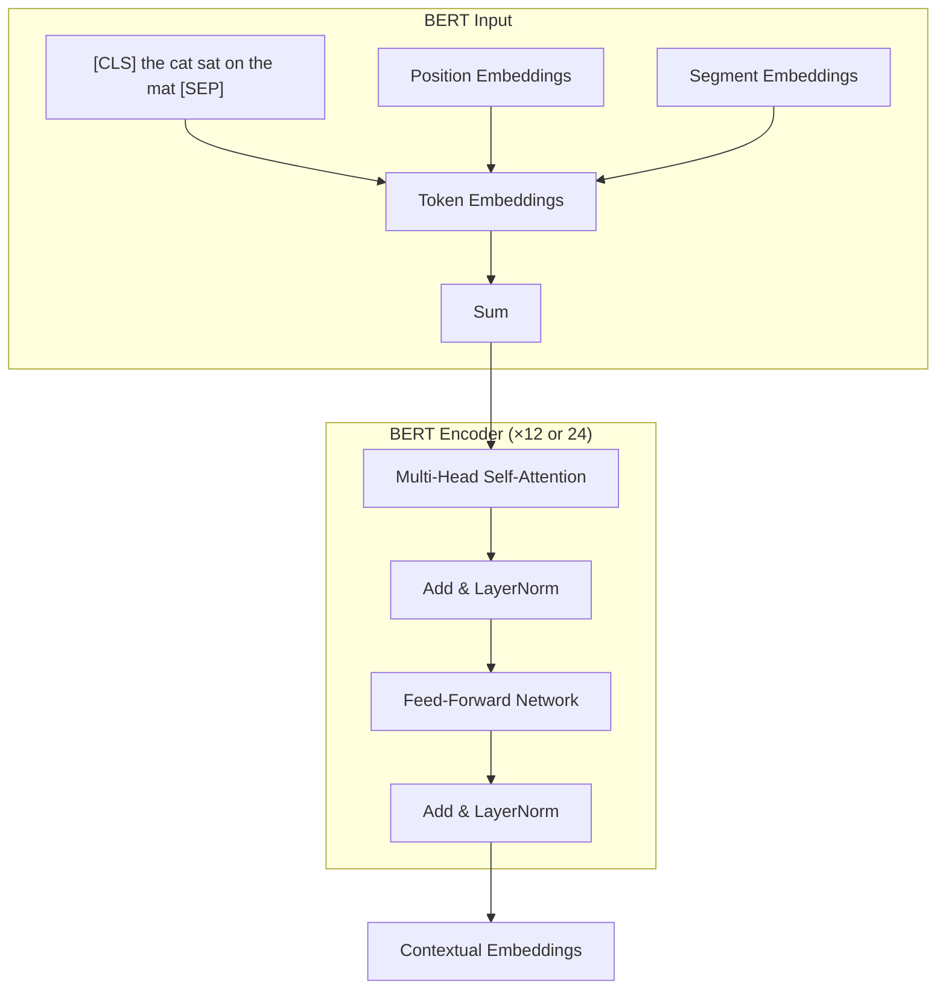
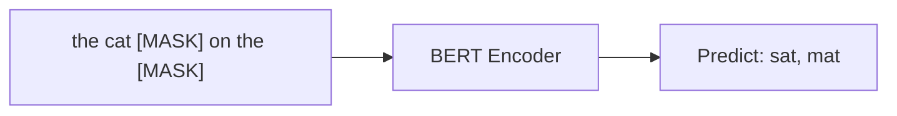
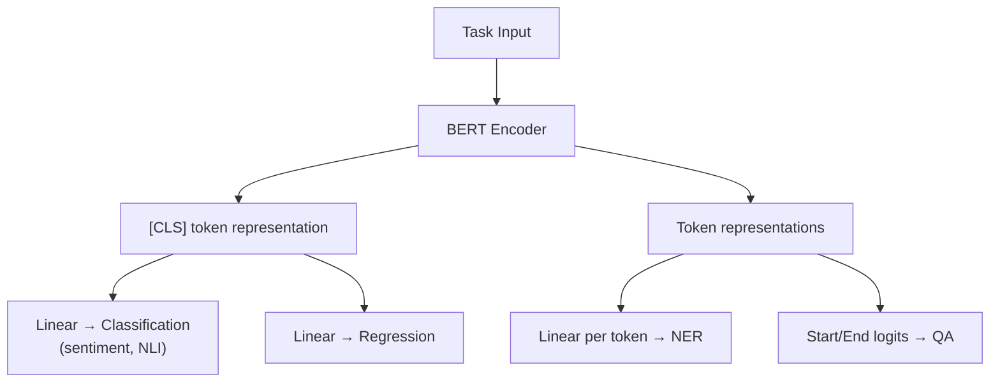

# BERT (Bidirectional Encoder Representations from Transformers)

## Overview

BERT, introduced by Devlin et al. (2018), is an **encoder-only** Transformer that learns deep bidirectional representations by jointly conditioning on both left and right context. It revolutionized NLP by introducing **pre-training on unlabeled text** followed by **fine-tuning on downstream tasks**, establishing the "pre-train, fine-tune" paradigm.

## Architecture

BERT uses only the **encoder** part of the Transformer:



### Input Representation

Each token embedding is the sum of three embeddings:

\\[\text{Input} = \text{TokenEmb}(w_i) + \text{PositionEmb}(i) + \text{SegmentEmb}(s_i)\\]

- **Token Embedding**: WordPiece tokenization (30,522 tokens)
- **Position Embedding**: Learned absolute positions (max 512)
- **Segment Embedding**: Distinguishes sentence A (0) from sentence B (1)

| Model | Layers | Hidden | Heads | Params |
|-------|--------|--------|-------|--------|
| BERT-Base | 12 | 768 | 12 | 110M |
| BERT-Large | 24 | 1024 | 16 | 340M |

## Pre-Training Objectives

### 1. Masked Language Modeling (MLM)

Randomly mask 15% of tokens and predict them:
- 80% replaced with `[MASK]`
- 10% replaced with random token
- 10% kept unchanged

\\[\mathcal{L}_{\text{MLM}} = -\sum_{i \in \mathcal{M}} \log P(x_i | x_{\backslash \mathcal{M}})\\]



### 2. Next Sentence Prediction (NSP)

Predict if sentence B follows sentence A:
- 50% positive (B follows A)
- 50% negative (B is random)

\\[\mathcal{L}_{\text{NSP}} = -\log P(y | [\text{CLS}])\\]

> **Note**: Later research (RoBERTa, ALBERT) showed NSP may not be helpful. RoBERTa removed it entirely.

## Fine-Tuning

BERT adds a task-specific head on top of the `[CLS]` token representation:



| Task | Input Format | Output |
|------|-------------|--------|
| Text Classification | `[CLS] text [SEP]` | `[CLS]` → Linear → label |
| Named Entity Recognition | `[CLS] tokens [SEP]` | Each token → Linear → label |
| Question Answering | `[CLS] question [SEP] passage [SEP]` | Start/end span positions |
| Sentence Pair | `[CLS] sent_A [SEP] sent_B [SEP]` | `[CLS]` → relationship |

## Code: BERT for Classification

```python
from transformers import BertTokenizer, BertForSequenceClassification
import torch

# Load pre-trained BERT
tokenizer = BertTokenizer.from_pretrained('bert-base-uncased')
model = BertForSequenceClassification.from_pretrained('bert-base-uncased', num_labels=2)

# Tokenize
text = "This movie was absolutely wonderful!"
inputs = tokenizer(text, return_tensors='pt', padding=True, truncation=True)

# Forward pass
with torch.no_grad():
    outputs = model(**inputs)
    logits = outputs.logits
    prediction = torch.argmax(logits, dim=-1)

print(f"Prediction: {'positive' if prediction == 1 else 'negative'}")

# Fine-tuning loop
optimizer = torch.optim.AdamW(model.parameters(), lr=2e-5)
for epoch in range(3):
    for batch in dataloader:
        outputs = model(**batch, labels=batch['labels'])
        loss = outputs.loss
        loss.backward()
        optimizer.step()
        optimizer.zero_grad()
```

## BERT Variants

| Model | Key Change | Benefit |
|-------|-----------|---------|
| **RoBERTa** | Remove NSP, more data, longer training | Better performance |
| **ALBERT** | Parameter sharing, factorized embeddings | Fewer parameters |
| **DistilBERT** | Knowledge distillation | 60% smaller, 97% performance |
| **ELECTRA** | Replaced token detection (not MLM) | More efficient pre-training |
| **DeBERTa** | Disentangled attention, enhanced mask decoder | SOTA on many benchmarks |
| **ModernBERT** | RoPE, Flash Attention, longer context | 2024 refresh |

## Interview Questions

### Q1: How is BERT different from GPT?
**Answer:**
- **BERT** (encoder-only): Bidirectional attention — each token sees all other tokens. Pre-trained with MLM. Best for understanding tasks (classification, NER, QA).
- **GPT** (decoder-only): Causal attention — each token only sees previous tokens. Pre-trained with next-token prediction. Best for generation tasks.

### Q2: Why does BERT use 15% masking but 80/10/10 replacement?
**Answer:**
- **15%**: Too little masking wastes compute; too much loses too much signal.
- **80% [MASK]**: Primary prediction signal.
- **10% random**: Forces the model to maintain a distribution over all tokens, not just [MASK]. Prevents the model from learning that non-masked tokens are always correct.
- **10% unchanged**: Encourages the model to build good representations for all tokens, not just masked ones.

### Q3: What is the [CLS] token used for?
**Answer:** `[CLS]` is a special classification token prepended to every input. Through pre-training, it aggregates sequence-level information via self-attention. Its final hidden state is used as the **aggregate sequence representation** for classification tasks. For token-level tasks (NER, QA), the individual token representations are used instead.

### Q4: Why did RoBERTa outperform BERT?
**Answer:** RoBERTa made several training improvements:
1. Removed NSP (found to be unhelpful)
2. Trained with larger batch sizes and more data
3. Used dynamic masking (different mask each epoch vs. static)
4. Trained longer (500K vs. 1M steps)
5. Used byte-level BPE instead of WordPiece

## Common Mistakes

- ❌ Using BERT for generation tasks (it's bidirectional, not autoregressive)
- ❌ Forgetting to add [CLS] and [SEP] tokens
- ❌ Not fine-tuning (frozen BERT performs much worse)
- ❌ Using too high learning rate for fine-tuning (2e-5 to 5e-5 is typical)
- ❌ Confusing MLM (predict masked tokens) with next-token prediction

## Summary

BERT is an encoder-only Transformer pre-trained with Masked Language Modeling and Next Sentence Prediction. It produces deep bidirectional representations that can be fine-tuned for various NLP tasks. The [CLS] token provides sequence-level representations for classification. Variants like RoBERTa, ALBERT, and DeBERTa have improved upon the original design.

## Cross-References

- [Architecture →](architecture.md) Transformer encoder details
- [Self-Attention →](self-attention.md) Bidirectional self-attention
- [GPT →](gpt.md) Decoder-only comparison
- [T5 →](t5.md) Encoder-decoder comparison
- [Transfer Learning →](../deep-learning/transfer-learning.md) Fine-tuning paradigm
- [Training →](training.md) Pre-training and fine-tuning details
