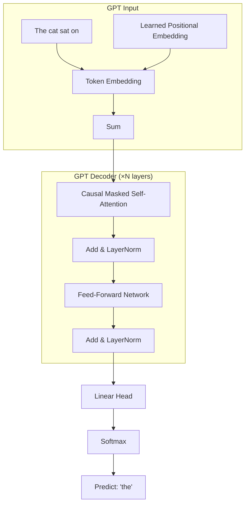
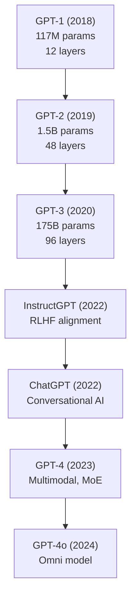
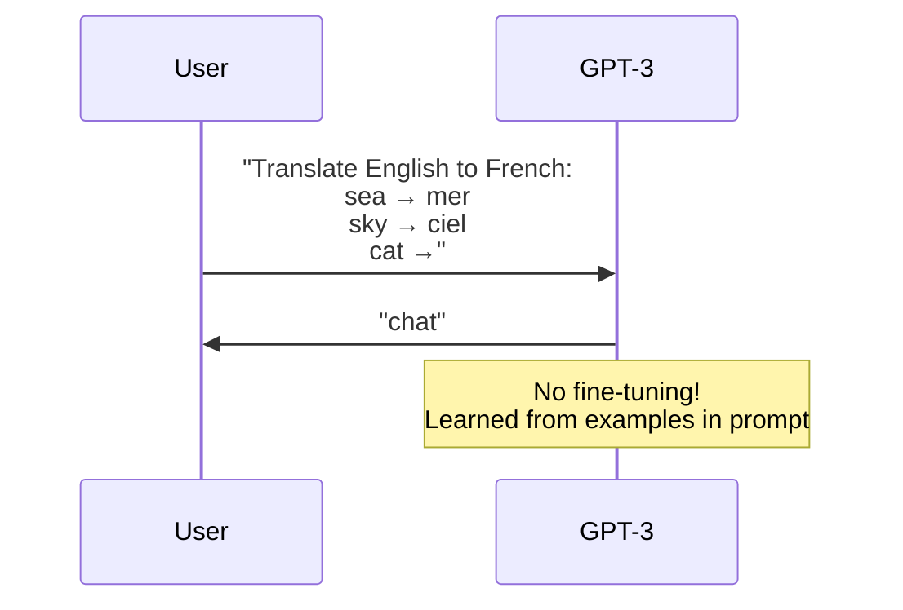

# GPT (Generative Pre-trained Transformer)

## Overview

GPT, introduced by Radford et al. (2018), is a **decoder-only** Transformer that uses **autoregressive** pre-training — predicting the next token given all previous tokens. GPT demonstrated that scaling language models with more data and parameters leads to emergent capabilities, culminating in GPT-3's few-shot learning and GPT-4's multimodal abilities.

## Architecture

GPT uses only the **decoder** part of the Transformer with **causal (masked) self-attention**:



### Causal Masking

Each token can only attend to itself and previous tokens:

$$\text{mask}_{ij} = \begin{cases} 0 & \text{if } j \leq i \text{ (can attend)} \\ -\infty & \text{if } j > i \text{ (cannot attend)} \end{cases}$$

```python
def causal_mask(seq_len):
    """Create causal attention mask."""
    mask = torch.tril(torch.ones(seq_len, seq_len))
    return mask  # Lower triangular
```

## Pre-Training: Next Token Prediction

The model maximizes the probability of each token given all previous tokens:

$$\mathcal{L} = -\sum_{t=1}^{T} \log P(x_t | x_1, x_2, \dots, x_{t-1}; \theta)$$

This is equivalent to maximizing the likelihood of the entire sequence:

$$P(x_1, x_2, \dots, x_T) = \prod_{t=1}^{T} P(x_t | x_{<t})$$

## GPT Evolution



| Model | Year | Params | Layers | Hidden | Heads | Context | Key Innovation |
|-------|------|--------|--------|--------|-------|---------|---------------|
| GPT-1 | 2018 | 117M | 12 | 768 | 12 | 512 | Transfer learning for NLP |
| GPT-2 | 2019 | 1.5B | 48 | 1600 | 25 | 1024 | Zero-shot task performance |
| GPT-3 | 2020 | 175B | 96 | 12288 | 96 | 2048 | In-context learning |
| GPT-4 | 2023 | ~1.8T* | ~120* | — | — | 8K/32K/128K | Multimodal, MoE |

## Scaling Laws

GPT's success is driven by **scaling laws** — performance improves predictably with more compute, data, and parameters:

$$L(N, D, C) \approx \left(\frac{N_c}{N}\right)^{\alpha_N} + \left(\frac{D_c}{D}\right)^{\alpha_D} + \left(\frac{C_c}{C}\right)^{\alpha_C}$$

Where:
- $N$: number of parameters
- $D$: dataset size (tokens)
- $C$: compute (FLOPs)
- $\alpha_N \approx 0.076$, $\alpha_D \approx 0.095$ (Kaplan et al., 2020)

**Chinchilla Scaling** (Hoffmann et al., 2022): Optimal scaling requires $D \approx 20N$ — for a 70B model, you need ~1.4T tokens.

## In-Context Learning

GPT-3 demonstrated **in-context learning** — performing tasks by conditioning on examples in the prompt, without any gradient updates:



Types of in-context learning:
- **Zero-shot**: No examples, just task description
- **One-shot**: One example
- **Few-shot**: A few examples (typically 3-10)

## Code: GPT Text Generation

```python
from transformers import GPT2LMHeadModel, GPT2Tokenizer

tokenizer = GPT2Tokenizer.from_pretrained('gpt2')
model = GPT2LMHeadModel.from_pretrained('gpt2')

# Greedy decoding
input_text = "The future of AI is"
input_ids = tokenizer.encode(input_text, return_tensors='pt')

# Generate
output = model.generate(
    input_ids,
    max_length=50,
    num_return_sequences=1,
    temperature=0.7,
    top_k=50,
    top_p=0.9,
    do_sample=True,
    pad_token_id=tokenizer.eos_token_id
)

print(tokenizer.decode(output[0], skip_special_tokens=True))
```

### Decoding Strategies

| Strategy | Method | Use Case |
|----------|--------|----------|
| Greedy | $\arg\max$ at each step | Deterministic, fast |
| Beam Search | Keep top-$k$ sequences | Translation, summarization |
| Temperature | Scale logits by $T$ before softmax | Control randomness |
| Top-k | Sample from top-$k$ tokens | Balanced quality/diversity |
| Top-p (nucleus) | Sample from smallest set with cumulative prob ≥ $p$ | Dynamic filtering |

$$P(x_t = w | x_{<t}) = \frac{\exp(z_w / T)}{\sum_{w'} \exp(z_{w'} / T)}$$

## GPT vs BERT

| Aspect | GPT | BERT |
|--------|-----|------|
| Architecture | Decoder-only | Encoder-only |
| Attention | Causal (left-to-right) | Bidirectional |
| Pre-training | Next token prediction | Masked LM |
| Use case | Generation, completion | Understanding, classification |
| [CLS] token | No | Yes |
| Autoregressive | Yes | No |

## Interview Questions

### Q1: Why is GPT autoregressive and what does that mean?
**Answer:** Autoregressive means the model generates tokens one at a time, left to right. Each token is conditioned on all previous tokens. This is natural for language generation and allows the model to be used as a general-purpose text completer. The causal mask ensures the model cannot "see" future tokens during training.

### Q2: What is in-context learning?
**Answer:** In-context learning is the ability of large language models to perform tasks by conditioning on examples provided in the prompt, without any parameter updates. For example, showing GPT-3 a few translation pairs enables it to translate new words. This is an emergent ability that appears at sufficient scale (~1B+ parameters).

### Q3: How does GPT-3 differ from GPT-2?
**Answer:**
- **Scale**: 175B vs 1.5B parameters (116× larger)
- **Few-shot learning**: GPT-3 can learn from examples in the prompt
- **Emergent abilities**: Chain-of-thought reasoning, code generation
- **Training data**: 300B tokens vs 40GB text
- **Context**: 2048 vs 1024 tokens

### Q4: What are scaling laws in the context of GPT?
**Answer:** Scaling laws describe the predictable relationship between model performance (loss) and three factors: model size (N), dataset size (D), and compute (C). Performance improves as a power law with each factor. The key insight is that you should scale all three together — Chinchilla showed that most models were undertrained relative to their size.

### Q5: What is the difference between GPT-3 and ChatGPT?
**Answer:** ChatGPT (based on GPT-3.5) added **RLHF (Reinforcement Learning from Human Feedback)** to align the model with human preferences. GPT-3 is a raw language model that completes text; ChatGPT is fine-tuned to be helpful, harmless, and honest. The RLHF process involves: 1) SFT on human demonstrations, 2) training a reward model, 3) PPO optimization.

## Common Mistakes

- ❌ Using GPT for classification without fine-tuning (BERT is usually better)
- ❌ Confusing GPT's causal attention with BERT's bidirectional attention
- ❌ Not understanding that GPT generates left-to-right (not in parallel)
- ❌ Ignoring temperature and sampling parameters for generation
- ❌ Thinking in-context learning requires gradient updates

## Summary

GPT is a decoder-only Transformer pre-trained with next-token prediction. It scales from 117M (GPT-1) to 175B+ (GPT-3) parameters, demonstrating emergent capabilities like in-context learning. Causal masking ensures autoregressive generation. Modern variants (GPT-4, ChatGPT) add RLHF alignment and multimodal capabilities.

## Cross-References

- [Architecture →](architecture.md) Transformer decoder details
- [Self-Attention →](self-attention.md) Causal self-attention
- [BERT →](bert.md) Encoder-only comparison
- [T5 →](t5.md) Encoder-decoder comparison
- [RLHF →](../rl/rlhf.md) Alignment training
- [Training →](training.md) Pre-training details
