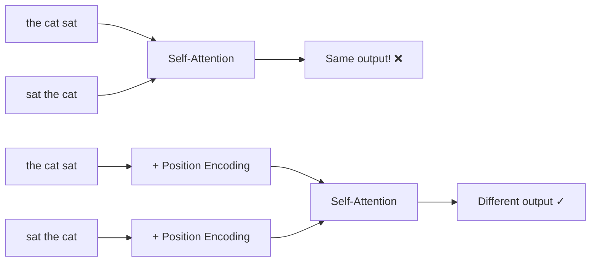
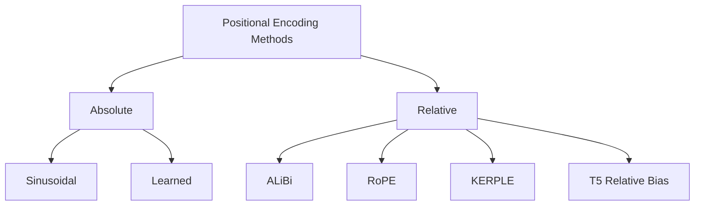
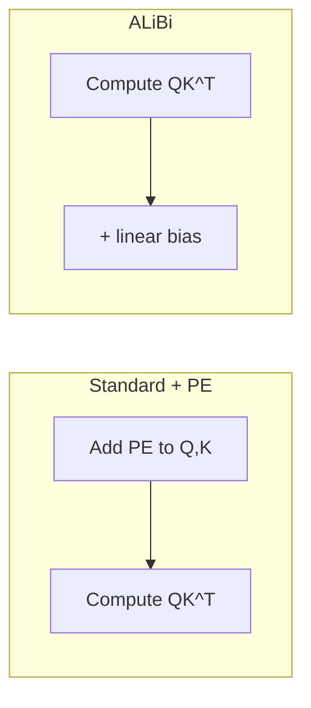

# Positional Encoding

## Overview

Self-attention is **permutation-equivariant** — it treats the input as a set, not a sequence. Without positional information, "the cat sat on the mat" and "the mat sat on the cat" produce identical representations. **Positional encoding** injects sequence order information into the model, enabling it to distinguish between different positions.

## Why Positional Encoding?



## Methods Overview



| Method | Type | Extrapolation | Used In |
|--------|------|---------------|---------|
| Sinusoidal | Absolute | Poor | Original Transformer |
| Learned | Absolute | Poor | BERT, GPT-2 |
| RoPE | Relative | Moderate | LLaMA, Mistral, Qwen |
| ALiBi | Relative | Good | BLOOM, MPT |
| T5 Relative Bias | Relative | Moderate | T5, FLAN-T5 |

## 1. Sinusoidal Positional Encoding

The original Transformer uses sine and cosine functions of different frequencies:

\\[PE_{(pos, 2i)} = \sin\left(\frac{pos}{10000^{2i/d_{\text{model}}}}\right)\\]

\\[PE_{(pos, 2i+1)} = \cos\left(\frac{pos}{10000^{2i/d_{\text{model}}}}\right)\\]

Where:
- $pos$: position in the sequence
- $i$: dimension index
- $d_{\text{model}}$: embedding dimension

### Properties

1. **Unique for each position**: Different positions get different encodings
2. **Bounded**: Values are in $[-1, 1]$
3. **Relative positions can be computed**: $PE_{pos+k}$ is a linear transformation of $PE_{pos}$
4. **No additional parameters**: Fixed function, not learned

```python
import torch
import math

def sinusoidal_encoding(max_len, d_model):
    pe = torch.zeros(max_len, d_model)
    position = torch.arange(0, max_len).unsqueeze(1).float()
    div_term = torch.exp(torch.arange(0, d_model, 2).float() * -(math.log(10000.0) / d_model))
    
    pe[:, 0::2] = torch.sin(position * div_term)  # Even dimensions
    pe[:, 1::2] = torch.cos(position * div_term)  # Odd dimensions
    return pe
```

## 2. Learned Positional Embeddings

Each position gets a learnable embedding vector:

\\[PE = \text{Embedding}(\text{position\_ids}) \in \mathbb{R}^{L \times d_{\text{model}}}\\]

- Used in BERT (max 512), GPT-2 (max 1024)
- More expressive than sinusoidal but **cannot extrapolate** beyond training length
- Each position has its own independent parameters

```python
class LearnedPositionalEncoding(nn.Module):
    def __init__(self, max_len, d_model):
        super().__init__()
        self.embedding = nn.Embedding(max_len, d_model)
    
    def forward(self, x):
        positions = torch.arange(x.size(1), device=x.device)
        return x + self.embedding(positions)
```

## 3. Rotary Position Embedding (RoPE)

**RoPE** encodes position by **rotating** the query and key vectors. Instead of adding position information, it bakes it into the attention computation directly.

### Core Idea

For position $m$, rotate the embedding by angle $m\theta$:

\\[f(x, m) = \begin{pmatrix} x_0 \\ x_1 \\ x_2 \\ x_3 \\ \vdots \end{pmatrix} \otimes \begin{pmatrix} \cos m\theta_0 \\ \cos m\theta_0 \\ \cos m\theta_1 \\ \cos m\theta_1 \\ \vdots \end{pmatrix} + \begin{pmatrix} -x_1 \\ x_0 \\ -x_3 \\ x_2 \\ \vdots \end{pmatrix} \otimes \begin{pmatrix} \sin m\theta_0 \\ \sin m\theta_0 \\ \sin m\theta_1 \\ \sin m\theta_1 \\ \vdots \end{pmatrix}\\]

Where $\theta_i = 10000^{-2i/d}$.

### Key Property

The inner product $\langle f(q, m), f(k, n) \rangle$ depends only on $q$, $k$, and the **relative distance** $m - n$:

\\[\langle f(q, m), f(k, n) \rangle = \text{Re}\left[\sum_i (q_{2i} + iq_{2i+1})(k_{2i} - ik_{2i+1})e^{i(m-n)\theta_i}\right]\\]

This means RoPE naturally captures relative positions through the attention mechanism.

```python
def apply_rope(q, k, freqs_cis):
    """Apply Rotary Position Embedding."""
    # Reshape for complex multiplication
    q_complex = torch.view_as_complex(q.float().reshape(*q.shape[:-1], -1, 2))
    k_complex = torch.view_as_complex(k.float().reshape(*k.shape[:-1], -1, 2))
    
    # Apply rotation
    q_out = torch.view_as_real(q_complex * freqs_cis).flatten(-2)
    k_out = torch.view_as_real(k_complex * freqs_cis).flatten(-2)
    
    return q_out.type_as(q), k_out.type_as(k)

def precompute_freqs_cis(dim, max_len, theta=10000.0):
    freqs = 1.0 / (theta ** (torch.arange(0, dim, 2).float() / dim))
    t = torch.arange(max_len)
    freqs = torch.outer(t, freqs)
    return torch.polar(torch.ones_like(freqs), freqs)  # e^{i*freq}
```

### NTK-Aware Scaling

For extending RoPE beyond training length, **NTK-aware interpolation** modifies the base frequency:

\\[\theta' = \theta \cdot \alpha^{d/(d-2)}\\]

Where $\alpha$ is the extension ratio. This preserves high-frequency components while interpolating low-frequency ones.

## 4. ALiBi (Attention with Linear Biases)

ALiBi doesn't add positional embeddings at all. Instead, it adds a **linear bias** to attention scores:

\\[\text{softmax}\left(\frac{QK^T}{\sqrt{d_k}} + m \cdot \text{bias}\right)\\]

Where $\text{bias}_{ij} = -|i - j|$ and $m$ is a head-specific slope.



- **No positional embedding parameters**
- **Excellent extrapolation**: Works at 2-4× training length
- **Different slopes per head**: Some heads focus locally (steep slope), others globally (gentle slope)
- Used in BLOOM, MPT

## 5. T5 Relative Position Bias

T5 uses **learned relative position biases** added to attention logits:

\\[\text{Attention} = \text{softmax}\left(\frac{QK^T}{\sqrt{d_k}} + B_{ij}\right)V\\]

Where $B_{ij}$ is a learned scalar for relative distance $|i-j|$, with logarithmic bucketing for efficiency.

## Comparison

| Method | Parameters | Extrapolation | Complexity | Quality |
|--------|-----------|---------------|------------|---------|
| Sinusoidal | 0 | Poor | $O(1)$ | Good |
| Learned | $L \times d$ | Poor | $O(1)$ | Good |
| RoPE | 0 | Moderate | $O(1)$ | Excellent |
| ALiBi | 0 | Excellent | $O(1)$ | Very Good |
| T5 Relative | Buckets | Moderate | $O(1)$ | Very Good |

## Interview Questions

### Q1: Why do Transformers need positional encoding?
**Answer:** Self-attention is permutation-equivariant — it treats the input as a set, not a sequence. Without positional encoding, the model cannot distinguish "the cat sat on the mat" from "the mat sat on the cat." Positional encoding injects order information so the model knows which token is at which position.

### Q2: What's the difference between absolute and relative positional encoding?
**Answer:**
- **Absolute**: Assigns a unique encoding to each position (e.g., sinusoidal, learned). Added to token embeddings before attention. Cannot generalize beyond training length.
- **Relative**: Encodes the distance between tokens directly in the attention computation (e.g., RoPE, ALiBi). Better at generalizing to unseen lengths.

### Q3: How does RoPE work?
**Answer:** RoPE rotates query and key vectors by angles proportional to their positions. The dot product between rotated vectors naturally depends on the relative distance between positions. This means relative position information is encoded in the attention scores without adding any extra parameters.

### Q4: Which positional encoding is best for long context?
**Answer:** ALiBi extrapolates best out-of-the-box (2-4× training length). RoPE with NTK-aware scaling or YaRN can also extend well. Learned embeddings cannot extrapolate at all. The choice depends on the use case — ALiBi for zero-shot length generalization, RoPE for quality with fine-tuning.

## Common Mistakes

- ❌ Forgetting positional encoding entirely (permutation invariance)
- ❌ Assuming sinusoidal encoding can extrapolate to longer sequences
- ❌ Confusing absolute (added to embeddings) with relative (added to attention scores)
- ❌ Not understanding that RoPE modifies Q and K, not the embeddings
- ❌ Thinking learned embeddings are always better than sinusoidal

## Summary

Positional encoding is essential for Transformers to understand sequence order. Sinusoidal and learned embeddings are absolute methods added to inputs. RoPE encodes relative position by rotating Q and K vectors. ALiBi adds linear distance bias to attention scores. Modern LLMs prefer RoPE (LLaMA, Mistral) or ALiBi (BLOOM, MPT) for better length generalization.

## Cross-References

- [Self-Attention →](self-attention.md) Where positional encoding is used
- [Architecture →](architecture.md) Full Transformer architecture
- [BERT →](bert.md) Uses learned positional embeddings
- [GPT →](gpt.md) Uses learned positional embeddings
- [T5 →](t5.md) Uses relative position bias
- [LLM Architecture](../../llm/llm-serving/architecture.md)
