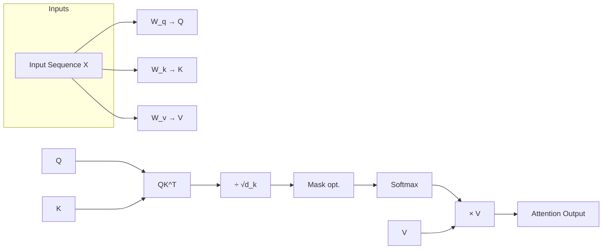
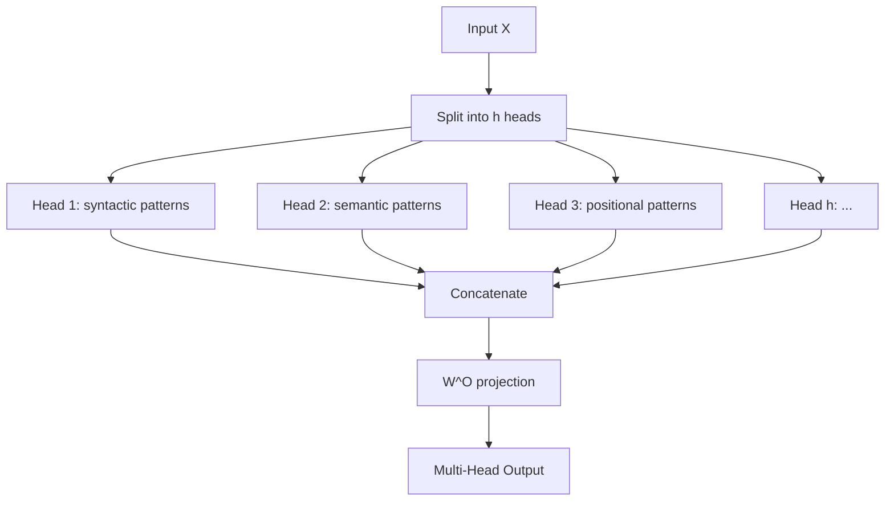
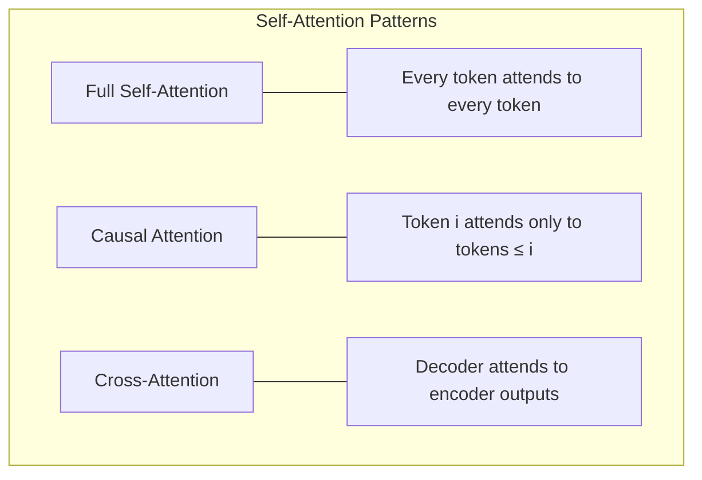

# Self-Attention

## Overview

Self-attention is the core mechanism of the Transformer. It allows each token in a sequence to compute a weighted sum of all other tokens' representations, enabling the model to capture **long-range dependencies** and **contextual relationships** in a single operation. Unlike RNNs that must propagate information step-by-step, self-attention creates direct connections between any pair of tokens.

## Scaled Dot-Product Attention

The fundamental attention operation:

$$\text{Attention}(Q, K, V) = \text{softmax}\left(\frac{QK^T}{\sqrt{d_k}}\right)V$$



### Step-by-Step

1. **Linear Projections**: Transform input $X \in \mathbb{R}^{n \times d_{\text{model}}}$ into Q, K, V
2. **Compute Scores**: $S = QK^T \in \mathbb{R}^{n \times n}$ — each entry $S_{ij}$ measures how much token $i$ should attend to token $j$
3. **Scale**: Divide by $\sqrt{d_k}$ to prevent dot products from growing too large
4. **Mask** (optional): For causal attention, mask future positions with $-\infty$
5. **Softmax**: Normalize scores to get attention weights $\alpha_{ij}$
6. **Weighted Sum**: Multiply by $V$ to get output representations

## Q/K/V Computation: Mathematical Derivation

### From Input to Queries, Keys, and Values

Given input sequence $X \in \mathbb{R}^{n \times d_{\text{model}}}$ where $n$ is the sequence length:

$$Q = XW^Q, \quad K = XW^K, \quad V = XW^V$$

Where:
- $W^Q \in \mathbb{R}^{d_{\text{model}} \times d_k}$ — projects input into **query** space
- $W^K \in \mathbb{R}^{d_{\text{model}} \times d_k}$ — projects input into **key** space
- $W^V \in \mathbb{R}^{d_{\text{model}} \times d_v}$ — projects input into **value** space

**Intuition for Q, K, V**:
- **Query** ($q_i$): "What am I looking for?" — the current token's information need
- **Key** ($k_j$): "What do I contain?" — what each token offers for matching
- **Value** ($v_j$): "What information do I provide?" — the actual content to aggregate

The attention score $q_i^T k_j$ measures how well token $j$'s offering (key) matches token $i$'s need (query).

### Detailed Computation Example

```python
import torch
import torch.nn.functional as F
import math

# Let's trace through self-attention with concrete numbers
# Sequence: "The cat sat" (3 tokens), d_model=4, d_k=2

# Input embeddings (after positional encoding)
X = torch.tensor([
    [1.0, 0.0, 1.0, 0.0],  # "The"
    [0.0, 1.0, 0.0, 1.0],  # "cat"
    [1.0, 1.0, 0.0, 0.0],  # "sat"
])  # (3, 4)

# Weight matrices (randomly initialized for illustration)
W_q = torch.tensor([
    [1.0, 0.0],
    [0.0, 1.0],
    [1.0, 0.0],
    [0.0, 1.0],
])  # (4, 2)

W_k = torch.tensor([
    [0.0, 1.0],
    [1.0, 0.0],
    [0.0, 1.0],
    [1.0, 0.0],
])  # (4, 2)

W_v = torch.tensor([
    [1.0, 0.0],
    [0.0, 1.0],
    [0.0, 1.0],
    [1.0, 0.0],
])  # (4, 2)

# Step 1: Compute Q, K, V
Q = X @ W_q  # (3, 2)
# Q = [[1, 0], [0, 2], [1, 1]]
# "The" queries for [1,0], "cat" queries for [0,2], "sat" queries for [1,1]

K = X @ W_k  # (3, 2)
# K = [[0, 2], [2, 0], [1, 1]]
# "The" key is [0,2], "cat" key is [2,0], "sat" key is [1,1]

V = X @ W_v  # (3, 2)
# V = [[1, 0], [0, 2], [1, 1]]

# Step 2: Compute attention scores QK^T
scores = Q @ K.T  # (3, 3)
# scores = [[0, 2, 1],    "The" attends to "The"=0, "cat"=2, "sat"=1
#           [4, 0, 2],    "cat" attends to "The"=4, "cat"=0, "sat"=2
#           [1, 2, 2]]    "sat" attends to "The"=1, "cat"=2, "sat"=2

# Step 3: Scale by sqrt(d_k) = sqrt(2) ≈ 1.414
d_k = Q.size(-1)
scaled_scores = scores / math.sqrt(d_k)

# Step 4: Apply softmax
attention_weights = F.softmax(scaled_scores, dim=-1)
# Row "cat": softmax([4/1.414, 0/1.414, 2/1.414])
#         = softmax([2.83, 0, 1.41])
#         ≈ [0.79, 0.05, 0.16]
# "cat" strongly attends to "The"!

# Step 5: Compute weighted sum of values
output = attention_weights @ V  # (3, 2)
# output[1] = 0.79*[1,0] + 0.05*[0,2] + 0.16*[1,1]
#           = [0.95, 0.26]
```

### Why Separate Q, K, V?

If we used the same projection for all three (i.e., $Q = K = V = XW$), the model would be much less expressive. Separate projections allow:

1. **Asymmetric attention**: Token $i$ attending to $j$ doesn't imply $j$ attends to $i$
2. **Different roles**: The query "what am I looking for" is fundamentally different from the key "what do I offer"
3. **Richer interactions**: The model can learn that certain types of content should be queried differently than they're offered

### Mathematical Properties of Attention

**Softmax normalization**: Each row of the attention matrix sums to 1:

$$\sum_{j=1}^{n} \alpha_{ij} = 1 \quad \forall i$$

This means the output is a **convex combination** of the value vectors — a weighted average where weights are non-negative and sum to 1.

**Permutation equivariance**: If the input order changes, the output changes in the same way (but self-attention doesn't inherently know about order — that's why we need positional encoding).

## Why Scale by $\sqrt{d_k}$?

If $q$ and $k$ are independent random vectors with mean 0 and variance 1, then $q \cdot k$ has mean 0 and variance $d_k$. Without scaling, the dot products grow with dimension, pushing softmax into regions with extremely small gradients. Scaling by $\sqrt{d_k}$ keeps the variance at 1.

```python
# Demonstration: scaling effect on softmax gradients
import torch

d_k_values = [1, 16, 64, 256, 1024]
for d_k in d_k_values:
    q = torch.randn(1000, d_k)
    k = torch.randn(1000, d_k)
    raw_scores = (q * k).sum(dim=-1)  # Dot products
    scaled_scores = raw_scores / math.sqrt(d_k)
    
    # Softmax gradient: softmax(x) * (1 - softmax(x))
    softmax_raw = torch.softmax(raw_scores, dim=0)
    softmax_scaled = torch.softmax(scaled_scores, dim=0)
    
    grad_raw = (softmax_raw * (1 - softmax_raw)).mean()
    grad_scaled = (softmax_scaled * (1 - softmax_scaled)).mean()
    
    print(f"d_k={d_k:4d} | Raw grad: {grad_raw:.6f} | Scaled grad: {grad_scaled:.6f}")
# Output shows raw gradients → 0 as d_k increases, scaled stays ~0.25
```

## Multi-Head Attention

A single attention head can only focus on one type of relationship at a time. **Multi-head attention** runs $h$ attention operations in parallel, each learning different patterns:

$$\text{MultiHead}(Q, K, V) = \text{Concat}(\text{head}_1, \dots, \text{head}_h)W^O$$

$$\text{head}_i = \text{Attention}(QW_i^Q, KW_i^K, VW_i^V)$$



### What Different Heads Learn

Research shows different heads specialize in different linguistic patterns:
- **Syntactic heads**: Subject-verb agreement, dependency parsing
- **Positional heads**: Attending to adjacent tokens
- **Semantic heads**: Coreference, related words
- **Rare token heads**: Attending to infrequent tokens

### Implementation Detail: Reshaping for Parallel Heads

```python
def multi_head_attention(x, n_heads, W_q, W_k, W_v, W_o, mask=None):
    batch_size, seq_len, d_model = x.size()
    d_k = d_model // n_heads
    
    # Project: (batch, seq, d_model) → (batch, seq, d_model)
    Q = W_q(x)
    K = W_k(x)
    V = W_v(x)
    
    # Reshape: (batch, seq, d_model) → (batch, seq, n_heads, d_k)
    Q = Q.view(batch_size, seq_len, n_heads, d_k)
    K = K.view(batch_size, seq_len, n_heads, d_k)
    V = V.view(batch_size, seq_len, n_heads, d_k)
    
    # Transpose: (batch, seq, n_heads, d_k) → (batch, n_heads, seq, d_k)
    Q = Q.transpose(1, 2)
    K = K.transpose(1, 2)
    V = V.transpose(1, 2)
    
    # Now each head processes independently in parallel
    attn_output, weights = scaled_dot_product_attention(Q, K, V, mask)
    
    # Transpose back: (batch, n_heads, seq, d_k) → (batch, seq, n_heads, d_k)
    attn_output = attn_output.transpose(1, 2)
    
    # Reshape: (batch, seq, n_heads, d_k) → (batch, seq, d_model)
    attn_output = attn_output.contiguous().view(batch_size, seq_len, d_model)
    
    # Final linear projection
    return W_o(attn_output)
```

## Attention Patterns



| Pattern | Used In | Mask |
|---------|---------|------|
| Full self-attention | BERT encoder | None |
| Causal (autoregressive) | GPT decoder | Lower triangular |
| Cross-attention | T5 decoder→encoder | None on encoder side |

### Causal Mask

For autoregressive models, token $i$ must not attend to tokens $j > i$:

$$\text{mask}_{ij} = \begin{cases} 0 & \text{if } j \leq i \\ -\infty & \text{if } j > i \end{cases}$$

After softmax, the $-\infty$ positions become zero attention weight.

```python
def create_causal_mask(seq_len):
    """Creates a lower-triangular boolean mask."""
    mask = torch.tril(torch.ones(seq_len, seq_len, dtype=torch.bool))
    return mask  # True = can attend, False = masked out
```

## Complexity Analysis

| Operation | Time | Space |
|-----------|------|-------|
| $QK^T$ | $O(n^2 \cdot d_k)$ | $O(n^2)$ |
| Softmax | $O(n^2)$ | $O(n^2)$ |
| $\text{Attn} \times V$ | $O(n^2 \cdot d_v)$ | $O(n \cdot d_v)$ |
| **Total** | $O(n^2 \cdot d)$ | $O(n^2 + n \cdot d)$ |

The $O(n^2)$ memory is the bottleneck for long sequences. Solutions include:
- **Flash Attention**: IO-aware exact attention ($O(n)$ memory)
- **Sparse Attention**: Only attend to subset of tokens
- **Linear Attention**: Approximate attention in $O(n)$ time
- **Sliding Window**: Attend only to local window + global tokens

## Code: Complete Self-Attention Module

```python
import torch
import torch.nn as nn
import torch.nn.functional as F
import math

def scaled_dot_product_attention(Q, K, V, mask=None):
    """
    Q, K, V: (batch, heads, seq_len, d_k)
    mask: (batch, 1, 1, seq_len) or (batch, 1, seq_len, seq_len)
    """
    d_k = Q.size(-1)
    scores = torch.matmul(Q, K.transpose(-2, -1)) / math.sqrt(d_k)
    
    if mask is not None:
        scores = scores.masked_fill(mask == 0, float('-inf'))
    
    attention_weights = F.softmax(scores, dim=-1)
    output = torch.matmul(attention_weights, V)
    return output, attention_weights


class MultiHeadSelfAttention(nn.Module):
    def __init__(self, d_model, n_heads, dropout=0.1):
        super().__init__()
        assert d_model % n_heads == 0
        self.d_k = d_model // n_heads
        self.n_heads = n_heads
        
        self.W_q = nn.Linear(d_model, d_model)
        self.W_k = nn.Linear(d_model, d_model)
        self.W_v = nn.Linear(d_model, d_model)
        self.W_o = nn.Linear(d_model, d_model)
        self.dropout = nn.Dropout(dropout)
    
    def forward(self, x, mask=None):
        batch_size, seq_len, d_model = x.size()
        
        # Project and reshape
        Q = self.W_q(x).view(batch_size, seq_len, self.n_heads, self.d_k).transpose(1, 2)
        K = self.W_k(x).view(batch_size, seq_len, self.n_heads, self.d_k).transpose(1, 2)
        V = self.W_v(x).view(batch_size, seq_len, self.n_heads, self.d_k).transpose(1, 2)
        
        # Attention
        attn_output, weights = scaled_dot_product_attention(Q, K, V, mask)
        attn_output = self.dropout(attn_output)
        
        # Concatenate and project
        attn_output = attn_output.transpose(1, 2).contiguous().view(
            batch_size, seq_len, d_model
        )
        return self.W_o(attn_output)


# Usage
batch, seq, d_model, heads = 2, 10, 512, 8
x = torch.randn(batch, seq, d_model)

# Full self-attention (BERT-style)
mha = MultiHeadSelfAttention(d_model, heads)
output = mha(x)  # (2, 10, 512)

# Causal self-attention (GPT-style)
causal_mask = torch.tril(torch.ones(seq, seq)).unsqueeze(0).unsqueeze(0)
output_causal = mha(x, mask=causal_mask)  # (2, 10, 512)
```

## Flash Attention

**Flash Attention** (Dao et al., 2022) computes exact attention with $O(n)$ memory by tiling the computation to exploit GPU memory hierarchy (SRAM vs HBM):

```mermaid
graph LR
    subgraph "Standard Attention"
        SA1[Compute full QK^T - O(n²) memory]
        SA2[Softmax]
        SA3[Multiply by V]
    end
    
    subgraph "Flash Attention"
        FA1[Tile Q, K, V into blocks]
        FA2[Compute attention block-by-block]
        FA3[Online softmax - no full n² matrix]
        FA4[Recompute in backward pass]
    end
```

Key insight: Avoid materializing the full $n \times n$ attention matrix by computing it in tiles and using **online softmax** to normalize incrementally.

```python
# Flash Attention is available in PyTorch 2.0+
import torch.nn.functional as F

# Simply use the built-in Flash Attention
output = F.scaled_dot_product_attention(
    Q, K, V,
    attn_mask=None,
    dropout_p=0.0,
    is_causal=False,
    scale=None  # Uses 1/sqrt(d_k) by default
)
```

## Interview Questions

### Q1: Why is self-attention important in Transformers?
**Answer:** Self-attention allows each token to directly attend to every other token in the sequence, regardless of distance. This solves the long-range dependency problem that RNNs struggle with. It also enables parallel computation of all positions simultaneously, making training much faster on modern hardware.

### Q2: What is the purpose of scaling by $\sqrt{d_k}$?
**Answer:** Without scaling, the dot products $q \cdot k$ have variance proportional to $d_k$. For large $d_k$, the dot products become very large, pushing softmax into regions with extremely small gradients (saturation). Dividing by $\sqrt{d_k}$ normalizes the variance to 1, keeping softmax in a region with useful gradients.

### Q3: How does multi-head attention help?
**Answer:** Multiple heads allow the model to attend to information from different representation subspaces simultaneously. One head might capture syntactic relationships, another semantic ones, and another positional patterns. This is more expressive than a single attention head that must average all types of relationships.

### Q4: What is the complexity bottleneck of attention, and how is it addressed?
**Answer:** The $O(n^2)$ time and memory complexity limits context length. Solutions include:
- **Flash Attention**: Exact attention with $O(n)$ memory via tiling
- **Sparse Attention**: Attend only to local windows + global tokens
- **Linear Attention**: Kernel approximation for $O(n)$ time
- **Multi-Query/Grouped-Query Attention**: Share KV heads to reduce memory

### Q5: What is Multi-Query Attention (MQA) vs Grouped-Query Attention (GQA)?
**Answer:**
- **Multi-Query Attention**: All heads share the same K and V projections, only Q is different. Reduces KV cache size by $h\times$.
- **Grouped-Query Attention**: Groups of heads share KV projections. E.g., 32 Q heads with 8 KV groups. Balances quality and efficiency.
- Used in LLaMA 2, Mistral, and other modern LLMs for inference efficiency.

### Q6: Why do we need separate Q, K, V projections?
**Answer:** Separate projections allow asymmetric attention (token $i$ attending to $j$ doesn't imply $j$ attends to $i$) and let the model learn different roles for querying ("what am I looking for?") vs. offering ("what do I contain?"). Using the same projection for all three would severely limit the model's expressiveness.

## Common Mistakes

- ❌ Forgetting to scale by $\sqrt{d_k}$, leading to training instability
- ❌ Not applying causal mask in decoder, causing information leakage
- ❌ Confusing self-attention (Q=K=V from same input) with cross-attention (Q from decoder, K/V from encoder)
- ❌ Thinking attention weights sum to 1 across rows AND columns (only rows)
- ❌ Ignoring the quadratic memory cost when designing for long sequences
- ❌ Not reshaping tensors correctly when implementing multi-head attention

## Summary

Self-attention computes pairwise interactions between all tokens in a sequence, enabling direct modeling of long-range dependencies. Q, K, V projections allow the model to learn different roles for querying and offering information. Multi-head attention runs multiple attention operations in parallel to capture different types of relationships. The scaling factor $\sqrt{d_k}$ prevents gradient saturation. Flash Attention and sparse variants address the $O(n^2)$ bottleneck for long sequences.

## References

1. Vaswani, A., et al. (2017). Attention Is All You Need. *NeurIPS*. *arXiv:1706.03762*.
2. Bahdanau, D., Cho, K., & Bengio, Y. (2014). Neural Machine Translation by Jointly Learning to Align and Translate. *arXiv:1409.0473*.
3. Voita, E., et al. (2019). Analyzing Multi-Head Self-Attention. *ACL*.
4. Dao, T., et al. (2022). FlashAttention: Fast and Memory-Efficient Exact Attention. *NeurIPS*.
5. Shazeer, N. (2019). Fast Transformer Decoding: One Write-Head is All You Need. *arXiv:1911.02150*.
6. Ainslie, J., et al. (2023). GQA: Training Generalized Multi-Query Transformer Models. *arXiv:2305.13245*.
7. Clark, K., et al. (2019). What Does BERT Look At? *ACL Workshop*.
8. Jain, S., & Wallace, B. C. (2019). Attention is not Explanation. *NAACL*.

## Cross-References

- [Architecture →](architecture.md) Where attention fits in the Transformer
- [Positional Encoding →](positional-encoding.md) Adding position information
- [BERT →](bert.md) Bidirectional self-attention
- [GPT →](gpt.md) Causal self-attention
- [Deep Learning: Attention →](../deep-learning/attention.md) Attention fundamentals
