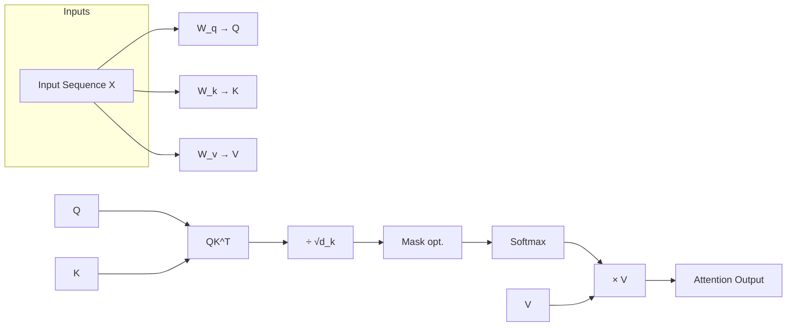
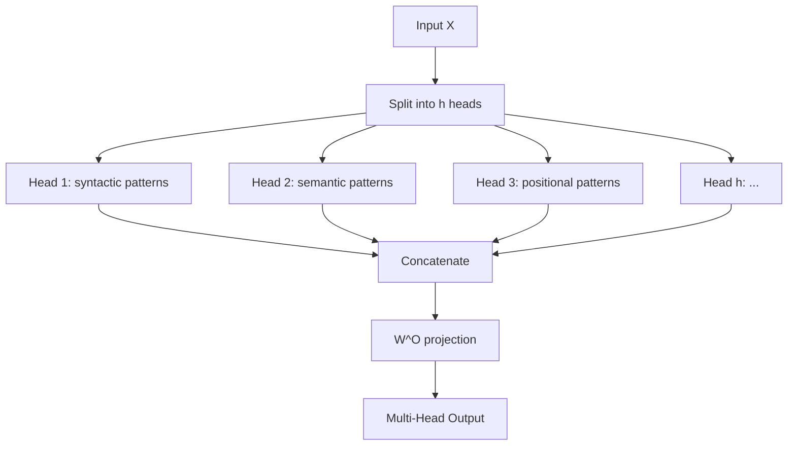
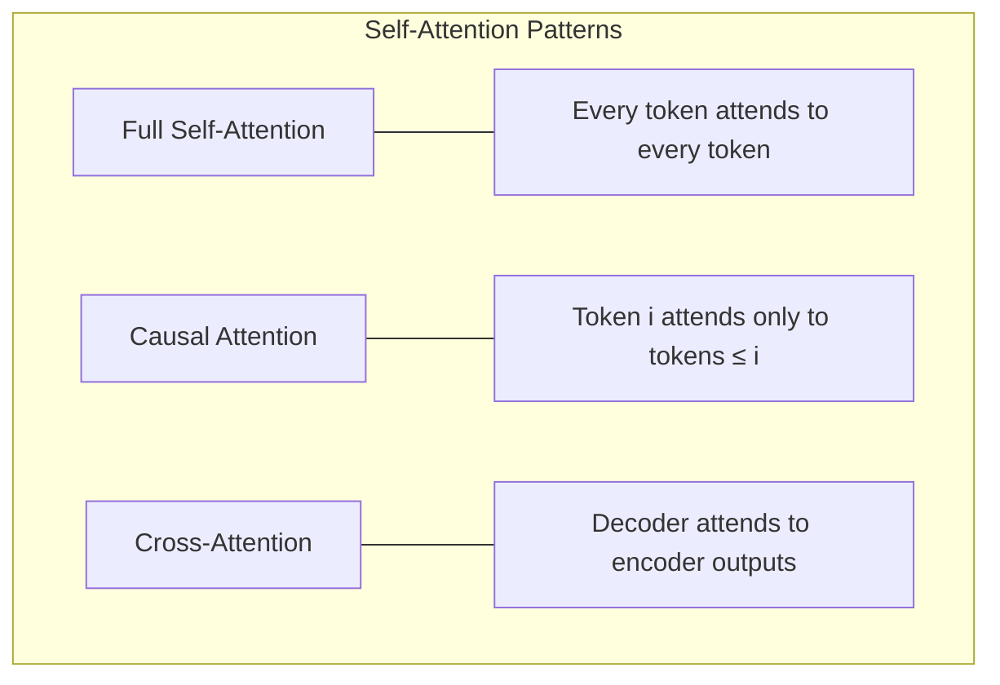

# Self-Attention

## Overview

Self-attention is the core mechanism of the Transformer. It allows each token in a sequence to compute a weighted sum of all other tokens' representations, enabling the model to capture **long-range dependencies** and **contextual relationships** in a single operation. Unlike RNNs that must propagate information step-by-step, self-attention creates direct connections between any pair of tokens.

## Scaled Dot-Product Attention

The fundamental attention operation:

$$\text{Attention}(Q, K, V) = \text{softmax}\left(\frac{QK^T}{\sqrt{d_k}}\right)V$$



### Step-by-Step

1. **Linear Projections**: Transform input $X \in \mathbb{R}^{n \times d_{\text{model}}}$ into Q, K, V
2. **Compute Scores**: $S = QK^T \in \mathbb{R}^{n \times n}$ — each entry $S_{ij}$ measures how much token $i$ should attend to token $j$
3. **Scale**: Divide by $\sqrt{d_k}$ to prevent dot products from growing too large
4. **Mask** (optional): For causal attention, mask future positions with $-\infty$
5. **Softmax**: Normalize scores to get attention weights $\alpha_{ij}$
6. **Weighted Sum**: Multiply by $V$ to get output representations

### Why Scale by $\sqrt{d_k}$?

If $q$ and $k$ are independent random vectors with mean 0 and variance 1, then $q \cdot k$ has mean 0 and variance $d_k$. Without scaling, the dot products grow with dimension, pushing softmax into regions with extremely small gradients. Scaling by $\sqrt{d_k}$ keeps the variance at 1.

## Multi-Head Attention

A single attention head can only focus on one type of relationship at a time. **Multi-head attention** runs $h$ attention operations in parallel, each learning different patterns:

$$\text{MultiHead}(Q, K, V) = \text{Concat}(\text{head}_1, \dots, \text{head}_h)W^O$$

$$\text{head}_i = \text{Attention}(QW_i^Q, KW_i^K, VW_i^V)$$



### What Different Heads Learn

Research shows different heads specialize in different linguistic patterns:
- **Syntactic heads**: Subject-verb agreement, dependency parsing
- **Positional heads**: Attending to adjacent tokens
- **Semantic heads**: Coreference, related words
- **Rare token heads**: Attending to infrequent tokens

## Attention Patterns



| Pattern | Used In | Mask |
|---------|---------|------|
| Full self-attention | BERT encoder | None |
| Causal (autoregressive) | GPT decoder | Lower triangular |
| Cross-attention | T5 decoder→encoder | None on encoder side |

### Causal Mask

For autoregressive models, token $i$ must not attend to tokens $j > i$:

$$\text{mask}_{ij} = \begin{cases} 0 & \text{if } j \leq i \\ -\infty & \text{if } j > i \end{cases}$$

After softmax, the $-\infty$ positions become zero attention weight.

## Complexity Analysis

| Operation | Time | Space |
|-----------|------|-------|
| $QK^T$ | $O(n^2 \cdot d_k)$ | $O(n^2)$ |
| Softmax | $O(n^2)$ | $O(n^2)$ |
| $\text{Attn} \times V$ | $O(n^2 \cdot d_v)$ | $O(n \cdot d_v)$ |
| **Total** | $O(n^2 \cdot d)$ | $O(n^2 + n \cdot d)$ |

The $O(n^2)$ memory is the bottleneck for long sequences. Solutions include:
- **Flash Attention**: IO-aware exact attention ($O(n)$ memory)
- **Sparse Attention**: Only attend to subset of tokens
- **Linear Attention**: Approximate attention in $O(n)$ time

## Code: Scaled Dot-Product Attention

```python
import torch
import torch.nn.functional as F
import math

def scaled_dot_product_attention(Q, K, V, mask=None):
    """
    Q, K, V: (batch, heads, seq_len, d_k)
    mask: (batch, 1, 1, seq_len) or (batch, 1, seq_len, seq_len)
    """
    d_k = Q.size(-1)
    scores = torch.matmul(Q, K.transpose(-2, -1)) / math.sqrt(d_k)
    
    if mask is not None:
        scores = scores.masked_fill(mask == 0, float('-inf'))
    
    attention_weights = F.softmax(scores, dim=-1)
    output = torch.matmul(attention_weights, V)
    return output, attention_weights

def multi_head_attention(x, n_heads, W_q, W_k, W_v, W_o, mask=None):
    batch_size, seq_len, d_model = x.size()
    d_k = d_model // n_heads
    
    # Project and reshape
    Q = W_q(x).view(batch_size, seq_len, n_heads, d_k).transpose(1, 2)
    K = W_k(x).view(batch_size, seq_len, n_heads, d_k).transpose(1, 2)
    V = W_v(x).view(batch_size, seq_len, n_heads, d_k).transpose(1, 2)
    
    # Attention
    attn_output, weights = scaled_dot_product_attention(Q, K, V, mask)
    
    # Concatenate heads and project
    attn_output = attn_output.transpose(1, 2).contiguous().view(batch_size, seq_len, d_model)
    return W_o(attn_output)

# Example
batch, seq, d_model, heads = 2, 10, 512, 8
x = torch.randn(batch, seq, d_model)
W_q = torch.nn.Linear(d_model, d_model)
W_k = torch.nn.Linear(d_model, d_model)
W_v = torch.nn.Linear(d_model, d_model)
W_o = torch.nn.Linear(d_model, d_model)

output = multi_head_attention(x, heads, W_q, W_k, W_v, W_o)
print(output.shape)  # torch.Size([2, 10, 512])
```

## Flash Attention

**Flash Attention** (Dao et al., 2022) computes exact attention with $O(n)$ memory by tiling the computation to exploit GPU memory hierarchy (SRAM vs HBM):

```mermaid
graph LR
    subgraph "Standard Attention"
        SA1[Compute full QK^T - O(n²) memory]
        SA2[Softmax]
        SA3[Multiply by V]
    end
    
    subgraph "Flash Attention"
        FA1[Tile Q, K, V into blocks]
        FA2[Compute attention block-by-block]
        FA3[Online softmax - no full n² matrix]
        FA4[Recompute in backward pass]
    end
```

Key insight: Avoid materializing the full $n \times n$ attention matrix by computing it in tiles and using **online softmax** to normalize incrementally.

## Interview Questions

### Q1: Why is self-attention important in Transformers?
**Answer:** Self-attention allows each token to directly attend to every other token in the sequence, regardless of distance. This solves the long-range dependency problem that RNNs struggle with. It also enables parallel computation of all positions simultaneously, making training much faster on modern hardware.

### Q2: What is the purpose of scaling by $\sqrt{d_k}$?
**Answer:** Without scaling, the dot products $q \cdot k$ have variance proportional to $d_k$. For large $d_k$, the dot products become very large, pushing softmax into regions with extremely small gradients (saturation). Dividing by $\sqrt{d_k}$ normalizes the variance to 1, keeping softmax in a region with useful gradients.

### Q3: How does multi-head attention help?
**Answer:** Multiple heads allow the model to attend to information from different representation subspaces simultaneously. One head might capture syntactic relationships, another semantic ones, and another positional patterns. This is more expressive than a single attention head that must average all types of relationships.

### Q4: What is the complexity bottleneck of attention, and how is it addressed?
**Answer:** The $O(n^2)$ time and memory complexity limits context length. Solutions include:
- **Flash Attention**: Exact attention with $O(n)$ memory via tiling
- **Sparse Attention**: Attend only to local windows + global tokens
- **Linear Attention**: Kernel approximation for $O(n)$ time
- **Multi-Query/Grouped-Query Attention**: Share KV heads to reduce memory

### Q5: What is Multi-Query Attention (MQA) vs Grouped-Query Attention (GQA)?
**Answer:**
- **Multi-Query Attention**: All heads share the same K and V projections, only Q is different. Reduces KV cache size by $h\times$.
- **Grouped-Query Attention**: Groups of heads share KV projections. E.g., 32 Q heads with 8 KV groups. Balances quality and efficiency.
- Used in LLaMA 2, Mistral, and other modern LLMs for inference efficiency.

## Common Mistakes

- ❌ Forgetting to scale by $\sqrt{d_k}$, leading to training instability
- ❌ Not applying causal mask in decoder, causing information leakage
- ❌ Confusing self-attention (Q=K=V from same input) with cross-attention (Q from decoder, K/V from encoder)
- ❌ Thinking attention weights sum to 1 across rows AND columns (only rows)
- ❌ Ignoring the quadratic memory cost when designing for long sequences

## Summary

Self-attention computes pairwise interactions between all tokens in a sequence, enabling direct modeling of long-range dependencies. Multi-head attention runs multiple attention operations in parallel to capture different types of relationships. The scaling factor $\sqrt{d_k}$ prevents gradient saturation. Flash Attention and sparse variants address the $O(n^2)$ bottleneck for long sequences.

## Cross-References

- [Architecture →](architecture.md) Where attention fits in the Transformer
- [Positional Encoding →](positional-encoding.md) Adding position information
- [BERT →](bert.md) Bidirectional self-attention
- [GPT →](gpt.md) Causal self-attention
- [Deep Learning: Attention →](../deep-learning/attention.md) Attention fundamentals
