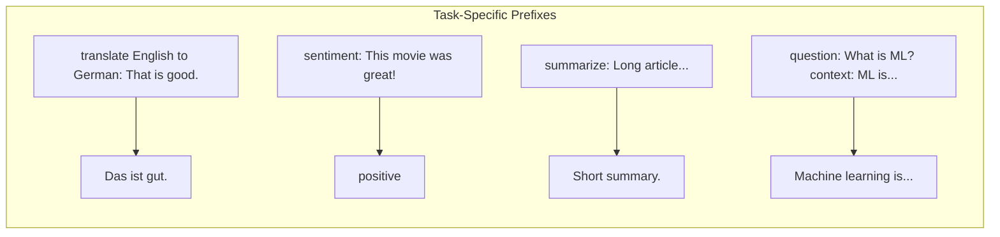
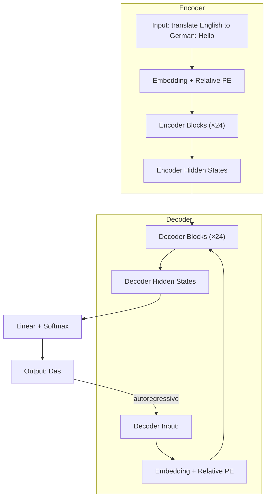

# T5 (Text-to-Text Transfer Transformer)

## Overview

T5, introduced by Raffel et al. (2019), frames **every NLP task as a text-to-text problem**. Classification, translation, summarization, and question answering all use the same encoder-decoder architecture with text inputs and text outputs. This unified framework simplifies multi-task learning and transfer learning.

## Text-to-Text Framework



| Task | Input | Output |
|------|-------|--------|
| Translation | `translate English to German: The house is wonderful.` | `Das Haus ist wunderbar.` |
| Classification | `sentiment: This movie is terrible.` | `negative` |
| Summarization | `summarize: Long article text...` | `Short summary.` |
| QA | `question: Who wrote 1984? context: 1984 was written by Orwell.` | `George Orwell` |
| STS | `sts sentence1: The cat sat. sentence2: A cat rested.` | `4.5` |

## Architecture

T5 uses the full **encoder-decoder** Transformer:



### Relative Position Bias

T5 uses **relative position bias** (not absolute positional encoding):

$$\text{Attention} = \text{softmax}\left(\frac{QK^T}{\sqrt{d_k}} + B_{ij}\right)V$$

Where $B_{ij}$ is a learned bias for relative distance $|i-j|$, bucketed logarithmically for efficiency.

## T5 Variants

| Model | Layers | $d_{\text{model}}$ | $d_{ff}$ | Heads | Params |
|-------|--------|-----|---------|-------|--------|
| T5-Small | 6+6 | 512 | 2048 | 8 | 77M |
| T5-Base | 12+12 | 768 | 3072 | 12 | 220M |
| T5-Large | 24+24 | 1024 | 4096 | 16 | 770M |
| T5-3B | 24+24 | 1024 | 16384 | 32 | 3B |
| T5-11B | 24+24 | 1024 | 65536 | 128 | 11B |

## Pre-Training: Span Corruption

T5 is pre-trained with **span corruption** — masking random spans of text and predicting them:

**Input**: `Thank you <X> me to your party <Y> week.`
**Target**: `<X> for inviting <Y> last <Z>`

```python
def span_corruption(tokens, mask_ratio=0.15, mean_span_length=3):
    """T5-style span corruption pre-training."""
    num_masked = int(len(tokens) * mask_ratio)
    # Sample span lengths from geometric distribution
    spans = []
    while sum(s[1] for s in spans) < num_masked:
        length = np.random.geometric(1 / mean_span_length)
        start = np.random.randint(0, len(tokens) - length)
        spans.append((start, length))
    
    # Create input and target
    # Replace spans with sentinel tokens <extra_id_0>, <extra_id_1>, ...
    # Target is the replaced spans separated by sentinels
    ...
```

## FLAN-T5: Instruction Tuning

FLAN-T5 fine-tunes T5 on **1,836 tasks** with chain-of-thought reasoning:

$$\text{Input:} \quad \text{Task instruction + examples + input}$$
$$\text{Output:} \quad \text{Expected response}$$

This dramatically improves zero-shot and few-shot performance on unseen tasks.

## Code: T5 for Translation

```python
from transformers import T5ForConditionalGeneration, T5Tokenizer

tokenizer = T5Tokenizer.from_pretrained('t5-base')
model = T5ForConditionalGeneration.from_pretrained('t5-base')

# Translation
input_text = "translate English to German: That is very good."
input_ids = tokenizer(input_text, return_tensors='pt').input_ids

outputs = model.generate(input_ids, max_length=50, num_beams=4)
print(tokenizer.decode(outputs[0], skip_special_tokens=True))
# Output: "Das ist sehr gut."

# Summarization
article = "summarize: The Transformer architecture has become..."
input_ids = tokenizer(article, return_tensors='pt', max_length=512, truncation=True).input_ids
summary = model.generate(input_ids, max_length=150, num_beams=4)
print(tokenizer.decode(summary[0], skip_special_tokens=True))
```

## T5 vs BERT vs GPT

| Aspect | T5 | BERT | GPT |
|--------|-----|------|-----|
| Architecture | Encoder-decoder | Encoder-only | Decoder-only |
| Pre-training | Span corruption | MLM + NSP | Next token prediction |
| Input/Output | Text → Text | Text → Embeddings | Text → Text (causal) |
| Best for | Seq2seq tasks | Understanding | Generation |
| Bidirectional | Encoder: yes | Yes | No |

## Interview Questions

### Q1: What is the key innovation of T5?
**Answer:** T5 frames every NLP task as a text-to-text problem. Instead of task-specific architectures (classification head, sequence labeling head), everything is text input → text output. This enables multi-task learning with a single model and simplifies transfer learning.

### Q2: How does T5's span corruption differ from BERT's MLM?
**Answer:** BERT masks individual tokens; T5 masks **contiguous spans** of tokens. The target is the concatenated spans separated by sentinel tokens. Span corruption is more natural for generation tasks and provides a better pre-training signal for the decoder.

### Q3: Why use an encoder-decoder instead of decoder-only?
**Answer:** The encoder can attend bidirectionally to the input (better understanding), while the decoder generates autoregressively. This is especially useful for tasks where the output depends heavily on understanding the full input (translation, summarization). However, at very large scale, decoder-only models (GPT-4) have proven competitive.

## Common Mistakes

- ❌ Forgetting task-specific prefixes (e.g., `translate English to German:`)
- ❌ Using T5 for simple classification (BERT is more efficient)
- ❌ Not understanding that the encoder is bidirectional but decoder is causal
- ❌ Confusing span corruption with token-level masking

## Summary

T5 unifies NLP tasks as text-to-text using an encoder-decoder Transformer. Pre-trained with span corruption, it excels at sequence-to-sequence tasks. The text-to-text framework enables multi-task learning and simple transfer. FLAN-T5 adds instruction tuning for improved zero-shot performance.

## Cross-References

- [Architecture →](architecture.md) Encoder-decoder Transformer
- [BERT →](bert.md) Encoder-only comparison
- [GPT →](gpt.md) Decoder-only comparison
- [Self-Attention →](self-attention.md) Bidirectional + causal attention
- [Training →](training.md) Pre-training objectives
