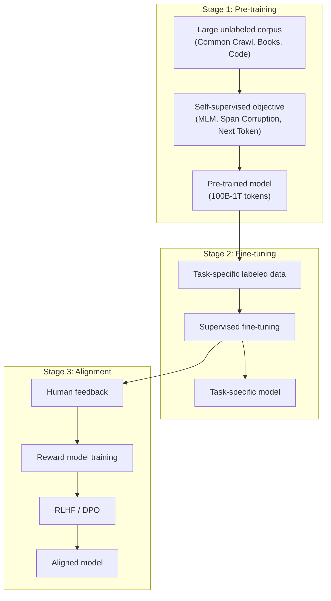
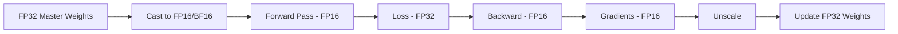
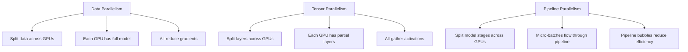

# Transformer Training

## Overview

Training Transformers involves two stages: **pre-training** on large unlabeled corpora with self-supervised objectives, followed by **fine-tuning** on specific downstream tasks. Modern LLMs add a third stage: **alignment** with human preferences via RLHF/DPO. This section covers the training pipeline, optimization strategies, and best practices.

## Training Pipeline



## Pre-Training Objectives

| Model | Objective | Formula |
|-------|-----------|---------|
| BERT | Masked LM | $\mathcal{L} = -\sum_{i \in \mathcal{M}} \log P(x_i \| x_{\backslash \mathcal{M}})$ |
| GPT | Next Token | $\mathcal{L} = -\sum_{t} \log P(x_t \| x_{<t})$ |
| T5 | Span Corruption | Predict masked spans with sentinel tokens |
| UL2 | Mixture of Denoisers | R-denoiser + S-denoiser + X-denoiser |

## Optimization

### Learning Rate Schedule

Transformers use a **warmup + cosine decay** schedule:

\\[\text{lr}(t) = \begin{cases} \text{lr}_{\max} \cdot \frac{t}{T_{\text{warmup}}} & \text{if } t < T_{\text{warmup}} \\ \text{lr}_{\min} + \frac{1}{2}(\text{lr}_{\max} - \text{lr}_{\min})(1 + \cos(\frac{t - T_{\text{warmup}}}{T - T_{\text{warmup}}} \pi)) & \text{otherwise} \end{cases}\\]

```python
import math

def cosine_schedule_with_warmup(step, warmup_steps, total_steps, max_lr, min_lr=0):
    if step < warmup_steps:
        return max_lr * step / warmup_steps
    progress = (step - warmup_steps) / (total_steps - warmup_steps)
    return min_lr + 0.5 * (max_lr - min_lr) * (1 + math.cos(math.pi * progress))
```

### Optimizer: AdamW

The standard optimizer for Transformers:

\\[m_t = \beta_1 m_{t-1} + (1 - \beta_1) g_t\\]
\\[v_t = \beta_2 v_{t-1} + (1 - \beta_2) g_t^2\\]
\\[\hat{m}_t = \frac{m_t}{1 - \beta_1^t}, \quad \hat{v}_t = \frac{v_t}{1 - \beta_2^t}\\]
\\[\theta_t = \theta_{t-1} - \text{lr} \cdot \left(\frac{\hat{m}_t}{\sqrt{\hat{v}_t} + \epsilon} + \lambda \theta_{t-1}\right)\\]

Typical hyperparameters:
- $\beta_1 = 0.9$, $\beta_2 = 0.95$ (or 0.999)
- $\epsilon = 10^{-8}$
- $\lambda = 0.1$ (weight decay)
- Peak lr: $3 \times 10^{-4}$ to $1 \times 10^{-3}$ (model-size dependent)

## Mixed Precision Training



- **FP16**: 16-bit floating point, needs loss scaling to prevent underflow
- **BF16**: Brain Float 16, wider dynamic range, no loss scaling needed
- **TF32**: TensorFloat-32, NVIDIA Ampere+, for matrix multiplications

```python
# PyTorch mixed precision
scaler = torch.cuda.amp.GradScaler()
for batch in dataloader:
    optimizer.zero_grad()
    with torch.cuda.amp.autocast():
        outputs = model(batch)
        loss = criterion(outputs)
    scaler.scale(loss).backward()
    scaler.step(optimizer)
    scaler.update()
```

## Gradient Accumulation

For effective batch sizes larger than GPU memory allows:

\\[\text{Effective batch size} = \text{micro\_batch} \times \text{accumulation\_steps} \times \text{num\_GPUs}\\]

```python
accumulation_steps = 8
for i, batch in enumerate(dataloader):
    loss = model(batch) / accumulation_steps
    loss.backward()
    if (i + 1) % accumulation_steps == 0:
        optimizer.step()
        optimizer.zero_grad()
```

## Distributed Training



| Strategy | Splits | Communication | Best For |
|----------|--------|---------------|----------|
| Data Parallel (DDP) | Data | All-reduce gradients | Small models, many GPUs |
| Tensor Parallel (Megatron) | Layers (columns/rows) | All-gather activations | Large models, fast interconnect |
| Pipeline Parallel | Model stages | Point-to-point | Very large models |
| FSDP / ZeRO | Parameters, gradients, optimizer states | All-gather | Memory-efficient training |
| 3D Parallel | All three | Mixed | Massive models (100B+) |

## Fine-Tuning Strategies

| Strategy | Description | Use Case |
|----------|-------------|----------|
| Full fine-tuning | Update all parameters | Large datasets, sufficient compute |
| LoRA | Low-rank adapter matrices | Limited compute, good performance |
| QLoRA | Quantized + LoRA | Very limited memory |
| Prefix tuning | Learn prefix tokens | Few-shot, generation tasks |
| Prompt tuning | Learn soft prompts | Multi-task, frozen model |
| Adapter layers | Small bottleneck layers | Multi-task, parameter-efficient |

### LoRA (Low-Rank Adaptation)

Instead of updating full weight matrices, LoRA adds low-rank updates:

\\[W' = W + \Delta W = W + BA\\]

Where $B \in \mathbb{R}^{d \times r}$, $A \in \mathbb{R}^{r \times d}$, and $r \ll d$.

```python
class LoRALayer(nn.Module):
    def __init__(self, in_dim, out_dim, rank=16, alpha=32):
        super().__init__()
        self.linear = nn.Linear(in_dim, out_dim, bias=False)
        self.linear.weight.requires_grad = False  # Freeze original
        
        self.lora_A = nn.Parameter(torch.randn(in_dim, rank) * 0.01)
        self.lora_B = nn.Parameter(torch.zeros(rank, out_dim))
        self.scaling = alpha / rank
    
    def forward(self, x):
        return self.linear(x) + (x @ self.lora_A @ self.lora_B) * self.scaling
```

## Interview Questions

### Q1: Why warmup the learning rate?
**Answer:** At the start of training, model weights are random, producing large and noisy gradients. A high learning rate in this phase causes divergence. Warmup gradually increases the learning rate, allowing the optimizer statistics (Adam's $m_t$, $v_t$) to stabilize before full-speed training.

### Q2: What is gradient accumulation and when is it needed?
**Answer:** Gradient accumulation simulates a larger batch size by accumulating gradients over multiple forward-backward passes before updating weights. It's needed when the desired batch size exceeds GPU memory. For example, accumulating over 8 steps with batch size 4 gives effective batch size 32.

### Q3: Compare DDP, FSDP, and tensor parallelism.
**Answer:**
- **DDP**: Each GPU holds the full model; data is split. Gradients are synchronized with all-reduce. Simple but memory-inefficient for large models.
- **FSDP/ZeRO**: Shards optimizer states, gradients, and/or parameters across GPUs. Enables training models that don't fit on a single GPU.
- **Tensor Parallelism**: Splits individual layers (weight matrices) across GPUs. Requires fast interconnect (NVLink). Best for very large models on a single node.

### Q4: What is LoRA and why is it useful?
**Answer:** LoRA adds low-rank update matrices ($\Delta W = BA$) to frozen pre-trained weights. Instead of fine-tuning all parameters (e.g., 7B), you only train the low-rank adapters (e.g., 10M parameters). Benefits: 1000× fewer trainable parameters, no inference latency (merge weights), easy to swap tasks.

## Common Mistakes

- ❌ Using too high learning rate for fine-tuning (destroys pre-trained knowledge)
- ❌ Not using gradient clipping (exploding gradients in deep Transformers)
- ❌ Forgetting to set model.eval() during inference (affects dropout, batch norm)
- ❌ Using FP16 without loss scaling (gradients underflow to zero)
- ❌ Not shuffling training data (causes training instability)

## Summary

Transformer training involves pre-training with self-supervised objectives, fine-tuning on downstream tasks, and alignment with human feedback. Key techniques: warmup + cosine schedule, AdamW optimizer, mixed precision, gradient accumulation, and distributed training. Parameter-efficient fine-tuning methods like LoRA enable adapting large models with limited compute.

## Cross-References

- [Architecture →](architecture.md) Transformer architecture details
- [BERT →](bert.md) Encoder pre-training (MLM)
- [GPT →](gpt.md) Decoder pre-training (next token)
- [RLHF →](../rl/rlhf.md) Alignment training
- [DPO →](../rl/dpo.md) Direct preference optimization
- [Backpropagation →](../deep-learning/backpropagation.md) Gradient computation
- [Optimizers →](../deep-learning/optimizers.md) Adam and variants
