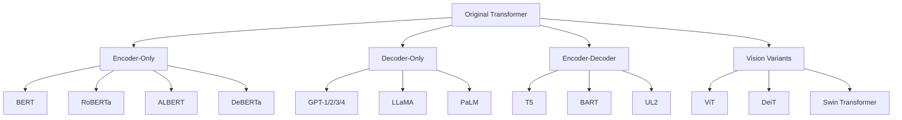
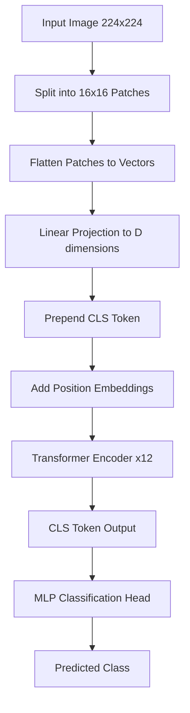

# Transformer Variants

## Overview

The original Transformer architecture has spawned numerous variants optimized for different tasks and modalities. Understanding these variants is essential for ML interviews and for choosing the right architecture for a given problem.

## Taxonomy of Transformer Variants



## BERT: Encoder-Only

**BERT** (Bidirectional Encoder Representations from Transformers) uses only the encoder stack and is designed for **understanding** tasks.

### Key Design Choices

| Feature | Description |
|---------|-------------|
| Bidirectional | Attends to both left and right context simultaneously |
| Pre-training Objectives | Masked Language Modeling (MLM) + Next Sentence Prediction (NSP) |
| Tokenization | WordPiece with [CLS] and [SEP] tokens |
| Fine-tuning | Add task-specific head on top of [CLS] token |

### Architecture Details

- **Base**: 12 layers, 768 hidden dim, 12 heads, 110M params
- **Large**: 24 layers, 1024 hidden dim, 16 heads, 340M params
- Max sequence length: 512 tokens

### Masked Language Modeling (MLM)

Randomly mask 15% of tokens: 80% → [MASK], 10% → random token, 10% → original. The model predicts the original token from context.

```python
import torch
import torch.nn as nn
from transformers import BertModel, BertTokenizer

class BertForClassification(nn.Module):
    def __init__(self, num_classes, model_name="bert-base-uncased"):
        super().__init__()
        self.bert = BertModel.from_pretrained(model_name)
        self.dropout = nn.Dropout(0.1)
        self.classifier = nn.Linear(self.bert.config.hidden_size, num_classes)
    
    def forward(self, input_ids, attention_mask):
        outputs = self.bert(input_ids=input_ids, attention_mask=attention_mask)
        # Use [CLS] token representation
        cls_output = outputs.last_hidden_state[:, 0, :]
        cls_output = self.dropout(cls_output)
        logits = self.classifier(cls_output)
        return logits
```

### BERT Variants

| Model | Key Innovation | Year |
|-------|---------------|------|
| RoBERTa | Remove NSP, more data, dynamic masking | 2019 |
| ALBERT | Parameter sharing, sentence-order prediction | 2019 |
| DistilBERT | Knowledge distillation, 60% faster | 2019 |
| DeBERTa | Disentangled attention, enhanced mask decoder | 2020 |
| SpanBERT | Mask spans instead of individual tokens | 2019 |
| ELECTRA | Replaced token detection (more efficient than MLM) | 2020 |

## GPT: Decoder-Only

**GPT** (Generative Pre-trained Transformer) uses only the decoder stack with **causal (autoregressive) masking**.

### Key Design Choices

| Feature | Description |
|---------|-------------|
| Unidirectional | Left-to-right autoregressive generation |
| Pre-training | Next token prediction |
| Scaling | GPT-1 (117M) → GPT-2 (1.5B) → GPT-3 (175B) → GPT-4 (est. 1.8T MoE) |
| In-context learning | Few-shot prompting without fine-tuning |

### Causal Masking

```python
import torch

def create_causal_mask(seq_len):
    """Create lower-triangular causal attention mask."""
    mask = torch.tril(torch.ones(seq_len, seq_len))
    # Convert to attention mask format (0 = attend, -inf = ignore)
    mask = mask.masked_fill(mask == 0, float('-inf'))
    mask = mask.masked_fill(mask == 1, 0.0)
    return mask

# Example for sequence length 4
# tensor([[ 0., -inf, -inf, -inf],
#         [ 0.,  0., -inf, -inf],
#         [ 0.,  0.,  0., -inf],
#         [ 0.,  0.,  0.,  0.]])
```

### GPT Scaling Timeline

| Model | Year | Parameters | Context Length | Key Innovation |
|-------|------|------------|---------------|----------------|
| GPT-1 | 2018 | 117M | 512 | Transfer learning for NLP |
| GPT-2 | 2019 | 1.5B | 1024 | Zero-shot task transfer |
| GPT-3 | 2020 | 175B | 2048 | In-context learning, few-shot |
| GPT-3.5 | 2022 | ~175B | 4096 | RLHF alignment |
| GPT-4 | 2023 | ~1.8T (MoE) | 8K/32K/128K | Multimodal, improved reasoning |

## T5: Encoder-Decoder

**T5** (Text-to-Text Transfer Transformer) frames **every** NLP task as a text-to-text problem.

### Key Design Choices

- Input: "translate English to German: That is good."
- Output: "Das ist gut."
- Same architecture for classification, translation, summarization, QA
- Uses relative positional embeddings instead of sinusoidal
- Pre-trained on the Colossal Clean Crawled Corpus (C4)

```python
from transformers import T5ForConditionalGeneration, T5Tokenizer

tokenizer = T5Tokenizer.from_pretrained("t5-base")
model = T5ForConditionalGeneration.from_pretrained("t5-base")

# Every task is text-to-text
input_text = "summarize: The Transformer architecture has revolutionized NLP..."
input_ids = tokenizer(input_text, return_tensors="pt").input_ids

outputs = model.generate(input_ids, max_length=50)
summary = tokenizer.decode(outputs[0], skip_special_tokens=True)
```

### T5 Model Sizes

| Model | Parameters | Layers | d_model | Heads |
|-------|-----------|--------|---------|-------|
| T5-Small | 60M | 6 | 512 | 8 |
| T5-Base | 220M | 12 | 768 | 12 |
| T5-Large | 770M | 24 | 1024 | 16 |
| T5-3B | 3B | 24 | 1024 | 32 |
| T5-11B | 11B | 24 | 1024 | 128 |

## Vision Transformer (ViT)

**ViT** applies the pure Transformer architecture to image recognition by treating images as sequences of patches.

### How ViT Works



### Patch Embedding

```python
import torch
import torch.nn as nn

class PatchEmbedding(nn.Module):
    def __init__(self, img_size=224, patch_size=16, in_channels=3, embed_dim=768):
        super().__init__()
        self.num_patches = (img_size // patch_size) ** 2  # 196 for 224/16
        self.projection = nn.Conv2d(
            in_channels, embed_dim, 
            kernel_size=patch_size, stride=patch_size
        )
    
    def forward(self, x):
        # x: (B, 3, 224, 224)
        x = self.projection(x)  # (B, 768, 14, 14)
        x = x.flatten(2).transpose(1, 2)  # (B, 196, 768)
        return x

class VisionTransformer(nn.Module):
    def __init__(self, img_size=224, patch_size=16, num_classes=1000,
                 embed_dim=768, depth=12, num_heads=12):
        super().__init__()
        self.patch_embed = PatchEmbedding(img_size, patch_size, 3, embed_dim)
        num_patches = (img_size // patch_size) ** 2
        
        self.cls_token = nn.Parameter(torch.zeros(1, 1, embed_dim))
        self.pos_embed = nn.Parameter(torch.zeros(1, num_patches + 1, embed_dim))
        
        encoder_layer = nn.TransformerEncoderLayer(
            d_model=embed_dim, nhead=num_heads, 
            dim_feedforward=embed_dim * 4, batch_first=True
        )
        self.encoder = nn.TransformerEncoder(encoder_layer, num_layers=depth)
        self.head = nn.Linear(embed_dim, num_classes)
    
    def forward(self, x):
        B = x.shape[0]
        x = self.patch_embed(x)  # (B, num_patches, embed_dim)
        
        cls_tokens = self.cls_token.expand(B, -1, -1)
        x = torch.cat([cls_tokens, x], dim=1)  # (B, num_patches+1, embed_dim)
        x = x + self.pos_embed
        
        x = self.encoder(x)
        cls_output = x[:, 0]  # CLS token
        return self.head(cls_output)
```

### ViT Variants

| Model | Key Idea | Year |
|-------|----------|------|
| DeiT | Data-efficient training with distillation token | 2021 |
| Swin Transformer | Shifted window attention, hierarchical features | 2021 |
| BEiT | BERT-style pre-training for images | 2021 |
| MAE | Masked autoencoder pre-training (75% masking) | 2022 |
| DINOv2 | Self-supervised ViT with emergent properties | 2023 |

### DeiT: Data-Efficient Image Transformer

DeiT showed that ViT can be trained effectively on ImageNet alone (without JFT-300M) using:
- **Distillation token**: Learnable token that attends to class predictions from a teacher CNN
- **Strong data augmentation**: RandAugment, Mixup, CutMix, Random Erasing
- **Stochastic depth**: Randomly drop layers during training

## Comparison: Encoder vs Decoder vs Encoder-Decoder

| Aspect | Encoder (BERT) | Decoder (GPT) | Enc-Dec (T5) |
|--------|---------------|---------------|---------------|
| Attention | Bidirectional | Causal (left-to-right) | Encoder: bidirectional, Decoder: causal |
| Best for | Understanding, classification | Generation, completion | Seq2seq tasks |
| Pre-training | MLM + NSP | Next token prediction | Span corruption |
| Fine-tuning | Add task head | Prompting / few-shot | Text-to-text |
| Example tasks | Sentiment, NER, QA | Chat, code, stories | Translation, summarization |

## Common Mistakes

1. **Using BERT for generation**: BERT's bidirectional attention makes autoregressive generation impossible — use GPT-style models instead
2. **Ignoring context length limits**: ViT's quadratic attention over patches limits resolution; use Swin Transformer for high-res images
3. **Confusing fine-tuning paradigms**: BERT needs a task head; GPT works with prompting; T5 reformulates tasks as text-to-text
4. **Not accounting for [CLS] token**: In BERT, the [CLS] token is at position 0, not appended
5. **Wrong masking for GPT**: GPT uses causal (lower-triangular) masking, not bidirectional

## Interview Questions

1. **What is the key difference between BERT and GPT?**
   BERT uses bidirectional (encoder) attention for understanding tasks; GPT uses causal (decoder) attention for generation tasks.

2. **Why does T5 frame everything as text-to-text?**
   It provides a unified framework where every task (classification, translation, summarization) uses the same architecture and training procedure, simplifying multi-task learning and transfer.

3. **How does ViT convert images into sequences?**
   ViT splits an image into fixed-size patches (e.g., 16x16), flattens each patch into a vector, linearly projects it to the embedding dimension, and prepends a learnable [CLS] token.

4. **What is the purpose of the distillation token in DeiT?**
   It's a learnable token (like [CLS]) that specifically attends to the teacher model's predictions, enabling knowledge distillation during training without needing extra data.

5. **Why can't BERT do autoregressive generation?**
   BERT's bidirectional self-attention allows each token to attend to all other tokens, including future tokens. This violates the autoregressive property needed for sequential generation.

6. **Compare the pre-training objectives of BERT, GPT, and T5.**
   BERT: Masked Language Modeling (predict masked tokens). GPT: Causal Language Modeling (predict next token). T5: Span corruption (predict corrupted spans).

7. **How does RoBERTa improve upon BERT?**
   Removes NSP, uses dynamic masking, trains with more data and larger batches, removes the Next Sentence Prediction objective, and uses byte-level BPE tokenization.

8. **What makes Swin Transformer more efficient than ViT?**
   Swin uses shifted window attention — computing attention within local windows rather than globally — reducing complexity from $O(n^2)$ to $O(n)$ with respect to image size.

9. **Explain the patch embedding in ViT.**
   A 224×224 image with 16×16 patches yields 196 patches. Each patch is flattened to a 768-dim vector (16×16×3). A linear projection maps each to the Transformer's hidden dimension.

10. **Why is ELECTRA more sample-efficient than BERT?**
    ELECTRA uses replaced token detection (binary classification: is this token real or replaced?) which provides training signal from every token, not just the 15% masked ones.

11. **How does ALBERT reduce parameters compared to BERT?**
    Cross-layer parameter sharing (all layers share the same weights), embedding factorization (separate vocabulary and hidden dimensions), and sentence-order prediction instead of NSP.

12. **When would you choose T5 over BERT?**
    For seq2seq tasks (translation, summarization), multi-task setups, or when you want a single model for both understanding and generation.

## Cross-References

- [Self-Attention Mechanism](./self-attention.md) — Foundation for all variants
- [Transformer Architecture](./architecture.md) — The original design
- [Training Transformers](./training.md) — How these models are trained
- [LLM Overview](../llm/README.md) — Scaling up decoder-only models
- [Vision Transformers](./vit.md) — Detailed ViT coverage
