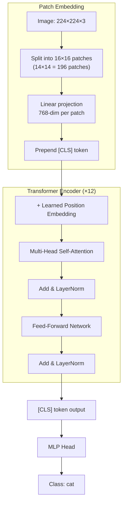
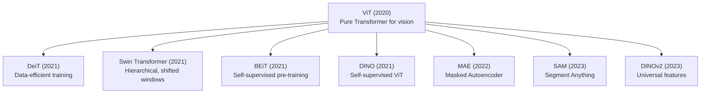

# ViT (Vision Transformer)

## Overview

The Vision Transformer (ViT), introduced by Dosovitskiy et al. (2020), applies the pure Transformer architecture to image recognition. It splits images into fixed-size patches, linearly embeds them, and processes them with standard Transformer encoder blocks. ViT demonstrated that **pure attention can match or exceed CNNs** on image classification when pre-trained on large datasets.

## Architecture



### Patch Embedding

An image $\mathbf{x} \in \mathbb{R}^{H \times W \times C}$ is split into $N = \frac{H \times W}{P^2}$ patches of size $P \times P$:

\\[\mathbf{z}_0 = [\mathbf{x}_{\text{cls}}; \; \mathbf{x}_p^1 \mathbf{E}; \; \mathbf{x}_p^2 \mathbf{E}; \; \dots; \; \mathbf{x}_p^N \mathbf{E}] + \mathbf{E}_{\text{pos}}\\]

Where:
- $\mathbf{E} \in \mathbb{R}^{P^2 \cdot C \times D}$: patch embedding projection
- $\mathbf{E}_{\text{pos}} \in \mathbb{R}^{(N+1) \times D}$: learned position embeddings
- $D$: Transformer hidden dimension

```python
import torch
import torch.nn as nn

class PatchEmbedding(nn.Module):
    def __init__(self, img_size=224, patch_size=16, in_channels=3, embed_dim=768):
        super().__init__()
        self.num_patches = (img_size // patch_size) ** 2
        # Efficient patch embedding via convolution
        self.proj = nn.Conv2d(in_channels, embed_dim, 
                              kernel_size=patch_size, stride=patch_size)
    
    def forward(self, x):
        # x: (B, C, H, W)
        x = self.proj(x)  # (B, embed_dim, H/P, W/P)
        x = x.flatten(2).transpose(1, 2)  # (B, num_patches, embed_dim)
        return x
```

## ViT Variants

| Model | Layers | Hidden | Heads | Patch | Params | ImageNet |
|-------|--------|--------|-------|-------|--------|----------|
| ViT-S/16 | 12 | 384 | 12 | 16 | 22M | 81.4% |
| ViT-B/16 | 12 | 768 | 12 | 16 | 86M | 84.2% |
| ViT-L/16 | 24 | 1024 | 16 | 16 | 307M | 85.2% |
| ViT-H/14 | 32 | 1280 | 16 | 14 | 632M | 88.6% |
| ViT-G/14 | 40 | 1664 | 16 | 14 | 1.8B | 90.5% |

## ViT vs CNN

| Aspect | ViT | CNN |
|--------|-----|-----|
| Inductive bias | Minimal (only position) | Strong (locality, translation equivariance) |
| Data efficiency | Poor without pre-training | Good |
| Scaling | Excellent | Good |
| Global context | Native (self-attention) | Limited (receptive field) |
| Interpretability | Attention maps | Feature maps |

**Key insight**: ViT needs more data than CNNs because it lacks the inductive biases (locality, translation equivariance) that CNNs have. But with sufficient data, ViT scales better.

## DeiT: Data-Efficient Image Transformer

DeiT (Touvron et al., 2021) made ViT work with only ImageNet (1.2M images) through:
- **Knowledge distillation** from a CNN teacher
- Strong data augmentation (RandAugment, Mixup, CutMix)
- Regularization (Stochastic depth, Label smoothing)

## Code: Full ViT Implementation

```python
class ViT(nn.Module):
    def __init__(self, img_size=224, patch_size=16, in_channels=3,
                 num_classes=1000, embed_dim=768, depth=12, 
                 num_heads=12, mlp_ratio=4.0, dropout=0.1):
        super().__init__()
        self.patch_embed = PatchEmbedding(img_size, patch_size, in_channels, embed_dim)
        num_patches = self.patch_embed.num_patches
        
        self.cls_token = nn.Parameter(torch.zeros(1, 1, embed_dim))
        self.pos_embed = nn.Parameter(torch.zeros(1, num_patches + 1, embed_dim))
        self.pos_drop = nn.Dropout(dropout)
        
        # Transformer blocks
        self.blocks = nn.ModuleList([
            TransformerBlock(embed_dim, num_heads, int(embed_dim * mlp_ratio), dropout)
            for _ in range(depth)
        ])
        
        self.norm = nn.LayerNorm(embed_dim)
        self.head = nn.Linear(embed_dim, num_classes)
        
        # Initialize
        nn.init.trunc_normal_(self.pos_embed, std=0.02)
        nn.init.trunc_normal_(self.cls_token, std=0.02)
    
    def forward(self, x):
        B = x.shape[0]
        x = self.patch_embed(x)  # (B, num_patches, embed_dim)
        
        cls_tokens = self.cls_token.expand(B, -1, -1)
        x = torch.cat([cls_tokens, x], dim=1)  # (B, num_patches+1, embed_dim)
        x = self.pos_drop(x + self.pos_embed)
        
        for block in self.blocks:
            x = block(x)
        
        x = self.norm(x)
        return self.head(x[:, 0])  # Use [CLS] token
```

## Evolution of Vision Transformers



## Interview Questions

### Q1: How does ViT process images differently from CNNs?
**Answer:** ViT splits an image into patches (e.g., 16×16), treats each patch as a "token," and applies standard Transformer self-attention. Unlike CNNs that use local convolutions with increasing receptive fields, ViT has global attention from the first layer — every patch can attend to every other patch.

### Q2: Why does ViT need more data than CNNs?
**Answer:** CNNs have strong inductive biases — locality (pixels near each other are related) and translation equivariance (the same filter is applied everywhere). ViT has minimal inductive bias, so it must learn these properties from data. With small datasets, CNNs' built-in biases help; with large datasets, ViT's flexibility wins.

### Q3: What is the role of the [CLS] token in ViT?
**Answer:** The [CLS] token is a learnable token prepended to the patch sequence. Through self-attention, it aggregates information from all patches. Its final representation is used for image classification, similar to BERT's [CLS] token for text classification.

### Q4: How does Swin Transformer improve upon ViT?
**Answer:** Swin Transformer introduces:
1. **Windowed attention**: Attention within local windows (not global), reducing complexity from $O(n^2)$ to $O(n \cdot w^2)$
2. **Shifted windows**: Alternating window positions to enable cross-window connections
3. **Hierarchical feature maps**: Multi-scale feature pyramids like CNNs, enabling use in detection and segmentation

## Common Mistakes

- ❌ Forgetting that ViT patches are non-overlapping (unlike CNN convolutions)
- ❌ Not understanding why ViT needs more data (lack of inductive bias)
- ❌ Confusing patch embedding with convolution (it's a projection, not learned filters)
- ❌ Assuming ViT always outperforms CNNs (depends on data availability)
- ❌ Ignoring position embeddings (patches have no inherent order)

## Summary

ViT applies pure Transformer architecture to vision by treating image patches as tokens. It achieves state-of-the-art when pre-trained on large datasets but needs more data than CNNs due to minimal inductive bias. Variants like DeiT, Swin, and BEiT address data efficiency and hierarchical features. ViT has become the dominant architecture in modern computer vision.

## Cross-References

- [Architecture →](architecture.md) Standard Transformer architecture
- [Self-Attention →](self-attention.md) Self-attention mechanism
- [Positional Encoding →](positional-encoding.md) Position embeddings in ViT
- [CNN →](../deep-learning/cnn.md) CNN comparison
- [Transfer Learning →](../deep-learning/transfer-learning.md) Pre-training ViT
