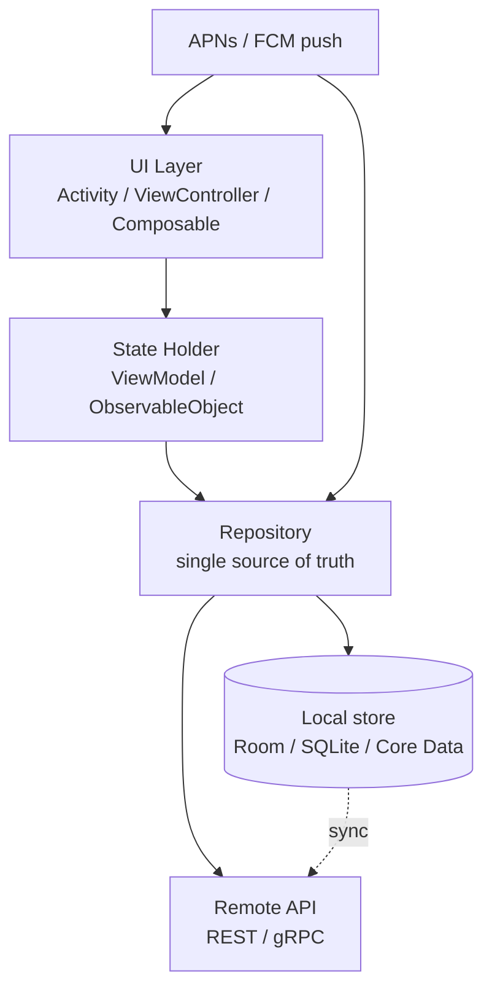

# Mobile Development Overview

Mobile engineering is a distinct discipline from backend or web work: you ship a
binary to a device you do not control, on an OS that will kill your process
whenever it likes, over a network that disappears without warning, and you do it
under store review. Interviews probe exactly those constraints — lifecycle,
memory limits, offline behaviour, and battery.

## Android vs iOS

| Aspect | Android | iOS |
|---|---|---|
| Language | Kotlin, Java | Swift, Objective-C |
| IDE | Android Studio | Xcode |
| UI Framework | Jetpack Compose, XML | SwiftUI, UIKit |
| Architecture | Linux kernel | Darwin (XNU) |
| Distribution | Play Store, APK | App Store, IPA |
| Market Share | ~72% global | ~27% global |
| Process model | One process per app, `Activity`/`Service` components | One process per app, `UIApplication` + scenes |
| Background work | `WorkManager`, foreground services | `BGTaskScheduler`, limited background execution |

## The Constraints That Define Mobile

These four properties drive almost every mobile design decision:

1. **You do not own the runtime.** The OS can terminate your process at any
   moment to reclaim memory. Any state that must survive goes to disk or to the
   server — never to a static variable.
2. **Lifecycle is a state machine, not a linear flow.** Rotation, incoming calls
   and OS-driven process death all tear down and rebuild your UI. Android's
   `Activity`/`Fragment` lifecycle and iOS's view-controller lifecycle are the
   two dialects of the same problem.
3. **The network is unreliable and slow relative to disk.** Mobile clients are
   offline-first for a reason: local storage is the source of truth for reads,
   and the network syncs it in the background.
4. **Battery and radio are the scarce resources.** Cellular radio wake-ups cost
   far more than the bytes they transfer, which is why batched push (APNs/FCM)
   beats polling, and why background work is scheduled and coalesced by the OS.

## What This Section Covers

| Page | Topic |
|---|---|
| [Android](./android.md) | Platform fundamentals, components, build system |
| [Android OS Internals](./android-internals.md) | Binder IPC, ART, Zygote, system_server |
| [iOS / Swift](./ios.md) | UIKit/SwiftUI, ARC, app lifecycle |
| [Mobile Engineering Deep Dive](./mobile-engineering.md) | Lifecycle, offline-first, performance, release engineering |
| [Flutter and Dart](./flutter-dart.md) | Widget tree, rendering pipeline, platform channels |
| [React Native](./react-native.md) | Bridge/JSI, native modules, threading model |
| [Progressive Web Apps](./pwa.md) | Service workers, manifest, installability |
| [Mobile Databases](./mobile-databases.md) | SQLite, Room, Core Data, Realm, migrations |
| [Push Notifications](./push-notifications.md) | APNs and FCM delivery, tokens, silent push |
| [Crash Reporting](./crash-reporting.md) | Crashlytics, Sentry, symbolication, dSYM mapping |
| [Mobile Security](./mobile-security.md) | Storage, transport, platform protections |
| [Mobile Security Deep Dive](./mobile-security-deep.md) | Jailbreak/root detection, attestation, code signing |
| [Mobile Interview Questions](./interview-questions.md) | Commonly asked questions with answers |

## Core Concepts Worth Knowing Cold

- **Configuration change vs. process death.** A `ViewModel` (Android) or
  `@StateObject` (iOS) survives configuration changes because the OS keeps the
  process alive; neither survives process death. Only persisted state does.
- **Offline-first sync.** The repository writes to local storage first and
  queues the mutation; conflict resolution (last-write-wins, version vectors, or
  CRDTs) decides what wins when the network returns.
- **Payload size is a product decision.** App size affects install conversion,
  cold start affects retention, and over-the-air updates (CodePush, Play
  Feature Delivery) trade review latency against policy risk.
- **Code signing is the security boundary.** Android's keystore and Apple's
  provisioning profiles are what make the store a trusted distribution channel —
  which is also why root/jailbreak detection matters only as a speed bump, never
  as a guarantee.

## Interview Questions

1. **How do you survive process death mid-flow?**
   Persist the minimum needed to reconstruct state (saved-instance-state for
   small UI state, a local database for anything larger), and design screens to
   be reconstructible from an ID rather than from in-memory objects.

2. **Why is an offline-first architecture harder than it looks?**
   The hard part is not caching reads — it is the write path: queueing mutations,
   ordering them, and resolving conflicts deterministically on reconnect.

3. **How would you cut cold-start time?**
   Measure first (Android: `reportFullyDrawn`/Perfetto; iOS: Instruments' App
   Launch template), then defer non-critical initialisation off the main thread,
   trim dependency injection work at startup, and avoid I/O before first frame.

4. **When would you choose a PWA over a native app?**
   When distribution friction matters more than platform integration: no store
   review, one codebase, instant updates. You give up reliable background
   execution, deep push behaviour, and full device API access.

## Cross-References

- [Mobile Engineering Deep Dive](./mobile-engineering.md) — lifecycle, offline-first, release engineering
- [Mobile Databases](./mobile-databases.md) — local persistence choices and migrations
- [Push Notifications](./push-notifications.md) — APNs/FCM delivery semantics
- [Web Development Overview](../web-development/README.md) — shared browser/rendering fundamentals behind PWAs
- [Cloud Overview](../cloud/overview.md) — the backend these clients talk to
